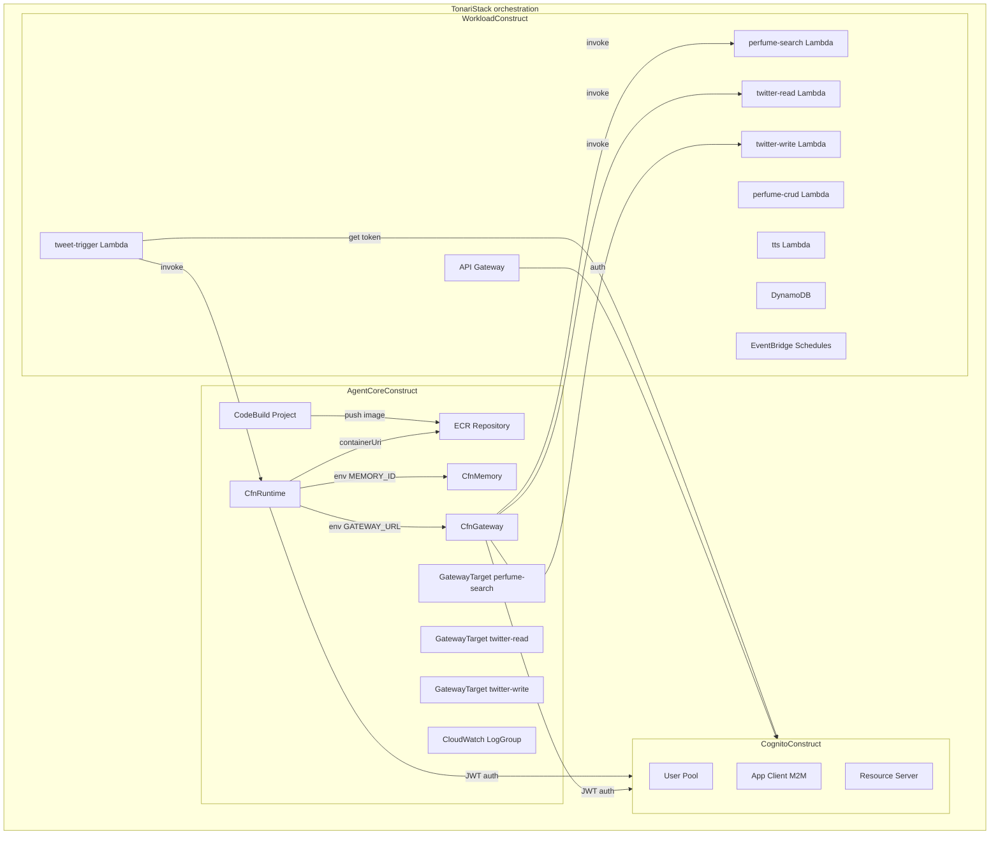
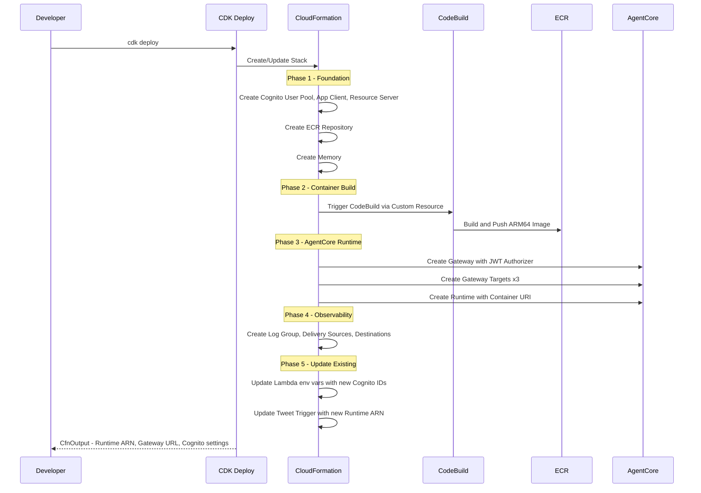
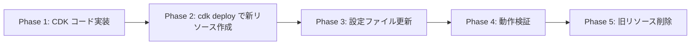

# Technical Design — AgentCore CDK Migration

## Overview

**Purpose:** Tonari プロジェクトのインフラ管理を統一するため、AgentCore Starter Toolkit CLI および手動で管理している全リソースを AWS CDK に移行する。

**Users:** 開発者（個人プロジェクト）が `cdk deploy` のみで全インフラをプロビジョニング・更新できるようにする。

**Impact:** 既存の CLI 管理リソース（Runtime, Memory, Gateway）と CLI 作成リソース（Cognito）を CDK で新規作成し、`agentcore deploy` / `agentcore gateway` / `agentcore identity setup-cognito` への依存を排除する。

### Goals

- 全インフラリソースを単一の `cdk deploy` でプロビジョニング可能にする
- `agentcore deploy` コマンドへの依存を完全に排除する
- 既存のフロントエンド・バックエンド連携（M2M 認証、SSE ストリーミング、Gateway ツール、Memory）を維持する

### Non-Goals

- 既存 Memory データの移行（新規作成で対応）
- L2 コンストラクト（`@aws-cdk/aws-bedrock-agentcore-alpha`）の使用（L1 で十分）
- CI/CD パイプラインの自動化（GitHub Actions 等との統合は将来対応）
- マルチ環境（staging/production）対応

## Architecture

### Existing Architecture Analysis

現在のインフラは以下の 3 層で管理されている:

| 管理方法 | リソース |
|---------|---------|
| CDK（`tonari-stack.ts`） | Lambda×5, DynamoDB, API Gateway, EventBridge Schedule×3 |
| Starter Toolkit CLI | AgentCore Runtime, Memory, Gateway + Targets |
| CLI 作成で未管理 | Cognito User Pool, App Client, Resource Server, Domain |

**既存 CDK スタック (`TonariStack`) の特徴:**
- `TonariStackProps` で `cognitoUserPoolId` / `cognitoClientId` を外部から受け取る
- `cdk.json` に Cognito ID とRuntime ARN をハードコード
- Lambda Authorizer が Cognito User Pool ID / Client ID を環境変数で参照
- Tweet Trigger Lambda が Runtime ARN / Cognito Token Endpoint を環境変数で参照

### Architecture Pattern and Boundary Map

**選択パターン:** `TonariStack` をオーケストレーション層とし、全リソースをカスタムコンストラクトに分割

**コンストラクト分割:**

| ファイル | コンストラクト | 責務 |
|---------|--------------|------|
| `infra/lib/tonari-stack.ts` | `TonariStack` | オーケストレーション専任（各コンストラクトの組み立てとコンストラクト間の接続） |
| `infra/lib/cognito-construct.ts` | `CognitoConstruct` | Cognito User Pool, App Client, Resource Server, Domain, Client Secret SSM |
| `infra/lib/workload-construct.ts` | `WorkloadConstruct` | Lambda×6, DynamoDB, API Gateway, EventBridge Schedules（既存リソースの移設） |
| `infra/lib/agentcore-construct.ts` | `AgentCoreConstruct` | Runtime, Memory, Gateway, Gateway Targets, IAM Roles, ECR, CodeBuild, Observability |

**分割の理由:**
- `CognitoConstruct`: 横断的な Identity 基盤。既存 Lambda と新規 AgentCore の両方から参照される
- `WorkloadConstruct`: 既存のアプリケーションリソース。現在 `tonari-stack.ts` に直書きされているものを移設
- `AgentCoreConstruct`: 今回新規追加する AgentCore 関連リソース一式



**Architecture Integration:**
- 選択パターン: 単一スタック + カスタムコンストラクト分割（`TonariStack` はオーケストレーション専任）
- コンストラクト分割: `CognitoConstruct`（横断 Identity）/ `WorkloadConstruct`（既存アプリリソース）/ `AgentCoreConstruct`（新規 AgentCore 一式）
- `WorkloadConstruct` は既存 `tonari-stack.ts` のリソース定義をそのまま移設（動作変更なし）
- コンストラクト間の接続（Lambda ARN → GatewayTarget、Cognito ID → Lambda env 等）は `TonariStack` で定義

### Technology Stack

| Layer | Choice / Version | Role | Notes |
|-------|------------------|------|-------|
| IaC | AWS CDK 2.240.0 | 全リソースのプロビジョニング | `aws-cdk-lib/aws-bedrockagentcore` L1 使用 |
| Container Registry | Amazon ECR | Agent コンテナイメージ格納 | ARM64 イメージ |
| Container Build | AWS CodeBuild | Docker イメージビルド | ARM64 ビルド環境 |
| Identity | Amazon Cognito | M2M 認証（client_credentials） | User Pool + Resource Server |
| Monitoring | CloudWatch Logs + X-Ray | ログ・トレース | Vended Logs パターン |
| Agent Runtime | Python 3.12 + OpenTelemetry | コンテナ内ランタイム | `aws-opentelemetry-distro` |

## System Flows

### cdk deploy フロー



**Key Decisions:**
- CodeBuild は CDK Custom Resource（`AwsCustomResource`）でトリガーし、`cdk deploy` 内でビルドを完結させる
- Gateway は Runtime より先に作成（Runtime の環境変数に Gateway URL を渡すため）
- Cognito は最初に作成（Runtime / Gateway / Lambda すべてが参照するため）

## Requirements Traceability

| Requirement | Summary | Components | Interfaces | Flows |
|-------------|---------|------------|------------|-------|
| 1.1 | Runtime を CDK で作成 | CfnRuntime, RuntimeIamRole | RuntimeProps | cdk deploy |
| 1.2 | ECR リポジトリ作成 | EcrRepository | — | — |
| 1.3 | CodeBuild で Docker ビルド | CodeBuildProject, BuildTrigger | — | cdk deploy |
| 1.4 | Runtime 環境変数 | CfnRuntime | RuntimeProps | — |
| 1.5 | Runtime IAM ロール | RuntimeIamRole | — | — |
| 1.6 | PUBLIC ネットワーク | CfnRuntime | RuntimeProps | — |
| 1.7 | JWT authorizer | CfnRuntime, CognitoResources | RuntimeProps | — |
| 2.1 | Memory を CDK で作成 | CfnMemory | MemoryProps | cdk deploy |
| 2.2 | STM+LTM モード | CfnMemory | MemoryProps | — |
| 2.3 | イベント保持 30 日 | CfnMemory | MemoryProps | — |
| 2.4 | Memory ID を Runtime に渡す | CfnRuntime, CfnMemory | — | — |
| 3.1 | Gateway を CDK で作成 | CfnGateway | GatewayProps | cdk deploy |
| 3.2 | Lambda ターゲット登録 | CfnGatewayTarget×3 | GatewayTargetProps | — |
| 3.3 | Gateway JWT authorizer | CfnGateway, CognitoResources | GatewayProps | — |
| 3.4 | Gateway IAM ロール | GatewayIamRole | — | — |
| 3.5 | Gateway URL を Runtime に渡す | CfnRuntime, CfnGateway | — | — |
| 4.1 | Cognito User Pool | CognitoUserPool | — | — |
| 4.2 | App Client | CognitoAppClient | — | — |
| 4.3 | Resource Server | CognitoResourceServer | — | — |
| 4.4 | User Pool Domain | CognitoDomain | — | — |
| 4.5 | Cognito ID を Runtime/Lambda に渡す | CognitoResources, CfnRuntime | — | — |
| 4.6 | Client Secret を SSM に格納 | ClientSecretSsm | — | — |
| 5.1 | CloudWatch LogGroup | LogGroup | — | — |
| 5.2 | ログ配信パイプライン | LogDeliverySource, LogDeliveryDestination, LogDelivery | — | — |
| 5.3 | トレース配信パイプライン | TraceDeliverySource, TraceDeliveryDestination, TraceDelivery | — | — |
| 5.4 | ログ保持 14 日 | LogGroup | — | — |
| 6.1 | ARM64 CodeBuild | CodeBuildProject | — | cdk deploy |
| 6.2 | agentcore ソースをコンテナに含める | Dockerfile | — | — |
| 6.3 | cdk deploy でビルドトリガー | BuildTrigger | — | cdk deploy |
| 6.4 | イメージ URI を Runtime に設定 | CfnRuntime, EcrRepository | — | — |
| 6.5 | Python 3.12 + OTel | Dockerfile | — | — |
| 7.1 | CfnOutput | StackOutputs | — | — |
| 7.2 | agentcore.json 更新手順 | — | — | — |
| 7.3 | .env 更新手順 | — | — | — |
| 7.4 | cdk.json の context 廃止 | StackProps 変更 | — | — |
| 8.1-8.4 | 既存機能互換性 | 全コンポーネント | — | — |
| 9.1-9.4 | デプロイフロー | 全コンポーネント | — | cdk deploy |

## Components and Interfaces

| Component | Domain | Intent | Req Coverage | Key Dependencies | Contracts |
|-----------|--------|--------|--------------|------------------|-----------|
| CognitoResources | Identity | Cognito M2M 認証基盤 | 4.1-4.6 | — | Service |
| ClientSecretSsm | Identity | Client Secret の SSM 格納 | 4.6 | CognitoResources (P0) | — |
| CfnMemoryResource | AgentCore | Memory リソース作成 | 2.1-2.4 | — | Service |
| EcrRepository | Build | コンテナイメージリポジトリ | 1.2, 6.4 | — | — |
| CodeBuildProject | Build | Docker イメージビルド | 1.3, 6.1-6.3, 6.5 | EcrRepository (P0) | — |
| BuildTrigger | Build | cdk deploy でビルド発火 | 6.3 | CodeBuildProject (P0) | — |
| GatewayIamRole | AgentCore | Gateway 用 IAM ロール | 3.4 | Lambda×3 (P0) | — |
| CfnGatewayResource | AgentCore | MCP Gateway 作成 | 3.1, 3.3 | CognitoResources (P0), GatewayIamRole (P0) | Service |
| CfnGatewayTargets | AgentCore | Lambda ターゲット登録 | 3.2, 3.5 | CfnGatewayResource (P0), Lambda×3 (P0) | Service |
| RuntimeIamRole | AgentCore | Runtime 用 IAM ロール | 1.5 | CfnMemoryResource (P1), CfnGatewayResource (P1) | — |
| CfnRuntimeResource | AgentCore | Runtime 作成 | 1.1, 1.4, 1.6, 1.7 | EcrRepository (P0), CognitoResources (P0), CfnMemoryResource (P0), CfnGatewayResource (P0), RuntimeIamRole (P0) | Service |
| ObservabilityResources | Monitoring | ログ・トレース配信 | 5.1-5.4 | CfnRuntimeResource (P0) | — |
| StackOutputs | Config | CfnOutput 出力 | 7.1 | 全コンポーネント (P1) | — |
| Dockerfile | Build | コンテナイメージ定義 | 6.2, 6.5 | — | — |

### Identity

#### CognitoResources

| Field | Detail |
|-------|--------|
| Intent | Cognito User Pool / App Client / Resource Server / Domain を CDK で作成 |
| Requirements | 4.1, 4.2, 4.3, 4.4, 4.5 |

**Responsibilities and Constraints**
- M2M（client_credentials）フロー専用の Cognito 環境を構成
- Resource Server にスコープ `read` / `write` を定義
- User Pool Domain はグローバル一意（既存と異なる名前が必要）

**Dependencies**
- Outbound: CfnRuntime — authorizer discoveryUrl (P0)
- Outbound: CfnGateway — authorizer discoveryUrl (P0)
- Outbound: Lambda (api-authorizer, tweet-trigger) — 環境変数 (P0)

**Contracts**: Service [x]

##### Service Interface

```typescript
// Cognito User Pool
const userPool = new cognito.UserPool(this, 'AgentCoreUserPool', {
  userPoolName: 'tonari-agentcore-m2m',
  selfSignUpEnabled: false,
  signInAliases: { username: false, email: false },
  removalPolicy: cdk.RemovalPolicy.DESTROY,
})

// Resource Server
const resourceServer = userPool.addResourceServer('ResourceServer', {
  identifier: 'agentcore-m2m',
  scopes: [
    { scopeName: 'read', scopeDescription: 'Read access' },
    { scopeName: 'write', scopeDescription: 'Write access' },
  ],
})

// App Client (client_credentials flow)
const appClient = userPool.addClient('M2MClient', {
  userPoolClientName: 'tonari-m2m-client',
  generateSecret: true,
  oAuth: {
    flows: { clientCredentials: true },
    scopes: [
      cognito.OAuthScope.custom('agentcore-m2m/read'),
      cognito.OAuthScope.custom('agentcore-m2m/write'),
    ],
  },
  supportedIdentityProviders: [
    cognito.UserPoolClientIdentityProvider.COGNITO,
  ],
})

// User Pool Domain
const domain = userPool.addDomain('Domain', {
  cognitoDomain: { domainPrefix: 'tonari-m2m' },
})
```

- Preconditions: なし（最初に作成される）
- Postconditions: User Pool ID, Client ID, Token Endpoint, OIDC Discovery URL が取得可能
- Invariants: Resource Server identifier は `agentcore-m2m` 固定

**Implementation Notes**
- Domain prefix は既存の `tonari-m2m-identity` と異なる名前を使用（`tonari-m2m` 等）
- `removalPolicy: DESTROY` で `cdk destroy` 時にクリーンアップ可能にする

#### ClientSecretSsm

| Field | Detail |
|-------|--------|
| Intent | Cognito App Client の Client Secret を SSM Parameter Store に格納 |
| Requirements | 4.6 |

**Responsibilities and Constraints**
- CDK の `AwsCustomResource` で Cognito `DescribeUserPoolClient` API を呼び出し、Client Secret を取得
- SSM SecureString パラメータとして `/tonari/cognito/client_secret` に格納

**Dependencies**
- Inbound: CognitoResources — App Client ID (P0)
- Outbound: Lambda (tweet-trigger) — SSM パラメータ参照 (P0)
- Outbound: Next.js (Vercel) — 環境変数 `COGNITO_CLIENT_SECRET` (P0)

**Implementation Notes**
- `cognito.UserPoolClient.secret` は CDK の `SecretValue` として取得可能だが、SSM に書き込むには Custom Resource が必要
- 代替案: Secrets Manager を使用する場合は `secretsmanager.Secret` で格納

### AgentCore

#### CfnMemoryResource

| Field | Detail |
|-------|--------|
| Intent | AgentCore Memory を STM+LTM モードで新規作成 |
| Requirements | 2.1, 2.2, 2.3, 2.4 |

**Responsibilities and Constraints**
- 既存 Memory（`tonari_mem-SZ0n7JG0K4`）のデータは移行しない
- STM は暗黙的に有効（ストラテジー不要）
- LTM は `semanticMemoryStrategy` + `userPreferenceMemoryStrategy` + `summaryMemoryStrategy` + `episodicMemoryStrategy` で構成

**Dependencies**
- Outbound: CfnRuntime — 環境変数 `AGENTCORE_MEMORY_ID` (P0)

**Contracts**: Service [x]

##### Service Interface

```typescript
const memory = new bedrockagentcore.CfnMemory(this, 'AgentCoreMemory', {
  name: 'tonari_memory',
  eventExpiryDuration: 30,
  memoryStrategies: [
    {
      userPreferenceMemoryStrategy: {
        name: 'preferences',
        namespaces: ['/preferences/{actorId}/'],
      },
    },
    {
      semanticMemoryStrategy: {
        name: 'facts',
        namespaces: ['/facts/{actorId}/'],
      },
    },
    {
      summaryMemoryStrategy: {
        name: 'summaries',
        namespaces: ['/summaries/{actorId}/'],
      },
    },
    {
      episodicMemoryStrategy: {
        name: 'episodes',
        namespaces: ['/episodes/{actorId}/'],
      },
    },
  ],
})
```

- Preconditions: なし
- Postconditions: `memory.attrMemoryId` で Memory ID を取得可能
- Invariants: namespace パスは既存エージェントコード（`tonari_agent.py`）の `RetrievalConfig` と一致させる

#### CfnGatewayResource

| Field | Detail |
|-------|--------|
| Intent | MCP Gateway を Cognito JWT 認証付きで作成 |
| Requirements | 3.1, 3.3 |

**Responsibilities and Constraints**
- プロトコルタイプ: `MCP`
- 認証: Cognito JWT authorizer

**Dependencies**
- Inbound: CognitoResources — OIDC Discovery URL (P0)
- Inbound: GatewayIamRole — IAM ロール ARN (P0)
- Outbound: CfnGatewayTargets — Gateway ID (P0)
- Outbound: CfnRuntime — Gateway URL (環境変数経由) (P0)

**Contracts**: Service [x]

##### Service Interface

```typescript
const gatewayRole = new iam.Role(this, 'GatewayRole', {
  assumedBy: new iam.ServicePrincipal('bedrock-agentcore.amazonaws.com'),
  inlinePolicies: {
    LambdaInvoke: new iam.PolicyDocument({
      statements: [new iam.PolicyStatement({
        actions: ['lambda:InvokeFunction'],
        resources: [
          searchLambda.functionArn,
          twitterReadLambda.functionArn,
          twitterWriteLambda.functionArn,
        ],
      })],
    }),
  },
})

const gateway = new bedrockagentcore.CfnGateway(this, 'AgentCoreGateway', {
  name: 'tonari-gateway',
  protocolType: 'MCP',
  authorizerType: 'CUSTOM_JWT',
  authorizerConfiguration: {
    customJwtAuthorizer: {
      discoveryUrl: `https://cognito-idp.${this.region}.amazonaws.com/${userPool.userPoolId}/.well-known/openid-configuration`,
      allowedClients: [appClient.userPoolClientId],
    },
  },
  roleArn: gatewayRole.roleArn,
})
```

- Preconditions: Cognito User Pool / App Client が作成済み
- Postconditions: `gateway.attrGatewayUrl` で Gateway URL を取得可能（`https://{id}.gateway.bedrock-agentcore.{region}.amazonaws.com/mcp` 形式）
- Invariants: `protocolType` は `MCP` 固定

#### CfnGatewayTargets

| Field | Detail |
|-------|--------|
| Intent | 3 つの Lambda ターゲット（perfume-search, twitter-read, twitter-write）を Gateway に登録 |
| Requirements | 3.2, 3.5 |

**Responsibilities and Constraints**
- 各ターゲットにツールスキーマ（`inlinePayload`）を定義
- `gatewayIdentifier` で親 Gateway を参照

**Dependencies**
- Inbound: CfnGatewayResource — Gateway ID (P0)
- Inbound: Lambda×3 — Function ARN (P0)

**Contracts**: Service [x]

##### Service Interface

```typescript
// perfume-search ターゲットの例
new bedrockagentcore.CfnGatewayTarget(this, 'PerfumeSearchTarget', {
  gatewayIdentifier: gateway.attrGatewayId,
  name: 'perfume-search',
  targetConfiguration: {
    mcp: {
      lambda: {
        lambdaArn: searchLambda.functionArn,
        toolSchema: {
          inlinePayload: [
            {
              name: 'search_perfumes',
              description: 'Search perfume database by keyword',
              inputSchema: {
                type: 'object',
                properties: {
                  query: { type: 'string', description: 'Search keyword' },
                  limit: { type: 'number', description: 'Max results (default 5)' },
                },
                required: ['query'],
              },
            },
          ],
        },
      },
    },
  },
})
```

- Preconditions: Gateway が作成済み、Lambda が作成済み
- Postconditions: 3 つの Gateway Target が作成され、Runtime からツールとして利用可能

**Implementation Notes**
- twitter-read ツール: `owner_user_id` (string), `max_count` (number) パラメータ
- twitter-write ツール: 既存 Lambda のインタフェースに合わせたスキーマ定義が必要
- ツールスキーマは現在 Gateway CLI 側に保持されているため、Lambda コードから正確なスキーマを定義する

#### CfnRuntimeResource

| Field | Detail |
|-------|--------|
| Intent | AgentCore Runtime をコンテナデプロイモードで作成 |
| Requirements | 1.1, 1.4, 1.5, 1.6, 1.7 |

**Responsibilities and Constraints**
- ContainerConfiguration で ECR イメージ URI を指定
- PUBLIC ネットワークモード
- Cognito JWT authorizer
- 環境変数で Memory ID / Gateway URL / Region を注入

**Dependencies**
- Inbound: EcrRepository — イメージ URI (P0)
- Inbound: BuildTrigger — ビルド完了 (P0)
- Inbound: CognitoResources — OIDC Discovery URL, Client ID (P0)
- Inbound: CfnMemoryResource — Memory ID (P0)
- Inbound: CfnGatewayResource — Gateway URL (P0)
- Inbound: RuntimeIamRole — IAM ロール ARN (P0)

**Contracts**: Service [x]

##### Service Interface

```typescript
const runtimeRole = new iam.Role(this, 'RuntimeRole', {
  assumedBy: new iam.ServicePrincipal('bedrock-agentcore.amazonaws.com'),
  inlinePolicies: {
    BedrockInvoke: new iam.PolicyDocument({
      statements: [new iam.PolicyStatement({
        actions: ['bedrock:InvokeModel', 'bedrock:InvokeModelWithResponseStream'],
        resources: ['*'],
      })],
    }),
    MemoryAccess: new iam.PolicyDocument({
      statements: [new iam.PolicyStatement({
        actions: ['bedrock-agentcore:Invoke*', 'bedrock-agentcore:Retrieve*'],
        resources: [memory.attrMemoryArn],
      })],
    }),
    GatewayAccess: new iam.PolicyDocument({
      statements: [new iam.PolicyStatement({
        actions: ['bedrock-agentcore:InvokeGateway'],
        resources: [gateway.attrGatewayArn],
      })],
    }),
    Observability: new iam.PolicyDocument({
      statements: [
        new iam.PolicyStatement({
          actions: ['logs:CreateLogGroup', 'logs:CreateLogStream', 'logs:PutLogEvents', 'logs:DescribeLogGroups', 'logs:DescribeLogStreams'],
          resources: ['*'],
        }),
        new iam.PolicyStatement({
          actions: ['xray:PutTraceSegments', 'xray:PutTelemetryRecords', 'xray:GetSamplingRules', 'xray:GetSamplingTargets'],
          resources: ['*'],
        }),
        new iam.PolicyStatement({
          actions: ['cloudwatch:PutMetricData'],
          resources: ['*'],
          conditions: { StringEquals: { 'cloudwatch:namespace': 'bedrock-agentcore' } },
        }),
      ],
    }),
  },
})

const runtime = new bedrockagentcore.CfnRuntime(this, 'AgentCoreRuntime', {
  agentRuntimeName: 'tonari',
  agentRuntimeArtifact: {
    containerConfiguration: {
      containerUri: `${ecrRepo.repositoryUri}:latest`,
    },
  },
  networkConfiguration: {
    networkMode: 'PUBLIC',
  },
  protocolConfiguration: 'HTTP',
  roleArn: runtimeRole.roleArn,
  authorizerConfiguration: {
    customJwtAuthorizer: {
      discoveryUrl: `https://cognito-idp.${this.region}.amazonaws.com/${userPool.userPoolId}/.well-known/openid-configuration`,
      allowedClients: [appClient.userPoolClientId],
    },
  },
  environmentVariables: {
    AGENTCORE_MEMORY_ID: memory.attrMemoryId,
    AGENTCORE_GATEWAY_URL: gateway.attrGatewayUrl,
    AWS_REGION: this.region,
    BEDROCK_MODEL_ID: 'jp.anthropic.claude-haiku-4-5-20251001-v1:0',
  },
})
```

- Preconditions: ECR イメージがビルド済み、Cognito / Memory / Gateway が作成済み
- Postconditions: `runtime.attrAgentRuntimeArn` で Runtime ARN を取得可能
- Invariants: `networkMode` は `PUBLIC`、`protocolConfiguration` は `HTTP`

### Build

#### CodeBuildProject

| Field | Detail |
|-------|--------|
| Intent | agentcore/ 配下のソースから ARM64 Docker イメージをビルド |
| Requirements | 1.3, 6.1, 6.2, 6.5 |

**Responsibilities and Constraints**
- ARM64 アーキテクチャ（`linux/arm64`）でビルド
- Python 3.12 ベースイメージ
- OpenTelemetry インストルメンテーション（`aws-opentelemetry-distro`）をインストール
- `agentcore/` 配下の全ソース + `pyproject.toml` をコンテナに含める

**Dependencies**
- Inbound: EcrRepository — リポジトリ URI (P0)
- Outbound: CfnRuntime — コンテナ URI (P0)

**Contracts**: Service [x]

##### Service Interface

```typescript
const buildProject = new codebuild.Project(this, 'AgentCoreBuild', {
  projectName: 'tonari-agentcore-build',
  environment: {
    buildImage: codebuild.LinuxArmBuildImage.AMAZON_LINUX_2_STANDARD_3_0,
    computeType: codebuild.ComputeType.SMALL,
    privileged: true, // Docker ビルドに必要
  },
  source: codebuild.Source.gitHub({
    owner: 'n-yokomachi',
    repo: 'tonari',
    branchOrRef: 'main',
  }),
  buildSpec: codebuild.BuildSpec.fromObject({
    version: '0.2',
    phases: {
      pre_build: {
        commands: [
          'aws ecr get-login-password --region $AWS_DEFAULT_REGION | docker login --username AWS --password-stdin $ECR_REPO_URI',
        ],
      },
      build: {
        commands: [
          'cd agentcore',
          'docker build -t $ECR_REPO_URI:latest -f Dockerfile .',
        ],
      },
      post_build: {
        commands: [
          'docker push $ECR_REPO_URI:latest',
        ],
      },
    },
  }),
  environmentVariables: {
    ECR_REPO_URI: { value: ecrRepo.repositoryUri },
  },
})
```

**Implementation Notes**
- CodeBuild ソースは GitHub 直接参照か、S3 ソースアーカイブを使用
- 代替案: CDK の `DockerImageAsset` を使用する方法もあるが、ARM64 クロスビルドの制御が困難なため CodeBuild を採用
- CodeBuild の IAM ロールには ECR push 権限を付与

#### BuildTrigger

| Field | Detail |
|-------|--------|
| Intent | `cdk deploy` 時に CodeBuild を自動トリガー |
| Requirements | 6.3 |

**Responsibilities and Constraints**
- CDK の `AwsCustomResource` で `codebuild:StartBuild` を呼び出し
- デプロイ時に毎回ビルドをトリガー

**Dependencies**
- Inbound: CodeBuildProject — Project Name (P0)

**Implementation Notes**
- `AwsCustomResource` の `onCreate` / `onUpdate` でビルドをトリガー
- ビルドの完了を待つ必要があるかは要検討（カスタムリソースの Lambda タイムアウトに注意）
- 代替案: `cdk deploy` 前に手動で `aws codebuild start-build` を実行するフロー

#### Dockerfile

| Field | Detail |
|-------|--------|
| Intent | Agent コンテナイメージの定義 |
| Requirements | 6.2, 6.5 |

**Responsibilities and Constraints**
- Python 3.12 ベースイメージ
- `pyproject.toml` と依存関係をインストール
- `agentcore/` 配下のソースコードをコピー
- OpenTelemetry を `ENTRYPOINT` で使用

**Contracts**: Service [x]

##### Service Interface

```dockerfile
FROM public.ecr.aws/docker/library/python:3.12-slim

WORKDIR /app

# Install uv for fast dependency resolution
COPY --from=ghcr.io/astral-sh/uv:latest /uv /usr/local/bin/uv

# Install dependencies
COPY pyproject.toml .
RUN uv pip install --system -r pyproject.toml
RUN uv pip install --system aws-opentelemetry-distro

# Copy application code
COPY . .

# OpenTelemetry instrumented entrypoint
ENTRYPOINT ["opentelemetry-instrument", "python", "-m", "app"]
```

- Invariants: ARM64 互換のベースイメージを使用、OpenTelemetry は必須

### Monitoring

#### ObservabilityResources

| Field | Detail |
|-------|--------|
| Intent | Runtime のログ・トレースを CloudWatch Logs / X-Ray に配信 |
| Requirements | 5.1, 5.2, 5.3, 5.4 |

**Responsibilities and Constraints**
- Vended Logs パターンで構成
- ログ保持期間 14 日
- Runtime 作成後に配信パイプラインを構成（DependsOn）

**Dependencies**
- Inbound: CfnRuntimeResource — Runtime ARN, Runtime ID (P0)

**Contracts**: Service [x]

##### Service Interface

```typescript
// CloudWatch Log Group
const logGroup = new logs.LogGroup(this, 'RuntimeLogGroup', {
  logGroupName: `/aws/vendedlogs/bedrock-agentcore/${runtime.attrAgentRuntimeId}`,
  retention: logs.RetentionDays.TWO_WEEKS,
  removalPolicy: cdk.RemovalPolicy.DESTROY,
})

// Application Logs Delivery
const logsSource = new logs.CfnDeliverySource(this, 'LogsDeliverySource', {
  name: `${runtime.attrAgentRuntimeId}-logs-source`,
  logType: 'APPLICATION_LOGS',
  resourceArn: runtime.attrAgentRuntimeArn,
})

const logsDestination = new logs.CfnDeliveryDestination(this, 'LogsDeliveryDestination', {
  name: `${runtime.attrAgentRuntimeId}-logs-destination`,
  deliveryDestinationType: 'CWL',
  destinationResourceArn: logGroup.logGroupArn,
})

new logs.CfnDelivery(this, 'LogsDelivery', {
  deliverySourceName: logsSource.ref,
  deliveryDestinationArn: logsDestination.attrArn,
})

// X-Ray Traces Delivery
const tracesSource = new logs.CfnDeliverySource(this, 'TracesDeliverySource', {
  name: `${runtime.attrAgentRuntimeId}-traces-source`,
  logType: 'TRACES',
  resourceArn: runtime.attrAgentRuntimeArn,
})

const tracesDestination = new logs.CfnDeliveryDestination(this, 'TracesDeliveryDestination', {
  name: `${runtime.attrAgentRuntimeId}-traces-destination`,
  deliveryDestinationType: 'XRAY',
})

new logs.CfnDelivery(this, 'TracesDelivery', {
  deliverySourceName: tracesSource.ref,
  deliveryDestinationArn: tracesDestination.attrArn,
})
```

### Config

#### StackOutputs

| Field | Detail |
|-------|--------|
| Intent | デプロイ後のリソース情報を CfnOutput で出力 |
| Requirements | 7.1 |

**Responsibilities and Constraints**
- Runtime ARN, Memory ID, Gateway URL, Cognito 設定を出力
- `config/agentcore.json` と `.env` の更新に使用

##### Service Interface

```typescript
new cdk.CfnOutput(this, 'AgentCoreRuntimeArn', { value: runtime.attrAgentRuntimeArn })
new cdk.CfnOutput(this, 'AgentCoreMemoryId', { value: memory.attrMemoryId })
new cdk.CfnOutput(this, 'AgentCoreGatewayUrl', { value: gateway.attrGatewayUrl })
new cdk.CfnOutput(this, 'CognitoUserPoolId', { value: userPool.userPoolId })
new cdk.CfnOutput(this, 'CognitoClientId', { value: appClient.userPoolClientId })
new cdk.CfnOutput(this, 'CognitoTokenEndpoint', {
  value: `https://${domain.domainName}.auth.${this.region}.amazoncognito.com/oauth2/token`,
})
new cdk.CfnOutput(this, 'CognitoScope', {
  value: 'agentcore-m2m/read agentcore-m2m/write',
})
```

## Data Models

### Configuration Files Update

CDK 移行後、以下の設定ファイルを更新する必要がある:

**`config/agentcore.json`:**
- `runtimeArn` → CfnOutput `AgentCoreRuntimeArn` の値
- `cognito.tokenEndpoint` → CfnOutput `CognitoTokenEndpoint` の値
- `cognito.clientId` → CfnOutput `CognitoClientId` の値
- `cognito.scope` → `agentcore-m2m/read agentcore-m2m/write`

**`infra/cdk.json`:**

CDK スタック内で作成するリソースの ID/ARN はコンテキストから削除し、スタック内で直接参照する。CDK 管理外の設定値のみコンテキストに残す。

| コンテキストキー | 移行後 | 理由 |
|----------------|--------|------|
| `cognitoUserPoolId` | **削除** | スタック内で Cognito User Pool を作成するため不要 |
| `cognitoClientId` | **削除** | スタック内で App Client を作成するため不要 |
| `tweetScheduler.agentcoreRuntimeArn` | **削除** | スタック内で Runtime を作成するため不要 |
| `tweetScheduler.cognitoTokenEndpoint` | **削除** | スタック内の Cognito Domain から導出可能 |
| `tweetScheduler.cognitoScope` | **削除** | スタック内の Resource Server から導出可能 |
| `tweetScheduler.ssmCognitoClientSecret` | **維持** | SSM パラメータパスの命名規約（CDK 管理外） |
| `tweetScheduler.ownerTwitterUserId` | **維持** | 外部サービスのユーザー ID（CDK 管理外） |

**`infra/bin/infra.ts`:**
- `tryGetContext('cognitoUserPoolId')` / `tryGetContext('cognitoClientId')` を削除
- `TonariStackProps` から `cognitoUserPoolId` / `cognitoClientId` を削除
- `tweetScheduler` のうち `ownerTwitterUserId` と `ssmCognitoClientSecret` のみ context から取得を維持

**`agentcore/src/agent/tonari_agent.py`:**
- `DEFAULT_MEMORY_ID` / `DEFAULT_GATEWAY_URL` のハードコード値は環境変数フォールバック用として残すが、CDK 管理の環境変数が優先される

## Error Handling

### Error Strategy

CDK デプロイ時のエラーは CloudFormation のロールバック機構で処理される。

### Error Categories and Responses

**デプロイエラー:**
- CodeBuild ビルド失敗 → CloudFormation ロールバック → ECR イメージなし → Runtime 作成失敗
- Cognito Domain 衝突 → CDK デプロイ失敗（ユニークな domain prefix を指定して再デプロイ）
- IAM 権限不足 → Runtime/Gateway 作成後の機能不全 → ログで確認

**運用エラー:**
- Memory ストラテジー設定不一致 → LTM 機能不全 → namespace パスをエージェントコードと照合
- Gateway ツールスキーマ不一致 → ツール呼び出し失敗 → Lambda の入出力仕様と照合

### Monitoring

- CloudWatch Logs でランタイムログを確認（保持 14 日）
- X-Ray でリクエストトレースを確認
- CloudFormation イベントでデプロイ失敗原因を特定

## Testing Strategy

### Integration Tests
- `cdk synth` でテンプレート生成を検証（全リソースが含まれることを確認）
- CDK Assertions（`assertions.Template`）で各リソースのプロパティを検証
- 依存関係（DependsOn）の正しさを検証

### E2E Tests
- デプロイ後にフロントエンドから AgentCore Runtime を呼び出し（Cognito トークン取得 → SSE ストリーミング応答）
- Gateway ツール（perfume-search, twitter-read, twitter-write）の応答確認
- Memory（STM + LTM）の動作確認
- EventBridge → Tweet Trigger → Runtime の連携確認

## Migration Strategy



**Phase 1: CDK コード実装**
- `infra/lib/cognito-construct.ts` を新規作成（Cognito リソース）
- `infra/lib/workload-construct.ts` を新規作成（既存 Lambda / DynamoDB / API GW / EventBridge を `tonari-stack.ts` から移設）
- `infra/lib/agentcore-construct.ts` を新規作成（Runtime / Memory / Gateway / Build / Observability）
- `infra/lib/tonari-stack.ts` をオーケストレーション層にリファクタ（コンストラクトの組み立てと接続のみ）
- `agentcore/Dockerfile` を新規作成
- `infra/bin/infra.ts` / `infra/cdk.json` から CDK 管理リソースの context 参照を削除

**Phase 2: cdk deploy**
- 新リソースが作成される（旧リソースはそのまま残る）
- CfnOutput から新しい ID/ARN/URL を取得

**Phase 3: 設定ファイル更新**
- `config/agentcore.json` を新しい値で更新
- Vercel 環境変数に新しい `COGNITO_CLIENT_SECRET` を設定

**Phase 4: 動作検証**
- フロントエンドから新 Runtime への接続確認
- 全ツール・Memory・スケジューラの動作確認

**Phase 5: 旧リソース削除**
- CLI 管理の旧 Runtime / Memory / Gateway を手動削除
- CLI 作成の旧 Cognito リソースを手動削除
