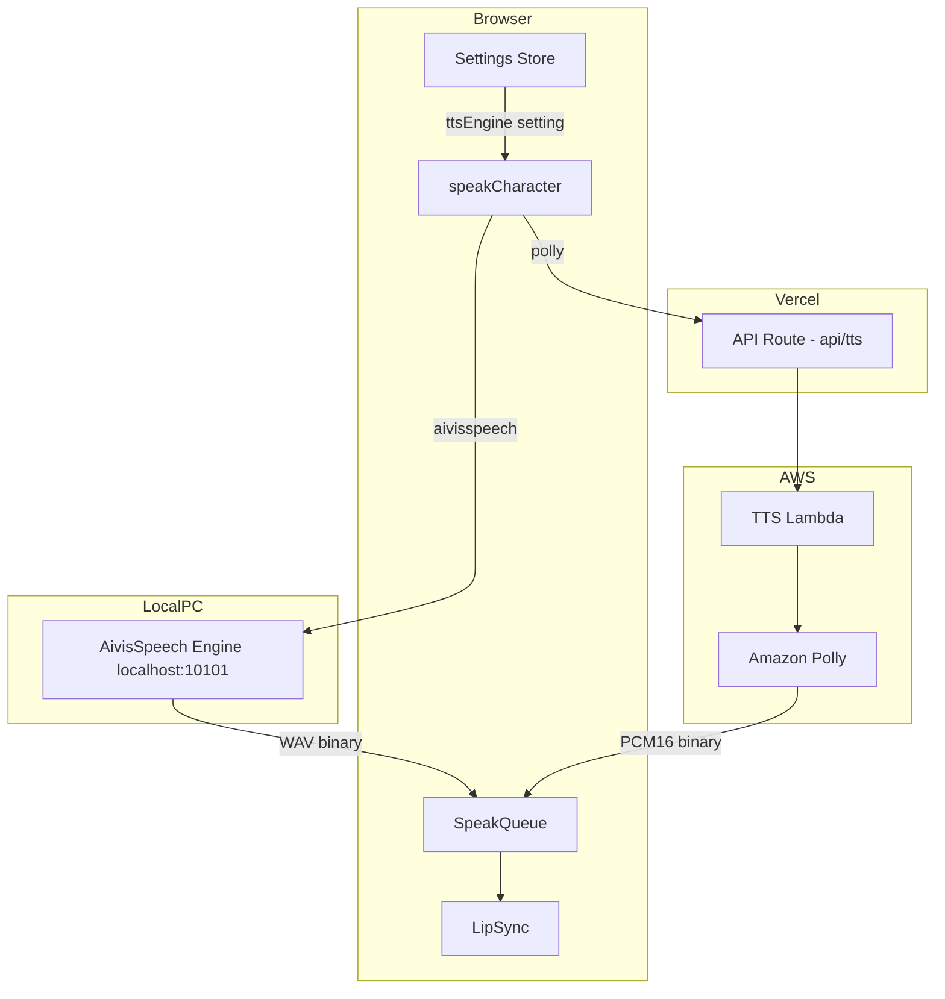
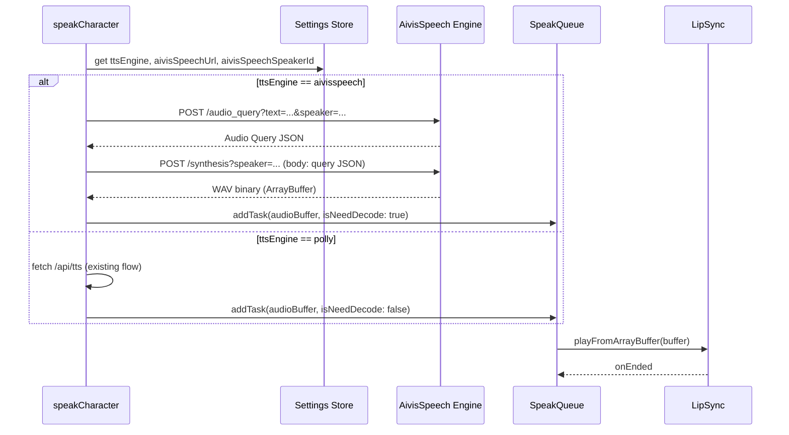
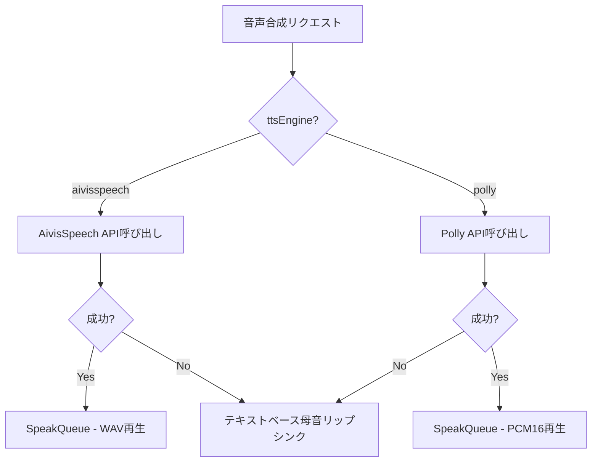

# Design Document: AivisSpeech Local TTS

## Overview

**Purpose**: Amazon Polly（Lambda経由）によるTTSに加え、ブラウザからローカルAivisSpeech Engineへの直接通信によるTTSを提供する。キャラクターらしい自然な音声合成を、追加コストなしで実現する。

**Users**: Tonariのオーナー（個人利用）が、Windows PC上でAivisSpeech Engineを起動し、ブラウザから直接音声合成を利用する。

**Impact**: 既存の音声パス（speakCharacter → /api/tts → Lambda → Polly）に並行して、新たな音声パス（speakCharacter → localhost:10101）を追加。設定UIでエンジン切り替えを可能にする。

### Goals
- AivisSpeech Engineによるキャラクター音声合成をブラウザから直接利用可能にする
- Polly TTSとの切り替えを設定UIで実現する
- セットアップ手順ドキュメントを提供する

### Non-Goals
- AivisSpeech Engineの自動起動・自動検出
- クラウドTTSサービス（Aivis Cloud API等）の統合
- 音声モデルの自動ダウンロード・インストール
- `/speakers` APIからの話者リスト動的取得UI（将来検討）

## Architecture

### Existing Architecture Analysis

現在のTTSフロー:
```
speakCharacter.ts → fetch('/api/tts') → Vercel API Route → Lambda → Amazon Polly
                                                                      ↓
SpeakQueue ← ArrayBuffer(PCM16) ← res.arrayBuffer() ←──────── base64 PCM16
    ↓
LipSync.playFromArrayBuffer(buffer, onEnded, isNeedDecode: false, 16000)
```

変更対象:
- `speakCharacter.ts`: TTS取得ロジックの分岐追加
- `settings.ts`: TTS設定項目の追加
- `based.tsx`: 設定UIの追加

変更なし（流用）:
- `SpeakQueue`: タスクキュー管理はそのまま
- `LipSync`: `isNeedDecode: true` でWAVデコード再生が可能
- `/api/tts.ts`: Pollyパスとして維持

### Architecture Pattern & Boundary Map



**Architecture Integration**:
- Selected pattern: 設定に基づくTTSクライアント関数の分岐（Strategy的アプローチを関数レベルで実現）
- Domain boundaries: TTS取得ロジックをspeakCharacter.tsから関数分離し、エンジン固有の通信処理をカプセル化
- Existing patterns preserved: SpeakQueue/LipSyncパイプライン、Zustand設定Store永続化
- New components rationale: AivisSpeech APIクライアント関数の追加のみ。新規ファイルは最小限
- Steering compliance: フロントエンドロジックはfeatures/配下、設定はZustand Store

### Technology Stack

| Layer | Choice / Version | Role in Feature | Notes |
|-------|------------------|-----------------|-------|
| Frontend | Next.js 14, TypeScript | TTS APIクライアント、設定UI | 既存 |
| TTS Engine | AivisSpeech Engine (Docker) | ローカル音声合成サーバー | 新規追加（ユーザー手動セットアップ） |
| State Management | Zustand + persist | TTS設定の永続化 | 既存拡張 |
| Audio | Web Audio API | WAVデコード・再生 | 既存LipSync流用 |

## System Flows

### AivisSpeech音声合成フロー



### エラーフォールバックフロー



## Requirements Traceability

| Requirement | Summary | Components | Interfaces | Flows |
|-------------|---------|------------|------------|-------|
| 1.1-1.4 | セットアップ手順ドキュメント | docs/aivisspeech-setup.md | - | - |
| 2.1-2.2 | AivisSpeech API通信 | fetchAivisSpeechAudio | AivisSpeech REST API | 音声合成フロー |
| 2.3 | WAV再生・リップシンク | LipSync（既存） | playFromArrayBuffer | 音声合成フロー |
| 2.4 | 通信失敗時フォールバック | speakCharacter | - | エラーフォールバック |
| 3.1-3.4 | 話者選択 | Settings Store, Settings UI | aivisSpeechSpeakerId | - |
| 4.1-4.3 | Engine URL設定 | Settings Store, Settings UI | aivisSpeechUrl | - |
| 5.1-5.4 | TTSエンジン切り替え | Settings Store, Settings UI, speakCharacter | ttsEngine | 音声合成フロー |
| 6.1-6.3 | Polly削除（将来） | - | - | - |

## Components and Interfaces

| Component | Domain/Layer | Intent | Req Coverage | Key Dependencies | Contracts |
|-----------|-------------|--------|--------------|-----------------|-----------|
| fetchAivisSpeechAudio | features/messages | AivisSpeech APIからWAVを取得 | 2.1, 2.2 | AivisSpeech Engine (External P1) | Service |
| speakCharacter（拡張） | features/messages | TTSエンジン分岐 | 2.3, 2.4, 5.2, 5.3 | Settings Store (P0), fetchAivisSpeechAudio (P0) | Service |
| Settings Store（拡張） | features/stores | TTS設定の状態管理・永続化 | 3.1, 3.3, 4.1, 4.3, 5.1 | Zustand (P0) | State |
| Settings UI（拡張） | components/settings | TTS設定UIの表示 | 3.2, 4.2, 5.4 | Settings Store (P0) | - |
| セットアップドキュメント | docs | Docker起動・モデル導入手順 | 1.1-1.4 | - | - |

### Features / Messages Layer

#### fetchAivisSpeechAudio

| Field | Detail |
|-------|--------|
| Intent | AivisSpeech Engineの2ステップAPIを呼び出し、WAVバイナリを返す |
| Requirements | 2.1, 2.2 |

**Responsibilities & Constraints**
- `/audio_query` と `/synthesis` の2ステップAPI呼び出しを1つの非同期関数にカプセル化
- エラー時はErrorをthrowし、呼び出し元でフォールバック処理

**Dependencies**
- External: AivisSpeech Engine REST API — 音声合成 (P1: Engine未起動時はエラー)

**Contracts**: Service [x]

##### Service Interface
```typescript
/**
 * AivisSpeech Engineから音声合成WAVバイナリを取得する
 */
function fetchAivisSpeechAudio(params: {
  text: string
  speakerId: number
  baseUrl: string
}): Promise<ArrayBuffer>
```
- Preconditions: text is non-empty, baseUrl is valid URL, speakerId is valid number
- Postconditions: Returns WAV format ArrayBuffer
- Error: Throws Error on network failure or non-OK response

#### speakCharacter（拡張）

| Field | Detail |
|-------|--------|
| Intent | TTSエンジン設定に基づきPollyまたはAivisSpeechのTTS取得を分岐実行 |
| Requirements | 2.3, 2.4, 5.2, 5.3 |

**Responsibilities & Constraints**
- `ttsEngine` 設定に基づきfetch先を切り替え
- AivisSpeechパスでは `isNeedDecode: true`（WAVデコード）
- Pollyパスでは `isNeedDecode: false`（PCM16直接再生）— 既存動作維持
- AivisSpeechのfetch失敗時はcatchしてテキストベースリップシンクにフォールバック

**Implementation Notes**
- 既存の `speakWithAudio` 関数内で分岐を追加
- audioPromiseの生成部分のみエンジンごとに切り替え、SpeakQueueへの投入以降は共通

### Features / Stores Layer

#### Settings Store（拡張）

| Field | Detail |
|-------|--------|
| Intent | TTS関連設定の追加と永続化 |
| Requirements | 3.1, 3.3, 4.1, 4.3, 5.1 |

**Contracts**: State [x]

##### State Management

追加する設定項目:

```typescript
// General interfaceへの追加
interface General {
  // ... existing fields ...
  ttsEngine: 'aivisspeech' | 'polly'
  aivisSpeechUrl: string
  aivisSpeechSpeakerId: number
}
```

デフォルト値:
```typescript
{
  ttsEngine: 'aivisspeech',
  aivisSpeechUrl: 'http://localhost:10101',
  aivisSpeechSpeakerId: 888753760,  // AivisSpeechデフォルト話者
}
```

- Persistence: Zustand persist middleware経由でlocalStorageに保存（既存パターン踏襲）
- partialize に3項目を追加

### Components / Settings Layer

#### Settings UI（拡張）

| Field | Detail |
|-------|--------|
| Intent | TTSエンジン選択、AivisSpeech URL、Speaker IDの設定UI |
| Requirements | 3.2, 4.2, 5.4 |

**Implementation Notes**
- `voiceEnabled` が `true` の場合のみ表示（既存パターン踏襲）
- TTSエンジン選択: TextButtonによるトグル（aivisspeech / polly）
- AivisSpeech URL: テキスト入力欄（ttsEngine === 'aivisspeech' の場合のみ表示）
- Speaker ID: 数値テキスト入力欄（ttsEngine === 'aivisspeech' の場合のみ表示）
- Polly Voice Model: 既存のTomoko/Kazuha選択（ttsEngine === 'polly' の場合のみ表示）

### Documentation

#### セットアップドキュメント（docs/aivisspeech-setup.md）

| Field | Detail |
|-------|--------|
| Intent | AivisSpeech EngineのDockerセットアップ手順を提供 |
| Requirements | 1.1-1.4 |

**記載内容**:
1. 前提条件（Docker Desktop for Windows）
2. Docker起動コマンド（CPU版 / GPU版）
3. 動作確認方法（`/version`、`/speakers`）
4. 音声モデル（.aivmx）のインストール手順
5. 話者IDの確認方法
6. トラブルシューティング（CORS、ポート競合等）

## Error Handling

### Error Strategy

| エラー種別 | 発生箇所 | 対処 |
|-----------|---------|------|
| AivisSpeech Engine未起動 | fetchAivisSpeechAudio | catch → テキストベースリップシンクにフォールバック |
| ネットワークエラー | fetchAivisSpeechAudio | catch → テキストベースリップシンクにフォールバック |
| audio_query失敗 | fetchAivisSpeechAudio | throw Error → 呼び出し元でフォールバック |
| synthesis失敗 | fetchAivisSpeechAudio | throw Error → 呼び出し元でフォールバック |
| WAVデコード失敗 | LipSync (既存) | 既存のcatch処理でonEnded呼び出し |
| 無効なURL設定 | Settings UI | 入力時バリデーションなし（fetch時にエラーとなりフォールバック） |

フォールバック動作は既存の `speakWithTextLipSync` をそのまま利用する。ユーザーへのエラー通知は console.error のみ（個人利用のため）。

## Testing Strategy

### Unit Tests
- `fetchAivisSpeechAudio`: 正常系（2ステップAPI成功）、異常系（network error、non-OK response）
- Settings Store: 新設定項目の初期値、永続化、型安全性

### Integration Tests
- speakCharacter: ttsEngine切り替えによるパス分岐の動作確認
- フォールバック: AivisSpeech失敗時にテキストベースリップシンクが実行されること

### E2E Tests（手動確認）
- AivisSpeech Engine起動状態で音声再生・リップシンクが動作すること
- 設定UIでエンジン切り替え後、正しいパスで音声合成されること
- Engine未起動時にフォールバック動作すること
