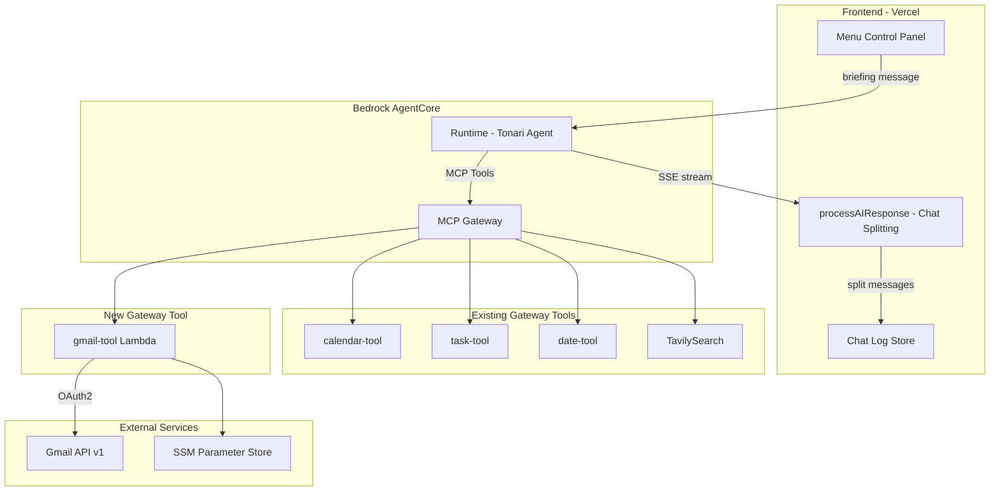
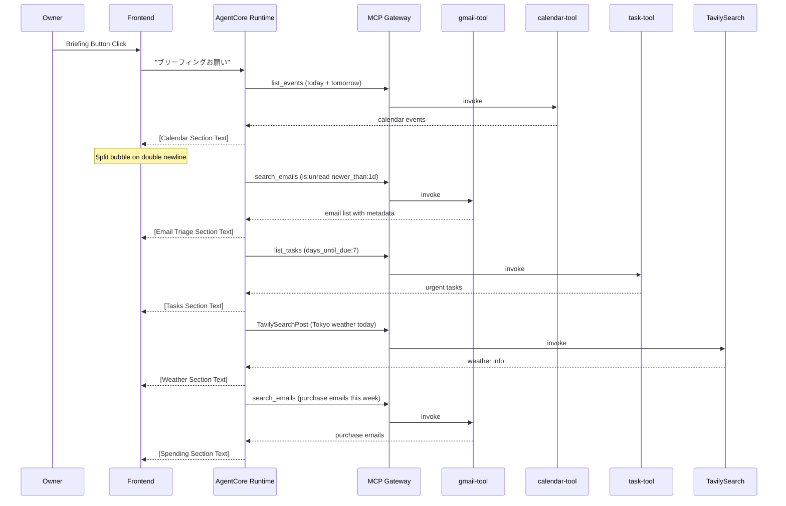
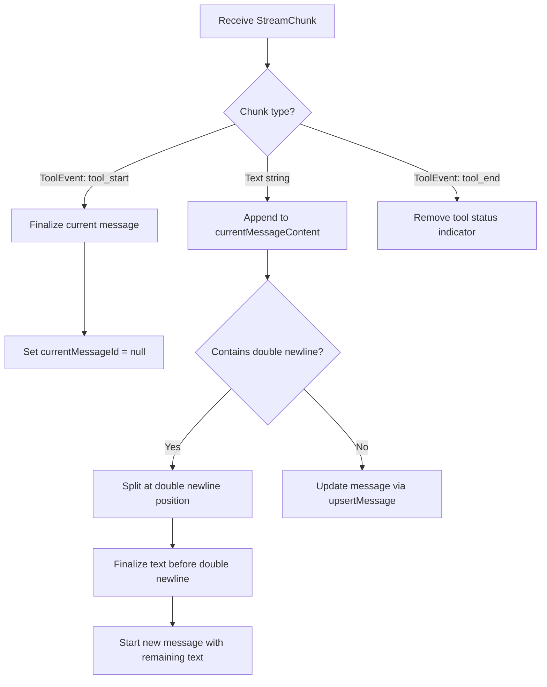

# Technical Design: Briefing Mode

## Overview

**Purpose**: ブリーフィングモード機能は、オーナーが朝の1アクションで Gmail・カレンダー・タスク・天気・支出を横断チェックし、対応が必要な項目を効率的に把握できるようにする。
**Users**: Tonariオーナーが毎朝のルーティンとしてブリーフィングを利用する。また、Gmail連携ツールは日常的なメール確認・下書き作成にも単独利用される。
**Impact**: 新規 gmail-tool Lambda の追加、フロントエンドのチャットバブル分割ロジックの導入、システムプロンプトへのブリーフィング手順の追加。

### Goals

- Gmail API を通じたメール参照・下書き作成・既読化・アーカイブ機能の提供
- ワンアクション（ボタンまたは自然言語）でのブリーフィング起動
- ツール呼び出し境界と空行での自動チャットバブル分割
- 購入メールからの週間支出サマリー（重複排除付き）

### Non-Goals

- メール送信機能（下書き作成まで）
- ブリーフィング専用のバックエンドワークフロー（システムプロンプト駆動で実現）
- メール内容の永続的な保存やインデックス化
- Gmail以外のメールプロバイダー対応

## Architecture

### Existing Architecture Analysis

Tonari は Frontend（Next.js on Vercel）と Backend（AWS Bedrock AgentCore Runtime）の分離アーキテクチャを採用している。エージェントツールは Lambda → MCP Gateway → AgentCore Runtime のパターンで統合されている。

現在のツール構成:
- calendar-tool: Google Calendar API v3（OAuth2、SSM経由）
- task-tool: DynamoDB（タスクCRUD）
- date-tool: 日付計算ユーティリティ
- TavilySearch: Web検索

ブリーフィングに必要なリソースのうち、カレンダー・タスク・天気検索は既存ツールでカバー済み。Gmail連携のみ新規追加が必要。

### Architecture Pattern & Boundary Map



**Architecture Integration**:
- Selected pattern: 既存の Lambda → MCP Gateway Target パターンを踏襲
- Domain boundaries: gmail-tool は独立Lambda。calendar-tool とOAuth2認証情報（SSM）を共有するが、コードは分離
- Existing patterns preserved: ツール追加の CDK パターン、SSE ストリーム処理パターン、Zustand ストアパターン
- New components rationale: gmail-tool は Gmail API 固有のロジック（MIME パース、ラベル操作）を持つため独立Lambda が適切
- Steering compliance: Feature-based + Layer-based hybrid 構造を維持

### Technology Stack

| Layer | Choice / Version | Role in Feature | Notes |
|-------|------------------|-----------------|-------|
| Frontend | Next.js 14 / TypeScript 5.0 | チャット分割ロジック、ブリーフィングUI | 既存 |
| Backend | Python 3.12 / Strands Agent | ブリーフィングオーケストレーション | 既存（プロンプト変更のみ） |
| Gmail API | Gmail API v1 | メール参照・下書き・ラベル操作 | 新規 |
| Auth | google-auth + google-api-python-client | OAuth2 認証 | calendar-tool と同一ライブラリ |
| Infrastructure | CDK / Lambda / MCP Gateway | gmail-tool のデプロイ | 既存パターン踏襲 |

## System Flows

### Briefing Flow



各セクション間でエージェントが空行（`\n\n`）を出力することで、フロントエンドがチャットバブルを自動分割する。

### Chat Bubble Splitting Flow



## Requirements Traceability

| Requirement | Summary | Components | Interfaces | Flows |
|-------------|---------|------------|------------|-------|
| 1.1 | メール検索 | gmail-tool Lambda | search_emails tool | - |
| 1.2 | メール詳細取得 | gmail-tool Lambda | get_email tool | - |
| 1.3 | 下書き作成 | gmail-tool Lambda | create_draft tool | - |
| 1.4 | 既読+アーカイブ | gmail-tool Lambda | archive_email tool | - |
| 1.5 | 検索クエリ対応 | gmail-tool Lambda | search_emails query param | - |
| 1.6 | OAuth2再利用 | gmail-tool Lambda, CDK | SSM credentials | - |
| 1.7 | 送信機能なし | gmail-tool Lambda | - | - |
| 2.1 | UIボタン起動 | BriefingButton | onClick handler | Briefing Flow |
| 2.2 | 自然言語起動 | System Prompt | - | Briefing Flow |
| 2.3 | 5リソースチェック | System Prompt | - | Briefing Flow |
| 2.4 | タスクスキップ | System Prompt | - | - |
| 2.5 | セクション分割表示 | Chat Splitting Logic | - | Chat Splitting Flow |
| 2.6 | プレーンテキスト | System Prompt | - | - |
| 2.7 | メールトリアージ | System Prompt | - | Briefing Flow |
| 2.8 | 支出スキップ | System Prompt | - | - |
| 3.1 | 購入メール検索 | gmail-tool Lambda, System Prompt | search_emails | Briefing Flow |
| 3.2 | 金額抽出・計算 | System Prompt (LLM推論) | - | - |
| 3.3 | 支出報告フォーマット | System Prompt | - | - |
| 3.4 | 重複排除 | System Prompt (LLM推論) | - | - |
| 3.5 | 重複注記 | System Prompt | - | - |
| 3.6 | 不確実注記 | System Prompt | - | - |
| 4.1 | 空行分割 | Chat Splitting Logic | - | Chat Splitting Flow |
| 4.2 | ツール前後分割 | Chat Splitting Logic | - | Chat Splitting Flow |
| 4.3 | tool_start分割 | Chat Splitting Logic | - | Chat Splitting Flow |
| 4.4 | 空行SSE分割 | Chat Splitting Logic | - | Chat Splitting Flow |
| 4.5 | 単一バブル維持 | Chat Splitting Logic | - | - |
| 4.6 | 書式正常表示 | ChatLog Component | - | - |
| 5.1 | ブリーフィングボタン | BriefingButton | - | - |
| 5.2 | メッセージ送信 | BriefingButton | handleSendChat | - |
| 5.3 | ローディング表示 | BriefingButton | chatProcessing state | - |

## Components and Interfaces

| Component | Domain/Layer | Intent | Req Coverage | Key Dependencies | Contracts |
|-----------|-------------|--------|--------------|-----------------|-----------|
| gmail-tool Lambda | Backend/Tool | Gmail API操作（検索・取得・下書き・アーカイブ） | 1.1-1.7 | Gmail API v1 (P0), SSM (P0) | Service |
| gmail-tool Gateway Target | Infrastructure | gmail-tool を MCP Gateway に登録 | 1.1-1.7 | gmail-tool Lambda (P0), MCP Gateway (P0) | API |
| Chat Splitting Logic | Frontend/Handler | SSEストリームのチャットバブル分割 | 4.1-4.6 | homeStore (P0) | State |
| BriefingButton | Frontend/UI | ブリーフィング起動ボタン | 5.1-5.3, 2.1 | handleSendChat (P0), homeStore (P1) | State |
| System Prompt Update | Backend/Config | ブリーフィング手順・Gmailツール説明の追加 | 2.1-2.8, 3.1-3.6 | - | - |

### Backend / Tool Layer

#### gmail-tool Lambda

| Field | Detail |
|-------|--------|
| Intent | Gmail API v1 を通じたメール検索・取得・下書き作成・既読化・アーカイブ |
| Requirements | 1.1, 1.2, 1.3, 1.4, 1.5, 1.6, 1.7 |

**Responsibilities & Constraints**
- Gmail API v1 の messages / drafts リソースに対する操作を担当
- メール送信機能は実装しない（1.7）
- OAuth2 認証情報は SSM Parameter Store から取得（calendar-tool と同一キー）
- Lambda タイムアウト: 30秒（バッチメタデータ取得を考慮）

**Dependencies**
- External: Gmail API v1 — メール操作 (P0)
- External: SSM Parameter Store — OAuth2 認証情報 (P0)
- External: google-api-python-client — API クライアント (P0)
- External: google-auth — OAuth2 credential management (P0)

**Contracts**: Service [x]

##### Service Interface

```python
# Tool dispatch: event["tool"] で分岐

def search_emails(query: str, max_results: int = 20) -> dict:
    """
    Gmail検索クエリでメールを検索し、メタデータ付きリストを返す。

    Returns:
        {
            "emails": [
                {
                    "id": str,
                    "threadId": str,
                    "subject": str,
                    "from": str,
                    "date": str,
                    "snippet": str,
                    "labels": list[str]
                }
            ],
            "resultCount": int
        }
    """

def get_email(message_id: str) -> dict:
    """
    指定メールIDの本文全文を取得する。

    Returns:
        {
            "id": str,
            "subject": str,
            "from": str,
            "to": str,
            "date": str,
            "body": str,
            "labels": list[str]
        }
    """

def create_draft(to: str, subject: str, body: str, thread_id: str | None = None) -> dict:
    """
    Gmailの下書きを作成する。

    Returns:
        {
            "draftId": str,
            "messageId": str
        }
    """

def archive_email(message_id: str) -> dict:
    """
    メールを既読にし、アーカイブする（UNREAD + INBOX ラベル除去）。

    Returns:
        {
            "id": str,
            "status": "archived"
        }
    """
```

- Preconditions: SSM に有効な OAuth2 認証情報が格納されていること。refresh token が gmail.modify + gmail.compose スコープを含むこと
- Postconditions: Gmail API の操作結果が JSON 形式で返却される
- Invariants: メール送信は行わない

**Implementation Notes**
- Integration: calendar-tool と同一の OAuth2 認証パターン（SSM `/tonari/google/*`）を使用。`build("gmail", "v1", credentials=credentials)` で Gmail サービスを構築
- Validation: `messages.list` は ID のみ返却するため、メタデータ取得に `messages.get(format="metadata")` の2パスが必要。バッチリクエストで効率化
- Risks: multipart MIME メッセージの本文パースが複雑。text/plain を優先し、なければ text/html から strip

### Infrastructure Layer

#### gmail-tool Gateway Target

| Field | Detail |
|-------|--------|
| Intent | gmail-tool Lambda を MCP Gateway Target として登録 |
| Requirements | 1.1, 1.2, 1.3, 1.4, 1.5 |

**Responsibilities & Constraints**
- 4つのツール（search_emails, get_email, create_draft, archive_email）のスキーマを定義
- IAM credential を使用（既存パターン）
- gateway.addLambdaTarget() で登録

**Dependencies**
- Inbound: MCP Gateway — ツール呼び出しルーティング (P0)
- Outbound: gmail-tool Lambda — 実行先 (P0)

**Contracts**: API [x]

##### API Contract — MCP Tool Schema

| Tool | Parameters | Required | Description |
|------|-----------|----------|-------------|
| search_emails | query: string, max_results: number | query | Gmail検索構文でメールを検索 |
| get_email | message_id: string | message_id | メールIDで本文全文を取得 |
| create_draft | to: string, subject: string, body: string, thread_id: string | to, subject, body | 下書きを作成 |
| archive_email | message_id: string | message_id | 既読化+アーカイブ |

**Implementation Notes**
- Integration: `infra/lib/agentcore-construct.ts` に calendar-tool と同じパターンで追加。`infra/lib/workload-construct.ts` に Lambda 定義を追加
- Lambda パス: `infra/lambda/gmail-tool/`
- Python依存: `google-api-python-client`, `google-auth` をLambdaレイヤーまたはインラインで含める（calendar-tool と同一手法）

### Frontend / Handler Layer

#### Chat Splitting Logic

| Field | Detail |
|-------|--------|
| Intent | SSEストリーム処理中にチャットバブルの分割ポイントを検出し、メッセージを分離する |
| Requirements | 4.1, 4.2, 4.3, 4.4, 4.5, 4.6 |

**Responsibilities & Constraints**
- `processAIResponse()` 関数内でのストリーム処理ロジック変更
- 2つの分割トリガー: 空行（`\n\n`）、ツール呼び出し（`tool_start`）
- 分割後の各バブルは独立した `messageId` を持つ
- 既存の感情タグ・ジェスチャータグ・カメラタグの処理に影響を与えない

**Dependencies**
- Inbound: SSE ReadableStream — チャンクデータ (P0)
- Outbound: homeStore.upsertMessage — メッセージ永続化 (P0)
- Outbound: generateMessageId — ID生成 (P0)

**Contracts**: State [x]

##### State Management

- State model: 既存の `currentMessageId` と `currentMessageContent` 変数を活用。分割時に両方を `null` / 空文字にリセットし、次のテキストチャンクで新規メッセージを開始する
- Persistence: homeStore の chatLog に自動永続化（既存の debounced localStorage 保存）
- Concurrency: 単一ストリームの逐次処理のため並行性の問題なし

**Implementation Notes**
- Integration: `src/features/chat/handlers.ts` の `processAIResponse()` 内、テキストチャンク処理部分を変更
- `tool_start` イベント検出時: `currentMessageContent` が空でなければ現在のメッセージを確定、`currentMessageId = null` にリセット
- テキスト蓄積後に `currentMessageContent` 内の `\n\n` を検出: 分割位置前のテキストで現在メッセージを確定、分割位置後のテキストで新メッセージを開始
- `\n\n` がチャンク境界をまたぐケース: `currentMessageContent` 末尾が `\n` かつ新チャンク先頭が `\n` の場合も検出する
- Risks: 感情タグ `[happy]` 等がメッセージ先頭に来る前提のロジックに影響する可能性。分割後の最初のバブルのみ感情タグを処理する設計で対応

### Frontend / UI Layer

#### BriefingButton

| Field | Detail |
|-------|--------|
| Intent | コントロールパネルにブリーフィング起動ボタンを配置する |
| Requirements | 5.1, 5.2, 5.3, 2.1 |

**Implementation Notes**
- Integration: `src/components/menu.tsx` のコントロールパネル（TaskIconButton と同列）に追加
- 既存の `IconButton` コンポーネントパターンを使用
- ボタンアイコン: 太陽または新聞アイコン（SVG）
- onClick: `handleSendChatFn` を呼び出して「ブリーフィングお願い」メッセージを送信
- ローディング状態: `homeStore.chatProcessing` を参照して非活性化
- モバイル/縦モニターの `MobileHeader` にも同様のボタンを追加

### Backend / Config Layer

#### System Prompt Update

| Field | Detail |
|-------|--------|
| Intent | ブリーフィング手順、Gmail ツール説明、出力フォーマット指示を追加 |
| Requirements | 2.1-2.8, 3.1-3.6 |

**Implementation Notes**
- 変更ファイル: `agentcore/src/agent/prompts.py`
- Gmail ツール説明セクション: search_emails, get_email, create_draft, archive_email の4ツールの使い方
- ブリーフィングモード指示セクション:
  - 「ブリーフィングして」等のトリガーフレーズの認識
  - 5リソースの順次チェック手順（カレンダー → メールトリアージ → タスク → 天気 → 支出）
  - 各セクション間に空行を挿入する出力フォーマット指示
  - メールトリアージ: 傾向要約 + 要注意メールのハイライト
  - 支出トラッキング: 月曜始まりの週間集計、重複排除判断基準、報告フォーマット
  - スキップ条件（タスクなし、支出なし）

## Data Models

### Gmail API Response Models

メール検索結果とメール詳細のデータ構造。gmail-tool Lambda が Gmail API レスポンスを加工してエージェントに返す。

**EmailSummary** (search_emails レスポンス要素):
- `id`: string — Gmail メッセージID
- `threadId`: string — スレッドID
- `subject`: string — 件名（headers から抽出）
- `from`: string — 差出人（headers から抽出）
- `date`: string — 日時（headers から抽出）
- `snippet`: string — 本文プレビュー（Gmail API の snippet フィールド）
- `labels`: string[] — ラベル一覧

**EmailDetail** (get_email レスポンス):
- 上記に加え `to`: string、`body`: string（text/plain 優先、fallback で text/html strip）

### Chat Message Model

既存の `Message` 型をそのまま使用。分割により chatLog 内のメッセージ数が増加するが、データ構造の変更は不要。

```typescript
type Message = {
  id?: string          // generateMessageId() で生成
  role: string         // "assistant" | "user" | "system" | "tool-status"
  content?: string | [{ type: 'text'; text: string }, { type: 'image'; image: string }]
  audio?: { id: string }
  timestamp?: string
}
```

## Error Handling

### Error Strategy

Gmail API エラーはgmail-tool Lambda内でキャッチし、エージェントに構造化されたエラーメッセージを返す。エージェントはエラー内容をオーナーに自然言語で報告する。

### Error Categories and Responses

**Gmail API Errors**:
- 401 Unauthorized → OAuth2 トークンの refresh 失敗。エラーメッセージ:「Gmail認証が期限切れです。再認証が必要です」
- 403 Forbidden → スコープ不足。エラーメッセージ:「Gmailへのアクセス権限がありません」
- 429 Rate Limit → レート制限超過。エラーメッセージ:「Gmail APIの制限に達しました。しばらく待ってからお試しください」
- 500 Internal → Gmail サーバーエラー。エラーメッセージ:「Gmailサーバーでエラーが発生しました」

**Chat Splitting Errors**:
- ストリーム処理中のエラーは既存のエラーハンドリング（try-catch + toast通知）で対応
- 分割ロジック自体はフェイルセーフ設計（分割に失敗した場合は従来通り1バブルで表示）

## Testing Strategy

### Unit Tests
- gmail-tool Lambda: 各ツール関数（search_emails, get_email, create_draft, archive_email）のレスポンス加工ロジック
- gmail-tool Lambda: MIME メッセージの本文パース（text/plain、text/html、multipart）
- Chat Splitting: `\n\n` 検出ロジック（通常ケース、チャンク境界、連続空行）

### Integration Tests
- gmail-tool Lambda: Gmail API との実際の通信（OAuth2 認証フロー含む）
- MCP Gateway: gmail-tool ターゲットの登録とツール呼び出し
- Briefing Flow: ブリーフィングメッセージ送信 → エージェントの順次ツール呼び出し → 分割表示

### E2E/UI Tests
- ブリーフィングボタン押下 → チャットログに複数バブルで結果表示
- メール確認依頼 → 検索結果表示 → 詳細表示 → 下書き作成
- アーカイブ依頼 → 既読化+アーカイブ完了確認

## Security Considerations

- OAuth2 refresh token は SSM Parameter Store に SecureString として格納（既存パターン）
- Gmail API アクセスは `gmail.modify` + `gmail.compose` スコープに限定。`gmail.send` は意図的に除外
- メール本文はエージェントのコンテキスト内でのみ処理され、永続的に保存されない
- Lambda の IAM ロールは SSM 読取りと Gmail API 呼び出しに必要な最小権限に限定
