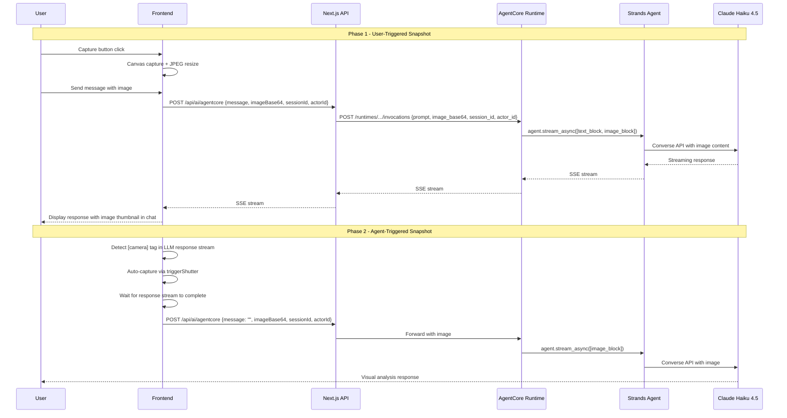
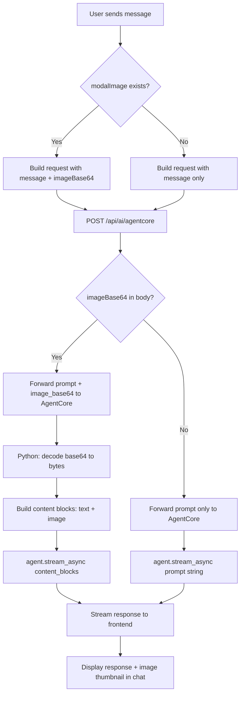
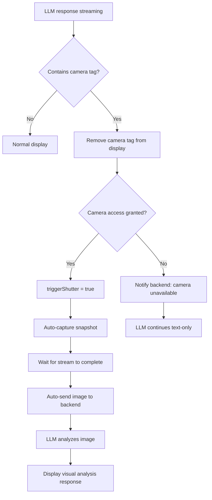

# Design Document

## Overview

**Purpose**: カメラ連携機能により、Tonariエージェントがユーザーの視覚情報（服装、シーンなど）に基づいた香水提案を行えるようにする。

**Users**: 香水ソムリエAIに「見せて相談したい」ユーザーがWebカメラのスナップショットを送信し、視覚情報を含めたアドバイスを受ける。

**Impact**: 既存のテキストのみのチャットフローに画像送信パイプラインを追加する。AITuber-kit由来の複雑なマルチモーダルコードは削除し、Tonari専用のシンプルなカメラ機能を新規構築する。状態管理パターン（`modalImage` / `triggerShutter`）のみ流用する。

### Goals
- Phase 1: ユーザーが手動でスナップショットを撮影し、テキストと共にエージェントに送信できるようにする
- Phase 2: エージェントが`[camera]`タグを使い、自発的に視覚情報を取得できるようにする
- 既存チャット機能に影響を与えない（カメラ機能はオプショナル）

### Non-Goals
- リアルタイム映像ストリーミング分析
- 定期キャプチャ（数秒おきの自動撮影）
- 画像の永続保存やギャラリー機能
- カメラ以外の画像入力（ファイルアップロード、ドラッグ&ドロップ）— 既存のmessageInput内機能は残すが、本設計のスコープ外

## Architecture

### Existing Architecture Analysis

現在のチャットフローと既存マルチモーダルインフラの分析結果。詳細は`research.md`を参照。

**流用する状態管理パターン**:
- `homeStore.modalImage`: キャプチャ画像の一時保持（data URL形式）
- `homeStore.triggerShutter`: プログラム的なキャプチャトリガー（Phase 2で使用）
- `homeStore.webcamStatus`: カメラ有効/無効フラグ
- `Message`型: マルチモーダルcontent対応済み（`[{ type: 'text', text }, { type: 'image', image }]`）

**削除する既存コード**（AITuber-kit由来、Tonariには不要）:
- `src/components/common/VideoDisplay.tsx`: ドラッグ/リサイズ/背景動画など過剰な機能を含む
- `src/components/modalImage.tsx`: サイドパネル表示（新UIに置き換え）
- `src/features/constants/aiModels.ts`内のマルチサービスマルチモーダル判定: `isMultiModalAvailable()`, `multiModalModels`等（TonariはAgentCoreのみ）
- `src/components/form.tsx`内の`multiModalMode`/`isMultiModalAvailable`ロジック: 3モード切替（always/never/ai-decide）は不要
- `src/features/stores/settings.ts`内の`multiModalMode`, `enableMultiModal`, `imageDisplayPosition`関連設定

**新規構築**:
- シンプルなカメラプレビュー+撮影コンポーネント（`CameraPreview`）
- 画像送信パイプライン（フロントエンド → Next.js API → AgentCore → Strands Agent）
- `[camera]`タグ処理ロジック（Phase 2）

### Architecture Pattern & Boundary Map



**Architecture Integration**:
- Selected pattern: 既存コード簡素化 + APIパイプライン拡張
- Domain boundaries: フロントエンドはキャプチャ+エンコード、バックエンドは画像→ContentBlock変換
- Existing patterns preserved: SSEストリーミング、Zustand状態管理、AgentCore Memory統合
- Code cleanup: AITuber-kit由来の複雑なマルチモーダルコードを削除し、Tonari専用のシンプルな実装に置き換え
- New components: `CameraPreview`（getUserMedia + Canvas + 撮影UI）を新規作成
- Steering compliance: TypeScript strict mode、ESLint/Prettier、`any`不使用

### Technology Stack

| Layer | Choice / Version | Role in Feature | Notes |
|-------|------------------|-----------------|-------|
| Frontend | TypeScript 5.0 + Next.js 14 | カメラキャプチャ、画像エンコード、タグパース | 既存 |
| Browser API | getUserMedia + Canvas API | Webカメラアクセス、フレームキャプチャ | 新規CameraPreviewで実装 |
| Backend API | Next.js API Routes | 画像データの中継（FE → AgentCore） | 既存エンドポイント拡張 |
| Agent Runtime | Strands Agents + AgentCore | 画像ContentBlock生成、Claude Vision呼び出し | `app.py`拡張 |
| LLM | Claude Haiku 4.5 via Bedrock | マルチモーダル入力（テキスト+画像）分析 | Vision対応済み |

## System Flows

### Phase 1: ユーザー起動型スナップショット送信フロー



### Phase 2: エージェント起動型フロー



## Requirements Traceability

| Requirement | Summary | Components | Interfaces | Flows |
|-------------|---------|------------|------------|-------|
| 1.1 | getUserMediaでカメラアクセス要求 | CameraPreview (新規) | — | — |
| 1.2 | カメラプレビュー表示 | CameraPreview (新規) | — | — |
| 1.3 | カメラ拒否時のフォールバック | CameraPreview (新規) | — | — |
| 1.4 | 非対応ブラウザのフォールバック | CameraPreview (新規) | — | — |
| 1.5 | カメラ無効化時のストリーム停止 | CameraPreview (新規) | — | — |
| 2.1 | スナップショット撮影ボタン | CameraPreview (新規) | — | — |
| 2.2 | 静止画キャプチャ | CameraPreview (新規) | — | Phase 1 Flow |
| 2.3 | キャプチャプレビュー表示 | CameraPreview (新規) | — | — |
| 2.4 | 撮り直し | CameraPreview (新規) | — | — |
| 2.5 | テキスト+画像同時送信 | AgentCoreChatClient, APIRoute, AgentEntrypoint | ChatRequest, RuntimePayload | Phase 1 Flow |
| 2.6 | 画像のみ送信 | AgentCoreChatClient, APIRoute, AgentEntrypoint | ChatRequest, RuntimePayload | Phase 1 Flow |
| 3.1 | Canvas APIでJPEGキャプチャ | CameraPreview (新規) | — | Phase 1 Flow |
| 3.2 | base64エンコード送信 | AgentCoreChatClient | ChatRequest | Phase 1 Flow |
| 3.3 | 画像リサイズ | CameraPreview (新規) | — | Phase 1 Flow |
| 3.4 | 既存APIエンドポイント拡張 | APIRoute, AgentEntrypoint | ChatRequest, RuntimePayload | Phase 1 Flow |
| 4.1 | base64抽出+ContentBlock変換 | AgentEntrypoint | RuntimePayload | Phase 1 Flow |
| 4.2 | Strands Agent画像形式変換 | AgentEntrypoint | — | Phase 1 Flow |
| 4.3 | テキスト+画像複合メッセージ | AgentEntrypoint | — | Phase 1 Flow |
| 4.4 | 不正画像エラーハンドリング | AgentEntrypoint, APIRoute | — | Phase 1 Flow |
| 5.1 | 画像分析+視覚情報応答 | SystemPrompt | — | — |
| 5.2 | キャラクター設定に沿った応答 | SystemPrompt | — | — |
| 5.3 | 服装/シーンに基づく香水提案 | SystemPrompt | — | — |
| 5.4 | 不鮮明画像時のフォールバック | SystemPrompt | — | — |
| 6.1 | 送信中ローディング表示 | ChatHandlers (既存chatProcessing) | — | — |
| 6.2 | チャット履歴に画像サムネイル | ChatLog (修正) | — | — |
| 6.3 | 送信失敗時のエラー表示 | ChatHandlers (既存エラーハンドリング) | — | — |
| 6.4 | カメラ機能のオプショナル性 | CameraPreview, ChatHandlers | — | — |
| 7.1 | [camera]タグパース | CameraTagHandler | — | Phase 2 Flow |
| 7.2 | 自動キャプチャトリガー | CameraTagHandler | — | Phase 2 Flow |
| 7.3 | 自動送信 | CameraTagHandler, AgentCoreChatClient | ChatRequest | Phase 2 Flow |
| 7.4 | カメラ未許可時のフォールバック | CameraTagHandler | — | Phase 2 Flow |
| 7.5 | タグの表示テキスト除去 | CameraTagHandler | — | Phase 2 Flow |
| 8.1 | [camera]タグ使用ルール | SystemPrompt | — | — |
| 8.2 | 適切なタイミングでのタグ使用 | SystemPrompt | — | — |
| 8.3 | 1応答1回制限 | SystemPrompt | — | — |
| 8.4 | ユーザー意向の尊重 | SystemPrompt | — | — |
| 9.1 | 撮影通知アニメーション | CameraTagHandler | — | Phase 2 Flow |
| 9.2 | 自動キャプチャのサムネイル表示 | ChatLog (修正) | — | Phase 2 Flow |
| 9.3 | 自動撮影無効化オプション | CameraPreview | — | — |

## Components and Interfaces

| Component | Domain/Layer | Intent | Req Coverage | Key Dependencies | Contracts |
|-----------|-------------|--------|--------------|------------------|-----------|
| CameraPreview | Frontend/UI | カメラプレビュー+撮影+リサイズ（**新規**） | 1.1-1.5, 2.1-2.4, 3.1, 3.3, 6.4, 9.3 | homeStore (P0) | State |
| AgentCoreChatClient | Frontend/Chat | 画像データ付きAPIリクエスト送信 | 2.5, 2.6, 3.2, 3.4 | APIRoute (P0) | API |
| ChatHandlers | Frontend/Chat | modalImage取得+API送信、[camera]タグ処理 | 2.5, 6.1, 7.1-7.5, 9.1 | AgentCoreChatClient (P0), homeStore (P0) | Service |
| ChatLog | Frontend/UI | 画像サムネイルのチャット履歴表示 | 6.2, 9.2 | homeStore (P0) | — |
| APIRoute | API/Middleware | 画像データの中継 | 3.4, 4.4 | AgentCore Runtime (P0) | API |
| AgentEntrypoint | Backend/Agent | 画像→ContentBlock変換、Strands Agent呼び出し | 4.1-4.4 | Strands SDK (P0) | Service |
| SystemPrompt | Backend/Config | 画像分析ガイドライン、[camera]タグルール | 5.1-5.4, 8.1-8.4 | — | — |
| CodeCleanup | Frontend | AITuber-kit由来の不要マルチモーダルコード削除 | — | — | — |

### Frontend / UI

#### CameraPreview (新規)

| Field | Detail |
|-------|--------|
| Intent | getUserMediaによるカメラプレビュー表示、スナップショット撮影（JPEG+リサイズ）、撮影画像プレビューを提供するシンプルなコンポーネント |
| Requirements | 1.1-1.5, 2.1-2.4, 3.1, 3.3, 6.4, 9.3 |

**Responsibilities & Constraints**
- getUserMedia APIでWebカメラにアクセスし、video要素でリアルタイムプレビューを表示
- 撮影ボタン押下でCanvas APIを使いJPEG形式でキャプチャ（quality 0.85、長辺最大1024px）
- キャプチャ画像を`homeStore.modalImage`にdata URLとして保存
- `homeStore.triggerShutter`が`true`になった時にプログラム的にキャプチャを実行（Phase 2用）
- カメラON/OFFトグルボタンを提供
- カメラアクセス拒否・非対応ブラウザ時はフォールバック表示

**Dependencies**
- Outbound: homeStore — modalImage保存、triggerShutter監視、webcamStatus更新 (P0)

**Contracts**: State [x]

##### State Management

```typescript
// homeStoreの既存状態を使用
interface CameraState {
  modalImage: string           // キャプチャ画像のdata URL（空文字=未キャプチャ）
  triggerShutter: boolean      // true時に自動キャプチャ実行（Phase 2用）
  webcamStatus: boolean        // カメラストリームが有効かどうか
  cameraOpen: boolean          // カメラプレビューUIの表示/非表示（新規追加）
}
```

**Implementation Notes**
- 配置場所: `src/components/cameraPreview.tsx`（新規ファイル）
- 既存の`VideoDisplay`（ドラッグ/リサイズ/背景動画）は削除し、このコンポーネントに置き換え
- `ModalImage`コンポーネントも削除
- **UIパターン: 撮影時のみ表示型（Pattern B）**
  - 通常時: メッセージ入力欄付近にカメラアイコンボタンを表示
  - カメラボタン押下: カメラプレビュー（ライブ映像）を表示 + 撮影ボタン
  - 撮影ボタン押下: キャプチャ画像のプレビュー + 送信/撮り直しボタン
  - 送信またはキャンセル: プレビューを閉じて通常状態に戻る
  - カメラは未使用時にはストリームを停止する（リソース節約）
- 画像の具体的な表示位置・レイアウトは実装時に調整

#### CodeCleanup (削除対象)

| Field | Detail |
|-------|--------|
| Intent | AITuber-kit由来の不要なマルチモーダルコードを削除し、コードベースを簡素化する |
| Requirements | — |

**削除対象ファイル/コード**:
- `src/components/common/VideoDisplay.tsx`: 全削除
- `src/components/modalImage.tsx`: 全削除
- `src/hooks/useDraggable.ts`, `src/hooks/useResizable.ts`: VideoDisplay専用フック、全削除（他で未使用の場合）
- `src/components/form.tsx`: `multiModalMode`, `isMultiModalAvailable`, `enableMultiModal`, `customModel`関連ロジックを削除。シンプルにmodalImageの有無のみで判定するように簡素化
- `src/features/constants/aiModels.ts`: `isMultiModalAvailable()`, `isMultiModalModelWithToggle()`, `multiModalModels`関連関数を削除（TonariはAgentCoreのみ使用）
- `src/features/stores/settings.ts`: `multiModalMode`, `enableMultiModal`, `imageDisplayPosition`関連の状態を削除
- `src/components/messageInput.tsx`: マルチモーダル判定ロジックの参照を削除

### Frontend / Chat

#### AgentCoreChatClient

| Field | Detail |
|-------|--------|
| Intent | 画像データを含むチャットリクエストをNext.js APIに送信する |
| Requirements | 2.5, 2.6, 3.2, 3.4 |

**Responsibilities & Constraints**
- テキストメッセージと画像データ（base64）を`/api/ai/agentcore`に送信
- 画像がない場合は既存の動作を維持（後方互換性）
- SSEストリーミングレスポンスの処理は既存ロジックをそのまま維持

**Dependencies**
- Outbound: APIRoute — チャットリクエスト送信 (P0)
- Inbound: ChatHandlers — メッセージ送信トリガー (P0)

**Contracts**: API [x]

##### API Contract

| Method | Endpoint | Request | Response | Errors |
|--------|----------|---------|----------|--------|
| POST | /api/ai/agentcore | ChatRequest | SSE Stream | 400, 500 |

```typescript
interface ChatRequest {
  message: string
  sessionId: string
  actorId: string
  imageBase64?: string      // JPEG base64 encoded string (data URL prefix removed)
  imageFormat?: 'jpeg'      // Image format identifier
}
```

#### ChatHandlers

| Field | Detail |
|-------|--------|
| Intent | チャット送信時にmodalImageを取得してAPIに渡す。Phase 2では[camera]タグの検出と自動キャプチャを制御する |
| Requirements | 2.5, 6.1, 7.1-7.5, 9.1 |

**Responsibilities & Constraints**
- `handleSendChatFn()`: modalImageが存在する場合、画像データをAPIリクエストに含める
- `processAIResponse()`: 画像データをAgentCoreChatClientに渡す
- Phase 2: ストリーミング中に`[camera]`タグを検出してtriggerShutterを発火
- Phase 2: ストリーミング完了後に自動的に画像付きメッセージを送信

**Dependencies**
- Outbound: AgentCoreChatClient — API呼び出し (P0)
- Outbound: homeStore — modalImage取得、triggerShutter制御 (P0)

**Contracts**: Service [x]

##### Service Interface

```typescript
// Phase 1: 既存handleSendChatFnの拡張
// modalImageが存在する場合、テキストと共にAPIに送信する
// 送信後、modalImageをクリアする

// Phase 2: [camera]タグ処理
interface CameraTagHandler {
  detectCameraTag(text: string): boolean
  removeCameraTag(text: string): string
  triggerAutoCapture(): void
  sendAutoCapturedImage(imageBase64: string): Promise<void>
}
```

**Implementation Notes**
- Phase 1: `handleSendChatFn`内で`homeStore.getState().modalImage`を参照し、存在すればAPIリクエストに含める。data URL prefix (`data:image/...;base64,`)を除去してbase64部分のみ送信する。送信後に`modalImage`をクリアする
- Phase 2: `[camera]`タグの検出パターンは`/\[camera\]/g`。既存の`removeGestureTags`と同様のパターンで実装。ストリーミング中に検出した場合は`triggerShutter = true`でキャプチャし、ストリーム完了後に`processAIResponse()`を再帰的に呼び出して画像を送信する
- Phase 2の自動送信では、ユーザーメッセージとしてではなくシステム的な送信であるため、chatLogへの表示は画像サムネイルのみとする

### API / Middleware

#### APIRoute

| Field | Detail |
|-------|--------|
| Intent | フロントエンドから受信した画像データをAgentCore Runtimeに中継する |
| Requirements | 3.4, 4.4 |

**Responsibilities & Constraints**
- リクエストボディから`imageBase64`を抽出し、AgentCore Runtimeへのペイロードに含める
- 画像なしの場合は既存の動作を維持
- エラー時は適切なHTTPステータスコードを返す

**Dependencies**
- Inbound: AgentCoreChatClient — チャットリクエスト受信 (P0)
- Outbound: AgentCore Runtime — Runtime呼び出し (P0)
- External: Cognito — アクセストークン取得 (P0)

**Contracts**: API [x]

##### API Contract

AgentCore Runtimeへの送信ペイロード:

```typescript
interface RuntimePayload {
  prompt: string
  session_id: string
  actor_id: string
  image_base64?: string    // JPEG base64 encoded string
  image_format?: string    // "jpeg"
}
```

### Backend / Agent

#### AgentEntrypoint

| Field | Detail |
|-------|--------|
| Intent | 受信した画像データをStrands AgentsのContentBlock形式に変換し、Claude Visionで分析する |
| Requirements | 4.1, 4.2, 4.3, 4.4 |

**Responsibilities & Constraints**
- payloadから`image_base64`を抽出し、`base64.b64decode()`でraw bytesに変換
- テキスト+画像のContentBlockリストを構築してStrands Agentに渡す
- 画像なしの場合は既存の文字列promptを使用（後方互換性）
- 不正なbase64データの場合はテキストのみにフォールバック

**Dependencies**
- Inbound: APIRoute — ペイロード受信 (P0)
- External: Strands SDK — Agent呼び出し (P0)
- External: Claude Haiku 4.5 via Bedrock — LLM推論 (P0)

**Contracts**: Service [x]

##### Service Interface

```python
# 画像データがある場合のcontentブロック構築
def build_content_blocks(prompt: str, image_base64: str | None, image_format: str = "jpeg") -> list | str:
    """
    Args:
        prompt: テキストプロンプト
        image_base64: base64エンコードされた画像データ（Noneの場合テキストのみ）
        image_format: 画像フォーマット（"jpeg"）
    Returns:
        画像がある場合: [{"text": prompt}, {"image": {"format": image_format, "source": {"bytes": decoded_bytes}}}]
        画像がない場合: prompt (string)
    """
```

**Implementation Notes**
- `agent.stream_async()`はstringまたはContentBlockリストの両方を受け付ける
- 画像がある場合のみリスト形式で渡し、ない場合は既存のstring形式を維持
- `base64.b64decode()`で変換失敗した場合はログ出力してテキストのみにフォールバック

### Backend / Config

#### SystemPrompt

| Field | Detail |
|-------|--------|
| Intent | 画像分析のガイドラインと[camera]タグの使用ルールを定義する |
| Requirements | 5.1-5.4, 8.1-8.4 |

**Responsibilities & Constraints**
- Phase 1: 画像付きメッセージを受信した際の応答ガイドライン
- Phase 2: `[camera]`タグの使用タイミング・制限・使用例
- 既存のフォーマットルール（Markdown禁止、感情タグ、ジェスチャータグ）との整合性維持

**Implementation Notes**
- Phase 1のプロンプト追加は「画像分析のルール」セクションとして、「香水提案のルール」の後に配置
- Phase 2のプロンプト追加は「ジェスチャー指示」セクションの後に「カメラ指示」セクションとして配置
- `[camera]`タグは1応答あたり最大1回、ジェスチャータグとの併用は可能

## Data Models

### Domain Model

本機能で新規のデータ永続化は不要。画像データはリクエスト単位のトランジェントデータとして扱う。

**既存データモデルへの影響**:
- `Message.content`: 既存のマルチモーダル型（`[{ type: 'text', text: string }, { type: 'image', image: string }]`）をそのまま使用
- `homeStore.modalImage`: 既存のdata URL string型をそのまま使用

### Data Contracts & Integration

**API Data Transfer**

フロントエンド → Next.js API:
```typescript
// Request body
{
  message: string              // テキストメッセージ（空文字列可）
  sessionId: string
  actorId: string
  imageBase64?: string         // data URL prefixを除去したbase64文字列
  imageFormat?: "jpeg"         // 画像フォーマット
}
```

Next.js API → AgentCore Runtime:
```typescript
// Request body
{
  prompt: string               // テキストプロンプト
  session_id: string
  actor_id: string
  image_base64?: string        // base64エンコード画像
  image_format?: string        // "jpeg"
}
```

AgentCore Runtime → Strands Agent:
```python
# テキストのみ
agent.stream_async("prompt string")

# テキスト + 画像
agent.stream_async([
    {"text": "user message"},
    {
        "image": {
            "format": "jpeg",
            "source": {
                "bytes": b"raw bytes from base64.b64decode()"
            }
        }
    }
])
```

## Error Handling

### Error Categories and Responses

**User Errors (4xx)**:
- カメラアクセス拒否 → カメラ不要のテキストチャット継続
- 非対応ブラウザ → カメラUI非表示、テキストチャットのみ
- 空メッセージ（画像もテキストもなし）→ 送信ボタン無効化

**System Errors (5xx)**:
- base64デコード失敗 → テキストのみでフォールバック（ログ出力）
- AgentCore Runtime画像処理エラー → テキストのみでフォールバック
- Claude Vision APIエラー → テキストベースの応答にフォールバック

**Phase 2固有エラー**:
- `[camera]`タグ検出時にカメラ未許可 → バックエンドに「カメラ利用不可」を通知、テキスト継続

### Monitoring
- 画像付きリクエストの成功/失敗率（ログ出力）
- 画像サイズの分布（リサイズ後の実測値）

## Testing Strategy

### Unit Tests
- `build_content_blocks()`: テキストのみ、テキスト+画像、画像のみ、不正base64の各パターン
- `ChatRequest`バリデーション: imageBase64の有無による分岐
- `detectCameraTag()` / `removeCameraTag()`: タグ検出と除去
- data URL prefix除去ロジック

### Integration Tests
- フロントエンド → Next.js API → AgentCore Runtime の画像送信E2Eフロー
- 画像なしリクエストの後方互換性確認
- Phase 2: ストリーミング応答中の`[camera]`タグ検出→自動キャプチャ→送信フロー

### E2E Tests
- カメラ許可 → スナップショット撮影 → テキスト+画像送信 → 視覚情報に基づく応答
- カメラ拒否 → テキストのみチャット正常動作
- Phase 2: エージェントが`[camera]`タグで自動キャプチャ → 画像分析応答

## Security Considerations

- カメラアクセスはブラウザの権限管理に委託（ユーザー明示許可必須）
- 画像データはリクエスト単位のトランジェントデータであり、サーバー側に永続保存しない
- base64画像データはHTTPS経由でのみ送信（Vercel + AgentCore間はCognito M2M認証済み）
- 画像サイズはフロントエンドでリサイズ制限（長辺1024px、JPEG quality 0.85）

## Performance & Scalability

- 画像リサイズ（長辺1024px）+ JPEG圧縮（quality 0.85）で100-200KB/画像を目標
- base64エンコード後は約130-270KB（33%オーバーヘッド）
- Claude Visionのトークンコスト: `(width * height) / 750` ≈ 約1,400トークン（1024x1024の場合）
- 画像付きリクエストのレイテンシ増加は画像解析分のLLM推論時間（+1-3秒見込み）
