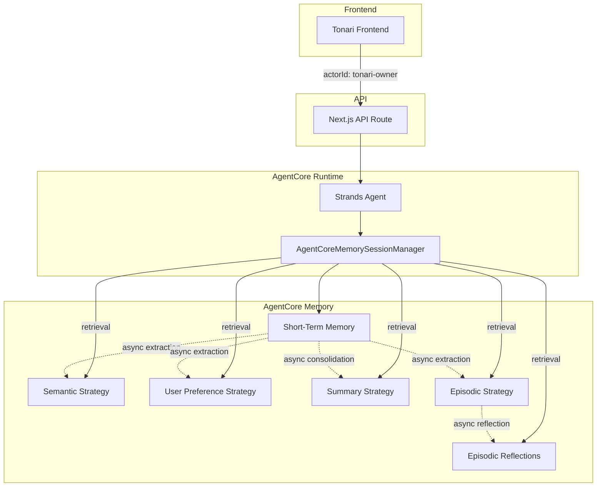
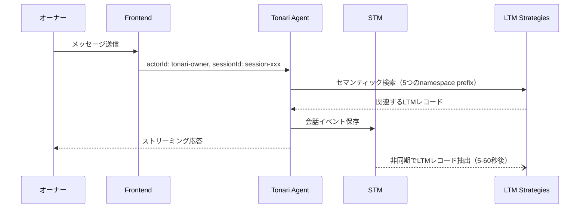

# Design Document

## Overview

**Purpose**: Tonariをオーナー1人のための専属パーソナルAIエージェントとして確立する。アクセス元の端末やセッションに関係なく、すべてのメモリ（STM・LTM）をオーナー専属として一元管理する。

**Users**: Tonariオーナー（個人）が、PC・スマートフォン等の複数端末から利用する。

**Impact**: 現在のブラウザ単位のactorId生成を固定値に変更し、AgentCore Memoryリソースに4つのLTMストラテジーを導入することで、端末・セッション横断の長期記憶を実現する。

### Goals
- オーナー固定のactorIdにより全端末・全セッションでメモリを統一
- 4つのLTMストラテジー（Semantic, UserPreference, Summary, Episodic）の導入
- クロスセッション対応のretrieval_config設計

### Non-Goals
- マルチユーザー対応（認証ベースのactorId割り当て）
- LTMストラテジーのカスタムプロンプトによるチューニング
- STMのセッション間共有（STMはセッション単位の会話コンテキストとして維持）

## Architecture

### Existing Architecture Analysis

現在のメモリフローは以下の通り:

1. **Frontend** (`agentCoreChat.ts`): `localStorage`で`actorId`（ランダムUUID）と`sessionId`を生成
2. **API Route** (`agentcore.ts`): フロントエンドから受け取った`actorId`と`sessionId`をAgentCore Runtimeに転送
3. **Backend** (`tonari_agent.py`): `AgentCoreMemoryConfig`でSTM + LTM取得を設定。現在retrieval_configに3つのnamespace prefixを定義
4. **AgentCore Memory**: STMイベントの保存・取得は動作中だが、LTMストラテジーが未設定のためLTMレコードは蓄積されていない

**課題**:
- `actorId`がブラウザごとに異なるUUIDのため、端末間でメモリが分離
- LTMストラテジーが未設定のため、好み・事実・要約・エピソードが永続化されない
- `/summaries/{actorId}/{sessionId}`のretrieval prefixがセッション固定で、過去セッションの要約が取得できない

### Architecture Pattern & Boundary Map



**Architecture Integration**:
- **Selected pattern**: 既存のフロントエンド→API→AgentCore Runtimeフローを維持し、メモリ設定のみ拡張
- **Domain boundaries**: フロントエンド（actorId固定化）とバックエンド（retrieval_config拡張）の変更は独立して実施可能
- **Existing patterns preserved**: SSEストリーミング、Cognito M2M認証、MCP Gateway統合
- **New components rationale**: 新規コンポーネントなし。既存の`AgentCoreMemoryConfig`設定の変更のみ

### Technology Stack

| Layer | Choice / Version | Role in Feature | Notes |
|-------|------------------|-----------------|-------|
| Frontend | TypeScript / Next.js 14 | actorId固定値の提供 | 既存`agentCoreChat.ts`の変更のみ |
| Backend | Python 3.12 / Strands Agents | retrieval_config拡張 | 既存`tonari_agent.py`の変更のみ |
| Data / Storage | AgentCore Memory | STM + LTM 4ストラテジー | `update-memory` APIでストラテジー追加 |
| Infrastructure | AWS CLI | メモリリソース更新 | `aws bedrock-agentcore-control update-memory` |

## System Flows

### LTMストラテジーの保存・取得フロー



**Key Decisions**:
- LTM取得はリクエスト処理の最初に実行され、過去の記憶を考慮した応答を生成
- LTM保存（抽出）は非同期で行われ、応答レイテンシに影響しない

## Requirements Traceability

| Requirement | Summary | Components | Interfaces | Flows |
|-------------|---------|------------|------------|-------|
| 1.1 | オーナー専属エージェントとして振る舞う | OwnerActorId, RetrievalConfig | — | — |
| 1.2 | 固定actorIdの送信 | OwnerActorId | — | — |
| 1.3 | STMセッション管理 + LTMセッション間共有 | RetrievalConfig | — | LTM保存取得フロー |
| 2.1 | 事実情報の自動抽出・永続化 | MemoryStrategies | UpdateMemory API | LTM保存取得フロー |
| 2.2 | オーナー単位namespace保存 | MemoryStrategies, RetrievalConfig | — | — |
| 2.3 | セマンティック検索による事実取得 | RetrievalConfig | — | LTM保存取得フロー |
| 3.1 | 好み・嗜好の自動抽出・永続化 | MemoryStrategies | UpdateMemory API | LTM保存取得フロー |
| 3.2 | オーナー単位namespace保存 | MemoryStrategies, RetrievalConfig | — | — |
| 3.3 | セマンティック検索による好み取得 | RetrievalConfig | — | LTM保存取得フロー |
| 4.1 | 会話要約の自動生成・永続化 | MemoryStrategies | UpdateMemory API | LTM保存取得フロー |
| 4.2 | セッション単位保存 + クロスセッション取得 | MemoryStrategies, RetrievalConfig | — | LTM保存取得フロー |
| 4.3 | セマンティック検索による要約取得 | RetrievalConfig | — | LTM保存取得フロー |
| 5.1 | エピソードの構造化記録・永続化 | MemoryStrategies | UpdateMemory API | LTM保存取得フロー |
| 5.2 | セッション単位保存 + クロスセッション取得 | MemoryStrategies, RetrievalConfig | — | LTM保存取得フロー |
| 5.3 | リフレクション生成・オーナー単位保存 | MemoryStrategies | UpdateMemory API | LTM保存取得フロー |
| 5.4 | エピソード・リフレクションのセマンティック検索 | RetrievalConfig | — | LTM保存取得フロー |

## Components and Interfaces

| Component | Domain/Layer | Intent | Req Coverage | Key Dependencies | Contracts |
|-----------|--------------|--------|--------------|------------------|-----------|
| OwnerActorId | Frontend | 固定actorIdの提供 | 1.1, 1.2 | — | — |
| RetrievalConfig | Backend | LTM取得namespace設定 | 1.3, 2.2, 2.3, 3.2, 3.3, 4.2, 4.3, 5.2, 5.4 | AgentCoreMemoryConfig (P0) | Service |
| MemoryStrategies | Infrastructure | LTMストラテジーのリソース設定 | 2.1, 3.1, 4.1, 5.1, 5.3 | AgentCore Memory (P0) | API |

### Frontend Layer

#### OwnerActorId

| Field | Detail |
|-------|--------|
| Intent | 全端末・全セッションで同一の固定actorIdを提供する |
| Requirements | 1.1, 1.2 |

**Responsibilities & Constraints**
- 固定文字列`tonari-owner`を返却する
- `localStorage`による動的生成を廃止
- `sessionId`の生成ロジックは変更しない（STM用に維持）

**Dependencies**
- Outbound: AgentCore API Route — actorIdの送信 (P0)

**Contracts**: State [ ]

**Implementation Notes**
- `getActorId()`関数を固定値返却に変更。`localStorage`アクセスを削除
- 既存の`localStorage`に保存されたランダムactorIdは参照されなくなるが、クリーンアップは不要（無害）

### Backend Layer

#### RetrievalConfig

| Field | Detail |
|-------|--------|
| Intent | 5つのnamespace prefixでLTMのクロスセッション・クロスデバイス取得を設定する |
| Requirements | 1.3, 2.2, 2.3, 3.2, 3.3, 4.2, 4.3, 5.2, 5.4 |

**Responsibilities & Constraints**
- `AgentCoreMemoryConfig`の`retrieval_config`を5つのnamespace prefixに拡張する
- 各namespaceの`top_k`と`relevance_score`を適切に設定する
- namespace末尾は`/`で統一する（プレフィックス衝突防止）

**Dependencies**
- External: AgentCore Memory — LTMレコードのセマンティック検索 (P0)
- External: bedrock_agentcore.memory — AgentCoreMemoryConfig, RetrievalConfig (P0)

**Contracts**: Service [x]

##### Service Interface

```python
# retrieval_config定義（AgentCoreMemoryConfigに渡す辞書）
retrieval_config: dict[str, RetrievalConfig] = {
    "/preferences/{actorId}/": RetrievalConfig(top_k=5, relevance_score=0.5),
    "/facts/{actorId}/": RetrievalConfig(top_k=10, relevance_score=0.4),
    "/summaries/{actorId}/": RetrievalConfig(top_k=3, relevance_score=0.6),
    "/episodes/{actorId}/": RetrievalConfig(top_k=3, relevance_score=0.5),
    "/reflections/{actorId}/": RetrievalConfig(top_k=3, relevance_score=0.5),
}
```

- Preconditions: AgentCore MemoryリソースにLTMストラテジーが設定済みであること
- Postconditions: エージェント呼び出し時に5つのnamespace prefixからLTMレコードがセマンティック検索される

**Implementation Notes**
- 既存の3つのretrieval_configキーを5つに拡張
- `/summaries/{actorId}/{sessionId}`から`/summaries/{actorId}/`に変更（クロスセッション化）
- 既存キーの末尾に`/`を追加（`/preferences/{actorId}` → `/preferences/{actorId}/`）

### Infrastructure Layer

#### MemoryStrategies

| Field | Detail |
|-------|--------|
| Intent | AgentCore Memoryリソースに4つのLTMストラテジーを追加する |
| Requirements | 2.1, 3.1, 4.1, 5.1, 5.3 |

**Responsibilities & Constraints**
- 既存メモリリソース`tonari_mem-SZ0n7JG0K4`にストラテジーを追加（再作成不要）
- 各ストラテジーのnamespaceはオーナー単位でデータを集約する設計
- Summary/Episodicの保存namespaceには`{sessionId}`を含める（セッション単位で生成されるため）

**Dependencies**
- External: AWS CLI (`aws bedrock-agentcore-control`) — UpdateMemory API (P0)
- External: AgentCore Memory Service — ストラテジー実行エンジン (P0)

**Contracts**: API [x]

##### API Contract

| Operation | API | Request | Response | Errors |
|-----------|-----|---------|----------|--------|
| ストラテジー追加 | `update-memory` | addMemoryStrategies (4ストラテジー) | Memory (更新済み) | ValidationException, ResourceNotFoundException |

**Namespace設計**:

| Strategy | 保存Namespace | 取得Prefix | スコープ |
|----------|--------------|-----------|---------|
| Semantic | `/facts/{actorId}/` | `/facts/{actorId}/` | オーナー単位 |
| User Preference | `/preferences/{actorId}/` | `/preferences/{actorId}/` | オーナー単位 |
| Summary | `/summaries/{actorId}/{sessionId}/` | `/summaries/{actorId}/` | 保存:セッション単位、取得:全セッション横断 |
| Episodic | `/episodes/{actorId}/{sessionId}/` | `/episodes/{actorId}/` | 保存:セッション単位、取得:全セッション横断 |
| Episodic Reflection | `/reflections/{actorId}/` | `/reflections/{actorId}/` | オーナー単位 |

**Implementation Notes**
- `agentcore` CLIには`memory update`がないため、`aws` CLIを直接使用する
- ストラテジー追加は既存STMデータに影響しない
- 追加後、`get-memory`でストラテジーの設定状態を確認する

## Data Models

### Domain Model

本機能では新規データモデルの定義は不要。AgentCore Memoryが管理するSTM/LTMレコードの構造はサービス側で定義済み。

**変更されるデータの流れ**:
- **STMイベント**: 変更なし（既存通り会話メッセージを保存）
- **LTMレコード**: 4つのストラテジーにより非同期で自動生成される（事実、好み、要約、エピソード、リフレクション）
- **Namespace**: LTMレコードの保存先が上記Namespace設計に従って決定される

### Data Contracts & Integration

**API Data Transfer**:
- フロントエンド→API Route: 既存の`{ message, sessionId, actorId }`構造を維持。`actorId`の値が固定値に変わるのみ
- API Route→AgentCore Runtime: 既存の`{ prompt, session_id, actor_id }`構造を維持

## Error Handling

### Error Strategy
既存のエラーハンドリングパターンを維持する。LTMストラテジー関連のエラーはAgentCore Memory側で処理され、アプリケーションレイヤーには影響しない。

### Error Categories and Responses
- **LTMストラテジー未設定**: MemoryリソースにLTMストラテジーがない場合、retrieval_configのセマンティック検索は空結果を返す（エラーにはならない）。Graceful degradation
- **UpdateMemory API失敗**: `ValidationException`（不正なストラテジー設定）、`ResourceNotFoundException`（メモリIDが不正）→ AWS CLIのエラーメッセージで対応

## Testing Strategy

### Integration Tests
- AWS CLIで`get-memory`を実行し、4つのLTMストラテジーが正しく設定されていることを確認
- 会話後に`list-long-term-memory-records`で各namespaceにLTMレコードが生成されていることを確認

### E2E Tests
- 端末Aで「柑橘系の香りが好き」と伝え、端末Bで「おすすめは？」と質問 → 好みが反映された回答が返ること
- セッション1で「先週ソヴァージュを買った」と伝え、セッション2で購入履歴を確認 → 事実情報が取得されること
- 複数セッションの会話後、新しいセッションで過去の会話内容に言及 → サマリーが取得されること

### Build Verification
- `npm run build`でフロントエンドのビルドが成功すること
