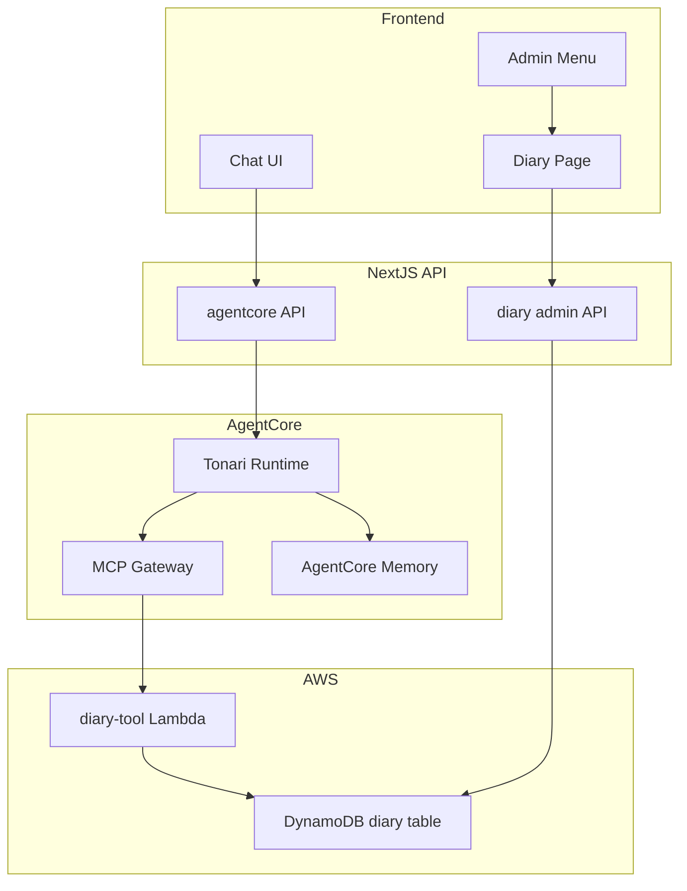
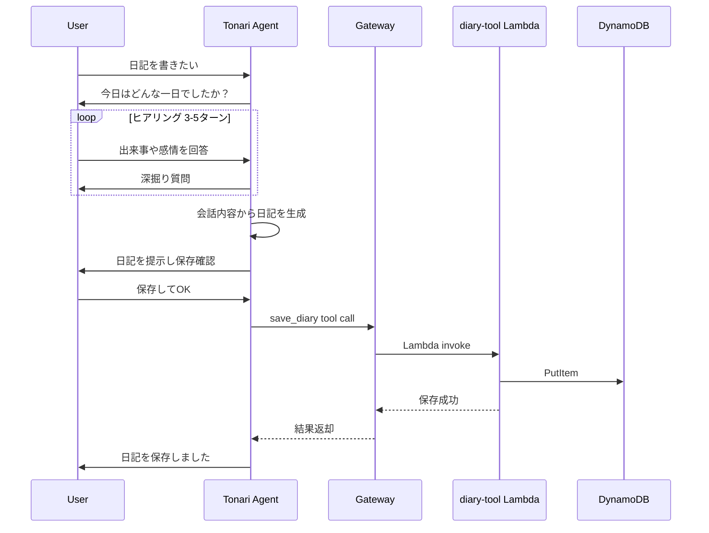

# Design Document: diary-hearing-generation

## Overview

**Purpose**: ヒアリング形式の日記生成機能により、ユーザーが対話を通じて日記を作成・蓄積できるようにする。
**Users**: Tonariのエンドユーザーがエージェントとの会話を通じて日記を生成し、管理画面から閲覧する。
**Impact**: 既存のTonari Runtimeにdiary toolを追加し、管理画面にメニュー+日記閲覧ページを追加する。

### Goals
- エージェントが3〜5ターンのヒアリングでユーザーの1日を聞き取り、日記を自動生成する
- 日記をDynamoDBに保存し、管理画面から閲覧可能にする
- 既存アーキテクチャを最大限活用し、最小限の変更で実装する

### Non-Goals
- 日記の編集・修正機能（管理画面からの閲覧のみ）
- 日記の共有・エクスポート機能
- 別Runtimeでの日記エージェント（既存Runtime内で実装）
- 画像・メディア添付機能

## Architecture

### Existing Architecture Analysis

現在のアーキテクチャ:
- **Frontend**: Next.js (Vercel) → `/api/ai/agentcore` → AgentCore Runtime
- **Agent**: Strands Agent + MCP Gateway tools (perfume-search, twitter-read/write, tavily)
- **Admin**: `/admin/perfumes` → `/api/admin/perfumes` → REST API Gateway → Lambda → DynamoDB
- **Infra**: CDK Stack (CognitoConstruct, WorkloadConstruct, AgentCoreConstruct)

変更対象:
- AgentCoreConstruct: Gateway targetにdiary-toolを追加
- WorkloadConstruct: DynamoDBテーブル+diary Lambda追加
- agentcore/src/agent/prompts.py: ヒアリングモード指示追加
- Frontend: admin menu + diary閲覧ページ追加、Next.js APIルート追加

### Architecture Pattern & Boundary Map



**Architecture Integration**:
- Selected pattern: 既存Gateway target追加パターン（perfume-searchと同一アプローチ）
- Domain boundaries: エージェント会話（AgentCore）と管理画面（Next.js）の分離を維持
- Existing patterns preserved: MCP Gateway経由のツール呼び出し、DynamoDB + Lambda構成
- New components: diary-tool Lambda、DynamoDBテーブル、管理画面ページ
- 管理画面のDynamoDBアクセスはNext.js APIルートからAWS SDKで直接クエリ（Lambda不要）

### Technology Stack

| Layer | Choice / Version | Role in Feature | Notes |
|-------|------------------|-----------------|-------|
| Frontend | Next.js 14 (Pages Router) | 管理画面メニュー、日記閲覧ページ | 既存と同一 |
| Backend | Strands Agent (Python 3.12) | ヒアリング会話制御、日記生成 | prompts.py変更のみ |
| Data | DynamoDB | 日記データ永続化 | 新規テーブル |
| Infrastructure | AWS CDK | DynamoDBテーブル、Lambda、Gateway target定義 | 既存ConstructsへのProp追加 |
| Gateway | AgentCore MCP Gateway | diary-tool Lambda連携 | 新規Gateway target |
| Admin API | AWS SDK for JavaScript v3 | Next.js APIルートからDynamoDB直接アクセス | 新規依存追加 |

## System Flows

### 日記ヒアリング・生成フロー



## Requirements Traceability

| Requirement | Summary | Components | Interfaces | Flows |
|-------------|---------|------------|------------|-------|
| 1.1, 1.2, 1.3, 1.4 | ヒアリング会話 | SystemPrompt | — | 日記ヒアリングフロー |
| 2.1, 2.2, 2.3 | 日記生成・保存 | SystemPrompt, diary-tool Lambda | save_diary tool | 日記ヒアリングフロー |
| 2.4 | 日記データ構造 | DiaryTable | — | — |
| 2.5 | エラーハンドリング | SystemPrompt, diary-tool Lambda | save_diary error | — |
| 3.1 | DynamoDBテーブル | DiaryTable (CDK) | — | — |
| 3.2 | CRUD Lambda | diary-tool Lambda | save_diary, get_diaries | — |
| 3.3 | IAMロール | diary-tool Lambda (CDK) | — | — |
| 3.4 | Gateway target | AgentCoreConstruct (CDK) | MCP tool schema | — |
| 3.5 | ツールスキーマ | AgentCoreConstruct (CDK) | save_diary, get_diaries schema | — |
| 4.1, 4.2, 4.3, 4.4 | 管理画面メニュー | AdminMenuPage | — | — |
| 5.1, 5.2, 5.3, 5.4 | 日記閲覧 | DiaryPage, DiaryAdminAPI | GET /api/admin/diary | — |

## Components and Interfaces

| Component | Domain/Layer | Intent | Req Coverage | Key Dependencies | Contracts |
|-----------|-------------|--------|--------------|-----------------|-----------|
| SystemPrompt | Agent | ヒアリングモード制御・日記生成指示 | 1.1-1.4, 2.1-2.3, 2.5 | Tonari Runtime (P0) | — |
| diary-tool Lambda | Backend | 日記の保存・取得 | 2.3, 2.4, 3.2, 3.3 | DiaryTable (P0) | Service |
| DiaryTable | Data | 日記データ永続化 | 2.4, 3.1 | — | — |
| AgentCore Gateway Target | Infra | diary-tool Lambdaのエージェントツール登録 | 3.4, 3.5 | diary-tool Lambda (P0), Gateway (P0) | API |
| AdminMenuPage | Frontend/UI | 日記管理と香水管理の導線 | 4.1-4.4 | Next.js Router (P0) | — |
| DiaryPage | Frontend/UI | 日記一覧・詳細閲覧 | 5.1-5.4 | DiaryAdminAPI (P0) | — |
| DiaryAdminAPI | Frontend/API | DynamoDBから日記取得 | 5.1-5.3 | DiaryTable (P0), AWS SDK (P0) | API |

### Agent Layer

#### SystemPrompt (prompts.py)

| Field | Detail |
|-------|--------|
| Intent | ヒアリングモードの会話制御と日記テキスト生成の指示 |
| Requirements | 1.1, 1.2, 1.3, 1.4, 2.1, 2.2, 2.3, 2.5 |

**Responsibilities & Constraints**
- 「日記を書きたい」等のトリガーを検知してヒアリングモードに移行する指示
- 3〜5ターンの深掘り質問パターンの定義
- ヒアリング完了後の日記生成フォーマット指示
- save_diaryツール呼び出し前のユーザー確認フロー
- 既存の感情タグ・ジェスチャーフォーマットとの整合性維持

**Implementation Notes**
- prompts.pyのSYSTEM_PROMPTに日記ヒアリングセクションを追加
- ツール呼び出しは既存の自然化パターンに従う（「日記を保存しました」等）
- ヒアリング終了判定はLLMの判断に委ねる（明示的な終了ワード or 十分な情報量）

### Backend Layer

#### diary-tool Lambda

| Field | Detail |
|-------|--------|
| Intent | エージェントツールとして日記の保存・取得を提供 |
| Requirements | 2.3, 2.4, 3.2, 3.3 |

**Responsibilities & Constraints**
- save_diary: 日記データをDynamoDBに保存
- get_diaries: ユーザーの日記一覧を取得
- DynamoDBへの読み書き権限（IAMロール）

**Dependencies**
- Outbound: DynamoDB DiaryTable — データ永続化 (P0)
- External: AgentCore Gateway — MCP tool invocation (P0)

**Contracts**: Service [x]

##### Service Interface
```python
def handler(event: dict, context: object) -> dict:
    """
    AgentCore Gateway経由でMCPツールとして呼び出される。
    eventはツールのinputSchemaに対応するパラメータを含む。
    """
    ...
```

**save_diary入力**:
```
{
  "user_id": str,       # ユーザーID（actorId）
  "date": str,          # 日記の日付（YYYY-MM-DD）
  "title": str,         # 日記タイトル
  "body": str           # 日記本文
}
```

**save_diary出力**:
```
{
  "success": bool,
  "message": str,
  "diary": { "userId": str, "date": str, "title": str, "createdAt": str }
}
```

**get_diaries入力**:
```
{
  "user_id": str,       # ユーザーID
  "limit": int          # 取得件数（デフォルト: 10）
}
```

**get_diaries出力**:
```
{
  "diaries": [{ "date": str, "title": str, "createdAt": str }],
  "count": int
}
```

**Implementation Notes**
- `infra/lambda/diary-tool/index.py`に配置
- 操作種別はeventのフィールド有無で判別（dateとtitleがあればsave、なければget）
- createdAtは保存時にLambdaで自動付与

### Infrastructure Layer

#### AgentCore Gateway Target (CDK)

| Field | Detail |
|-------|--------|
| Intent | diary-tool LambdaをAgentCore Gatewayのツールとして登録 |
| Requirements | 3.4, 3.5 |

**Contracts**: API [x]

##### API Contract (Tool Schema)

**save_diary**:
| Field | Type | Required | Description |
|-------|------|----------|-------------|
| user_id | string | yes | ユーザーID |
| date | string | yes | 日記日付 YYYY-MM-DD |
| title | string | yes | 日記タイトル |
| body | string | yes | 日記本文 |

**get_diaries**:
| Field | Type | Required | Description |
|-------|------|----------|-------------|
| user_id | string | yes | ユーザーID |
| limit | number | no | 取得件数（デフォルト: 10） |

**Implementation Notes**
- `agentcore-construct.ts`のAgentCoreConstructPropsに`diaryLambdaArn?: string`を追加
- 既存のPerfumeSearchToolパターンに従ってCfnGatewayTargetを追加
- Gateway IAMロールにdiary Lambda invoke権限を追加

### Frontend Layer

#### AdminMenuPage

| Field | Detail |
|-------|--------|
| Intent | 管理画面のエントリポイントとして日記管理・香水管理への導線を提供 |
| Requirements | 4.1, 4.2, 4.3, 4.4 |

**Implementation Notes**
- `src/pages/admin/index.tsx`に配置
- 2つのメニューカード（日記管理 → `/admin/diary`、香水管理 → `/admin/perfumes`）
- 既存のTailwind CSSスタイルに準拠
- 認証チェック済み（middlewareで保護）

#### DiaryPage

| Field | Detail |
|-------|--------|
| Intent | 日記一覧と詳細を日付降順で閲覧 |
| Requirements | 5.1, 5.2, 5.3, 5.4 |

**Dependencies**
- Inbound: AdminMenuPage — ナビゲーション (P1)
- Outbound: DiaryAdminAPI — データ取得 (P0)

**Implementation Notes**
- `src/pages/admin/diary.tsx`に配置
- 左側に日記一覧（タイトル+日付）、選択で詳細表示
- perfumes.tsxのUIパターンを踏襲（ソート、ローディング、エラー表示）
- 「戻る」ボタンで`/admin`に遷移

#### DiaryAdminAPI

| Field | Detail |
|-------|--------|
| Intent | DynamoDBから日記データを取得するNext.js APIルート |
| Requirements | 5.1, 5.2, 5.3 |

**Contracts**: API [x]

##### API Contract

| Method | Endpoint | Request | Response | Errors |
|--------|----------|---------|----------|--------|
| GET | /api/admin/diary | query: userId | DiaryListResponse | 401, 500 |
| GET | /api/admin/diary/[date] | params: date | DiaryDetailResponse | 401, 404, 500 |

**DiaryListResponse**:
```typescript
interface DiaryListResponse {
  diaries: Array<{
    date: string
    title: string
    createdAt: string
  }>
}
```

**DiaryDetailResponse**:
```typescript
interface DiaryDetailResponse {
  diary: {
    userId: string
    date: string
    title: string
    body: string
    createdAt: string
  }
}
```

**Implementation Notes**
- `src/pages/api/admin/diary/index.ts`と`[date].ts`に配置
- AWS SDK v3 (`@aws-sdk/client-dynamodb`, `@aws-sdk/lib-dynamodb`)を使用
- validateAdminTokenで認証チェック
- userId はデフォルト値を使用（単一ユーザーアプリケーション）

## Data Models

### Physical Data Model (DynamoDB)

**テーブル: tonari-diary**

| Attribute | Type | Key | Description |
|-----------|------|-----|-------------|
| userId | STRING | PK (Partition Key) | ユーザーID（actorIdと同一） |
| date | STRING | SK (Sort Key) | 日記日付 YYYY-MM-DD |
| title | STRING | — | 日記タイトル |
| body | STRING | — | 日記本文 |
| createdAt | STRING | — | 作成日時 ISO8601 |

- **Billing**: PAY_PER_REQUEST
- **Key Design**: PK=userId, SK=dateで1ユーザー1日1エントリ。日付降順クエリはScanIndexForward=falseで実現
- **Removal Policy**: DESTROY（開発段階）

## Error Handling

### Error Categories and Responses

**Agent Layer**:
- save_diary失敗 → エージェントがエラーメッセージを自然な言葉で伝え、再試行を提案（Req 2.5）
- ヒアリング中の予期しない入力 → エージェントが適切にリカバリ（プロンプト指示）

**API Layer**:
- 401 Unauthorized → 認証エラー、ログインページへリダイレクト
- 404 Not Found → 指定日付の日記が存在しない
- 500 Internal Server Error → DynamoDBアクセスエラー、エラーメッセージ表示

**Lambda Layer**:
- DynamoDB PutItem/Query失敗 → エラーレスポンスを返却、Gateway経由でエージェントに伝達

## Testing Strategy

### Unit Tests
- diary-tool Lambda: save_diary/get_diaries の正常系・異常系
- DiaryAdminAPI: 認証チェック、DynamoDBクエリのモック

### Integration Tests
- エージェント → Gateway → diary-tool Lambda → DynamoDB の一連のフロー
- 管理画面 → API → DynamoDB の一連のフロー

### E2E Tests
- ヒアリング → 日記生成 → 保存 → 管理画面で閲覧の全フロー
- 管理画面メニューからの遷移（diary, perfumes）
