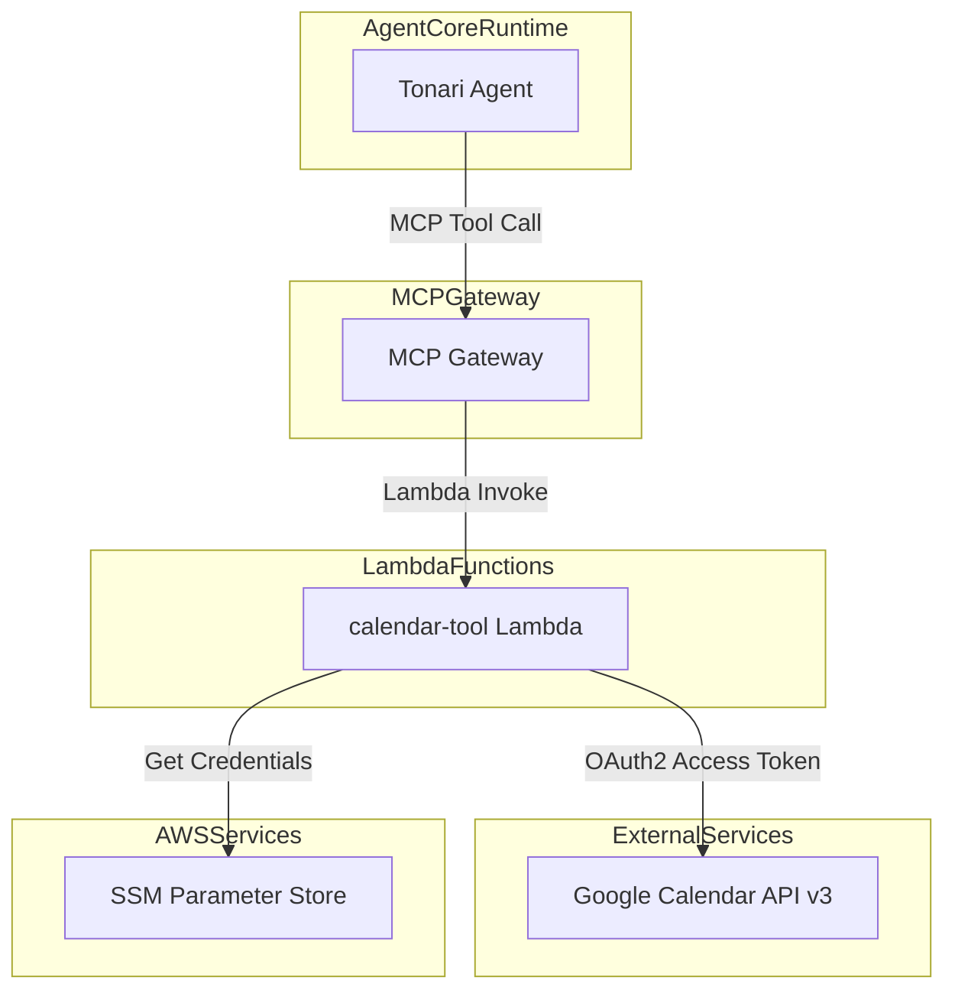
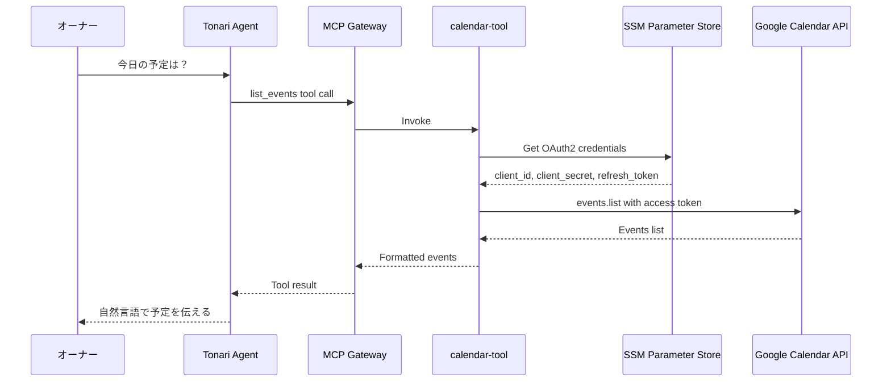
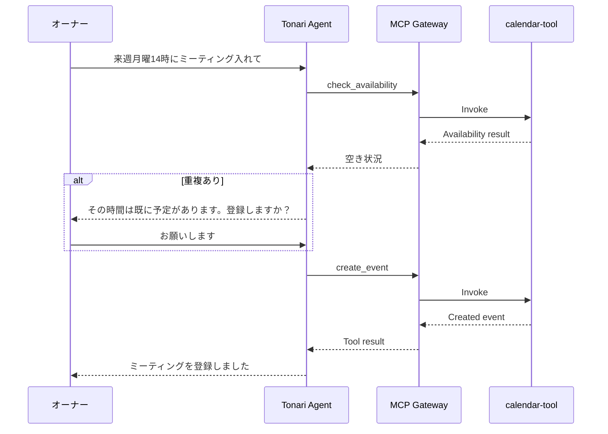

# Design Document: Google Calendar Integration

## Overview

**Purpose**: GoogleカレンダーとTonariエージェントを連携し、会話を通じたスケジュール管理（予定の閲覧・作成・変更・削除・空き時間確認・スケジュール提案）を実現する。

**Users**: オーナー（個人ユーザー）がTonariとの対話を通じてGoogleカレンダーを操作する。

**Impact**: 既存のMCP Gateway Targetパターンに新しいcalendar-tool Lambdaを追加。エージェントのシステムプロンプトにカレンダー操作のガイドラインを追加。

### Goals
- GoogleカレンダーのCRUD操作を会話ベースで実現
- 空き時間の照会とスケジュール候補の提案
- OAuth2認証情報の安全な管理
- 既存のtask-tool/diary-toolと同一のアーキテクチャパターンで統合

### Non-Goals
- 他ユーザーのカレンダーとの共有・招待管理
- 繰り返しイベントの個別編集（シリーズ全体の操作のみ）
- ニュースブリーフィングへのカレンダー統合（別スコープ）
- Google Calendar以外のカレンダーサービス対応

## Architecture

### Existing Architecture Analysis

現在のTonariは以下のツール統合パターンを持つ:
- **MCP Gateway Target**: Lambda関数をGateway経由でエージェントツールとして公開
- **認証情報管理**: SSM Parameter Store（Twitter Bearer Token等）
- **CDK構成**: `WorkloadConstruct`でLambda定義、`AgentCoreConstruct`でGateway Target登録

calendar-toolはこのパターンを完全に踏襲する。

### Architecture Pattern & Boundary Map



**Architecture Integration**:
- **Selected pattern**: Lambda Gateway Target（既存パターンと同一）
- **Domain boundaries**: calendar-tool Lambdaがカレンダー操作の全責務を持つ。エージェント側はツール呼び出しと結果の自然言語化のみ
- **Existing patterns preserved**: PythonFunction + SSM + Gateway Target
- **New components**: calendar-tool Lambda（1コンポーネント追加のみ）

### Technology Stack

| Layer | Choice / Version | Role in Feature | Notes |
|-------|------------------|-----------------|-------|
| Backend | Python 3.12 Lambda | Google Calendar APIの中継 | 既存ランタイムと統一 |
| External API | Google Calendar API v3 | カレンダー操作 | OAuth2認証 |
| Library | google-api-python-client 2.x | Google API クライアント | pip依存 |
| Library | google-auth 2.x | OAuth2認証 | リフレッシュトークンによるアクセストークン自動取得 |
| Secret Store | SSM Parameter Store | OAuth2認証情報の保存 | SecureString、既存パターン |
| Infrastructure | CDK + PythonFunction | Lambda + Gateway Target定義 | 既存構造に追加 |

## System Flows

### 予定取得フロー（Req 1.1-1.4, 2.1-2.3）



### 予定作成フロー（Req 3.1-3.5）



## Requirements Traceability

| Requirement | Summary | Components | Interfaces | Flows |
|-------------|---------|------------|------------|-------|
| 1.1 | 特定日のイベント一覧取得 | calendar-tool Lambda | list_events | 予定取得フロー |
| 1.2 | 日付範囲のイベント取得 | calendar-tool Lambda | list_events | 予定取得フロー |
| 1.3 | 今日/明日の予定取得 | calendar-tool Lambda | list_events | 予定取得フロー |
| 1.4 | イベント無し時の応答 | Tonari Agent (prompt) | — | — |
| 2.1 | 特定日の空き確認 | calendar-tool Lambda | check_availability | 予定取得フロー |
| 2.2 | 特定時間帯の空き確認 | calendar-tool Lambda | check_availability | 予定取得フロー |
| 2.3 | 期間内の空き日リスト | calendar-tool Lambda | check_availability | 予定取得フロー |
| 3.1 | イベント作成（タイトル・日時） | calendar-tool Lambda | create_event | 予定作成フロー |
| 3.2 | イベント作成（場所・説明付き） | calendar-tool Lambda | create_event | 予定作成フロー |
| 3.3 | 作成成功の確認メッセージ | Tonari Agent (prompt) | — | — |
| 3.4 | 重複時の警告 | calendar-tool Lambda + Agent | check_availability + create_event | 予定作成フロー |
| 3.5 | スケジュール登録の自動提案 | Tonari Agent (prompt) | — | — |
| 4.1 | イベント日時変更 | calendar-tool Lambda | update_event | — |
| 4.2 | イベント削除（確認付き） | calendar-tool Lambda + Agent | delete_event | — |
| 4.3 | 候補提示による特定 | Tonari Agent (prompt) + list_events | list_events | — |
| 5.1 | 空き枠の分析と候補提案 | calendar-tool Lambda | suggest_schedule | — |
| 5.2 | 候補選択によるイベント作成 | calendar-tool Lambda + Agent | create_event | — |
| 5.3 | 重複なし枠のみ候補 | calendar-tool Lambda | suggest_schedule | — |
| 6.1 | 認証情報の安全管理 | SSM Parameter Store + Lambda | — | — |
| 6.2 | 最小限スコープ | OAuth2 scope設定 | — | — |
| 6.3 | トークン自動リフレッシュ | calendar-tool Lambda | — | — |
| 6.4 | APIエラー時の自然な応答 | Tonari Agent (prompt) | — | — |

## Components and Interfaces

| Component | Domain/Layer | Intent | Req Coverage | Key Dependencies | Contracts |
|-----------|-------------|--------|-------------|-----------------|-----------|
| calendar-tool Lambda | Backend / Lambda | Google Calendar APIへの中継 | 1.1-1.4, 2.1-2.3, 3.1-3.4, 4.1-4.3, 5.1-5.3, 6.1-6.3 | Google Calendar API (P0), SSM (P0) | Service |
| AgentCore Gateway Target | Infra / CDK | calendar-toolをMCPツールとして公開 | All | calendar-tool Lambda (P0) | API |
| System Prompt更新 | Agent / Config | カレンダーツールの使い方ガイド | 1.4, 3.3, 3.5, 4.2, 4.3, 6.4 | — | — |
| OAuth2 Setup Script | Tooling | 初回認可フローの実行 | 6.1, 6.2 | Google Cloud Console (P0) | — |

### Backend / Lambda

#### calendar-tool Lambda

| Field | Detail |
|-------|--------|
| Intent | Google Calendar API v3への中継。6つのツール操作をイベントフィールドで識別しディスパッチする |
| Requirements | 1.1-1.4, 2.1-2.3, 3.1-3.4, 4.1-4.3, 5.1-5.3, 6.1-6.3 |

**Responsibilities & Constraints**
- Google Calendar APIとの通信を一元管理
- OAuth2トークンの取得・リフレッシュを内部で処理
- 入力バリデーション（日付フォーマット、必須パラメータ）
- Google APIレスポンスをエージェントが理解しやすい形式に変換
- タイムゾーンはJST（Asia/Tokyo）を基本とする

**Dependencies**
- External: Google Calendar API v3 — カレンダーデータの読み書き (P0)
- External: SSM Parameter Store — OAuth2認証情報の取得 (P0)
- Inbound: MCP Gateway — ツール呼び出しイベントの受信 (P0)

**Contracts**: Service [x]

##### Service Interface

```python
# ツールディスパッチ（task-toolパターンと同一）
def handler(event: dict, context) -> dict:
    """イベントフィールドに基づいてツール関数にディスパッチ"""
    ...

def list_events(event: dict) -> dict:
    """
    Input:
        date: str           # YYYY-MM-DD（単日指定時）
        date_from: str      # YYYY-MM-DD（範囲指定時の開始日）
        date_to: str        # YYYY-MM-DD（範囲指定時の終了日）
    Output:
        events: list[dict]  # [{title, start, end, location, event_id}]
        count: int
        message: str
    Errors:
        認証エラー → {"success": False, "message": "カレンダーにアクセスできません"}
    """

def create_event(event: dict) -> dict:
    """
    Input:
        title: str          # イベントタイトル（必須）
        start: str          # ISO 8601 日時 or YYYY-MM-DD（終日）
        end: str            # ISO 8601 日時 or YYYY-MM-DD（終日）
        location: str       # 場所（任意）
        description: str    # 説明（任意）
    Output:
        success: bool
        event: dict         # {event_id, title, start, end, location}
        message: str
    """

def update_event(event: dict) -> dict:
    """
    Input:
        event_id: str       # 更新対象のイベントID（必須）
        title: str          # 新しいタイトル（任意）
        start: str          # 新しい開始日時（任意）
        end: str            # 新しい終了日時（任意）
        location: str       # 新しい場所（任意）
        description: str    # 新しい説明（任意）
    Output:
        success: bool
        event: dict
        message: str
    """

def delete_event(event: dict) -> dict:
    """
    Input:
        event_id: str       # 削除対象のイベントID（必須）
    Output:
        success: bool
        message: str
    """

def check_availability(event: dict) -> dict:
    """
    Input:
        date: str           # YYYY-MM-DD（単日の空き確認）
        date_from: str      # YYYY-MM-DD（範囲の開始日）
        date_to: str        # YYYY-MM-DD（範囲の終了日）
        time_from: str      # HH:MM（時間帯の開始、任意）
        time_to: str        # HH:MM（時間帯の終了、任意）
    Output:
        available: bool     # 単日/時間帯の場合
        busy_slots: list    # [{start, end, title}]
        free_days: list     # [YYYY-MM-DD]（範囲指定で空き日リスト）
        message: str
    """

def suggest_schedule(event: dict) -> dict:
    """
    Input:
        date_from: str      # YYYY-MM-DD（候補検索の開始日、必須）
        date_to: str        # YYYY-MM-DD（候補検索の終了日、必須）
        duration_minutes: int  # 所要時間（分、必須）
        preferred_time_from: str  # HH:MM（希望時間帯の開始、任意、デフォルト09:00）
        preferred_time_to: str    # HH:MM（希望時間帯の終了、任意、デフォルト18:00）
    Output:
        suggestions: list   # [{start, end, date}] 最大5件
        count: int
        message: str
    """
```

**Implementation Notes**
- ディスパッチロジック: event内の特定フィールドの有無で判定（task-toolパターン踏襲）。`event_id`+更新フィールドあり→update_event、`event_id`のみ→delete_event、`title`+`start`あり→create_event、`duration_minutes`あり→suggest_schedule、`time_from`or`date`+空き確認系→check_availability、それ以外→list_events
- Google APIクライアントはLambdaのグローバルスコープで初期化（コールドスタート時のみ認証）
- リフレッシュトークンからアクセストークンへの変換は`google.oauth2.credentials.Credentials`で自動処理
- タイムゾーン: すべての日時入出力はJST（Asia/Tokyo）基準。Google APIへのリクエストはISO 8601 + タイムゾーンオフセット

### Infra / CDK

#### AgentCore Gateway Target定義

| Field | Detail |
|-------|--------|
| Intent | calendar-tool LambdaをMCP Gateway Targetとして登録し、6つのツールスキーマを定義する |
| Requirements | All |

**Responsibilities & Constraints**
- `WorkloadConstruct`にcalendar-tool Lambda定義を追加
- `AgentCoreConstruct`にGateway Target（CalendarTool）を追加
- SSM Parameter Storeへのアクセス権限をLambdaロールに付与

**Implementation Notes**
- SSM パラメータパス: `/tonari/google/client_id`, `/tonari/google/client_secret`, `/tonari/google/refresh_token`
- Lambda memorySize: 128MB、timeout: 30秒
- PythonFunctionのentry: `infra/lambda/calendar-tool`
- requirements.txt: `google-api-python-client`, `google-auth`

### Agent / Config

#### System Prompt更新

| Field | Detail |
|-------|--------|
| Intent | エージェントにカレンダーツールの使用方法と振る舞いガイドラインを指示する |
| Requirements | 1.4, 3.3, 3.5, 4.2, 4.3, 6.4 |

**Implementation Notes**
- `prompts.py`に「Googleカレンダー連携」セクションを追加
- ツール名と使用タイミングの説明（タスク管理セクションと同様の構成）
- 自動提案の検知パターン（「〜時に会議」「予定を入れて」等）
- エラー時の自然な言い回しガイド
- 削除時の確認フロー指示
- 候補が複数ある場合の提示方法

### Tooling

#### OAuth2 Setup Script

| Field | Detail |
|-------|--------|
| Intent | 初回のOAuth2認可フローを実行し、リフレッシュトークンをSSMに保存するヘルパースクリプト |
| Requirements | 6.1, 6.2 |

**Implementation Notes**
- `scripts/setup-google-calendar.py` として配置
- Google Cloud Consoleで事前にOAuth2クライアントID（Desktop App）を作成
- スクリプト実行 → ブラウザ認可 → リフレッシュトークン取得 → SSM保存
- 手動実行（一度きり）

## Data Models

### Domain Model

本機能はGoogle Calendar APIを中継するため、永続化データモデル（DynamoDB等）は不要。

**Value Objects（APIレスポンスの内部表現）**:
- `CalendarEvent`: event_id, title, start, end, location, description
- `AvailabilitySlot`: start, end, available
- `ScheduleSuggestion`: date, start, end

### Data Contracts & Integration

**MCP Tool Input/Output（Lambda Event/Response）**:

各ツールのInput/Outputは「Components and Interfaces」セクションのService Interfaceに定義済み。

**Google Calendar API Event Object（関連フィールド）**:
- `id`: イベントID
- `summary`: タイトル
- `start.dateTime` / `start.date`: 開始日時（時刻指定 / 終日）
- `end.dateTime` / `end.date`: 終了日時
- `location`: 場所
- `description`: 説明

## Error Handling

### Error Strategy

Google Calendar APIのエラーはcalendar-tool Lambda内でキャッチし、エージェントが自然に応答できる形式のメッセージに変換する。

### Error Categories and Responses

| Error | HTTP Code | Lambda Response | Agent Behavior |
|-------|-----------|----------------|----------------|
| 認証失敗（トークン期限切れ） | 401 | `{"success": false, "message": "カレンダーにアクセスできません。管理者に連絡してください。"}` | エラーメッセージを自然に伝える |
| イベント未検出 | 404 | `{"success": false, "message": "指定された予定が見つかりません。"}` | 候補を提示するよう促す |
| レート制限 | 429 | `{"success": false, "message": "カレンダーへのアクセスが一時的に制限されています。"}` | 少し待ってから再試行を提案 |
| 入力バリデーションエラー | — | `{"success": false, "message": "日付の形式が正しくありません。"}` | 正しい形式を案内 |
| Google API障害 | 5xx | `{"success": false, "message": "カレンダーサービスに接続できません。"}` | 後ほど再試行を提案 |

## Testing Strategy

### Unit Tests
- OAuth2トークン取得・リフレッシュのモック検証
- 各ツール関数の入力バリデーション
- Google APIレスポンスのパース・変換ロジック
- ディスパッチロジック（イベントフィールドによるルーティング）
- suggest_scheduleの空き枠計算ロジック

### Integration Tests
- SSM Parameter Storeからの認証情報取得
- Google Calendar API実呼び出し（テスト用カレンダー使用）
- CDKスナップショットテスト（Gateway Target定義の正確性）

## Security Considerations

- OAuth2リフレッシュトークンはSSM Parameter Store SecureString（KMS暗号化）で保存
- Lambda実行ロールには対象SSMパラメータへの`ssm:GetParameter`権限のみ付与
- Google Calendar APIスコープは`https://www.googleapis.com/auth/calendar`（読み書き必要なため）
- Google Cloud ConsoleのOAuth同意画面は「内部」または「テスト」モードで運用（個人利用のため公開不要）
