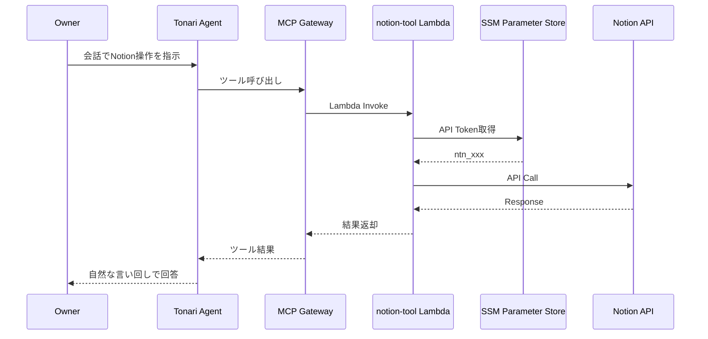

# Technical Design: Notion Gateway Integration

## Overview

**Purpose**: TonariエージェントにNotionワークスペースとの連携機能を提供する。オーナーが会話を通じてNotionのページ検索・閲覧・作成・更新・データベースクエリを行えるようにする。

**Users**: オーナー（Tonariの利用者）が日常の会話の中でNotionの操作を自然に行うために利用する。

**Impact**: 既存のMCP Gateway + Lambda Toolアーキテクチャに新しいLambda Target（notion-tool）を追加する。既存コンポーネントへの影響は最小限で、CDK Constructへのプロパティ追加とGateway Target登録のみ。

### Goals
- 6つの汎用ツール（search_pages, get_page, create_page, update_page, query_database, get_database）を提供
- 既存のGateway + Lambda Toolパターンに完全準拠
- システムプロンプトによるNotion活用ガイダンスの提供

### Non-Goals
- ショートカットツール（add_quick_note等）の実装（汎用ツール + システムプロンプトで対応）
- Notion OAuth認証（Internal Integration Token方式を使用）
- ブロック単位の編集・削除（ページ単位の操作に限定）
- 100ブロック超のページネーション（初期スコープ外）

## Architecture

### Existing Architecture Analysis

現在のTonariアーキテクチャでは、外部サービス連携はすべて以下のパターンで実装されている：

- **Lambda関数**: Python 3.12、PythonFunction（requirements.txt自動バンドル）
- **MCP Gateway**: Lambda Targetとしてツールスキーマを登録
- **認証情報**: SSM Parameter Store（SecureString）に保存、Lambda起動時に取得
- **CDK構成**: WorkloadConstruct（Lambda定義） → TonariStack（wiring） → AgentCoreConstruct（Gateway Target登録）

既存ツール（Gmail, Calendar, Task, Diary, Twitter等）が確立したこのパターンをそのまま踏襲する。

### Architecture Pattern & Boundary Map



**Architecture Integration**:
- Selected pattern: MCP Gateway + Lambda Tool（既存パターン踏襲）
- Domain boundary: notion-tool Lambdaが Notion API とのすべてのやり取りを担当
- Existing patterns preserved: action-basedディスパッチ、SSM認証、PythonFunction
- New components: notion-tool Lambda 1つのみ
- Steering compliance: 既存のInfrastructure / Lambdaパターンに完全準拠

### Technology Stack

| Layer | Choice / Version | Role in Feature | Notes |
|-------|------------------|-----------------|-------|
| Backend / Services | Python 3.12 + notion-client | Notion API呼び出し Lambda | notion-sdk-py (PyPI: notion-client) |
| Data / Storage | AWS SSM Parameter Store | Notion APIトークン保管 | SecureString、パス: /tonari/notion/api_token |
| Infrastructure / Runtime | AWS CDK + PythonFunction | Lambda定義・Gateway Target登録 | @aws-cdk/aws-lambda-python-alpha |

## Requirements Traceability

| Requirement | Summary | Components | Interfaces | Flows |
|-------------|---------|------------|------------|-------|
| 1.1-1.4 | ページ検索 | NotionToolLambda | search_pages action | Gateway → Lambda → Notion Search API |
| 2.1-2.3 | ページ内容取得 | NotionToolLambda | get_page action | Gateway → Lambda → Pages API + Blocks API |
| 3.1-3.5 | ページ作成 | NotionToolLambda | create_page action | Gateway → Lambda → Pages Create API |
| 4.1-4.5 | ページ更新・アーカイブ | NotionToolLambda | update_page action | Gateway → Lambda → Pages Update + Blocks Append API |
| 5.1-5.5 | データベースクエリ | NotionToolLambda | query_database action | Gateway → Lambda → Database Query API |
| 5.1 | データベーススキーマ取得 | NotionToolLambda | get_database action | Gateway → Lambda → Databases Retrieve API |
| 6.1-6.5 | 認証・セキュリティ | NotionToolLambda, CDK | SSM access, IAM policy | Lambda → SSM → Notion API |
| 7.1-7.5 | エージェント活用ガイダンス | System Prompt | — | — |
| 8.1-8.5 | インフラストラクチャ | CDK Constructs | Props, Gateway Target | CDK deploy |

## Components and Interfaces

| Component | Domain/Layer | Intent | Req Coverage | Key Dependencies | Contracts |
|-----------|-------------|--------|--------------|------------------|-----------|
| NotionToolLambda | Backend / Lambda | Notion API操作の6ツールをactionベースで処理 | 1-6, 7 | SSM (P0), Notion API (P0) | Service |
| WorkloadConstruct変更 | Infrastructure / CDK | Lambda定義 + SSM権限 | 8.1-8.2, 8.4 | PythonFunction (P0) | — |
| AgentCoreConstruct変更 | Infrastructure / CDK | Gateway Target登録（6ツールスキーマ） | 8.3, 8.5 | Gateway L2 (P0) | API |
| TonariStack変更 | Infrastructure / CDK | Lambda参照のwiring | 8.3 | WorkloadConstruct (P0) | — |
| SystemPrompt変更 | Agent / Prompt | Notion活用ガイダンス | 7.1-7.5 | — | — |

### Backend / Lambda

#### NotionToolLambda

| Field | Detail |
|-------|--------|
| Intent | Notion APIとの通信を担当し、6つのツールをaction-basedディスパッチで処理する |
| Requirements | 1.1-1.4, 2.1-2.3, 3.1-3.5, 4.1-4.5, 5.1-5.5, 6.1-6.5 |

**Responsibilities & Constraints**
- SSM Parameter StoreからNotion APIトークンを取得し、Notionクライアントを初期化（グローバルキャッシュ）
- eventのactionフィールドに基づいて6つのツール関数にディスパッチ
- Notion APIレスポンスを簡潔な形式に変換して返却

**Dependencies**
- External: AWS SSM Parameter Store — APIトークン取得 (P0)
- External: Notion API (notion-client経由) — すべてのNotion操作 (P0)

**Contracts**: Service [x]

##### Service Interface

```python
# Lambda handler event schema (Gateway → Lambda)
# 各ツールのeventには必ず "action" フィールドが含まれる

# search_pages
{
    "action": "search_pages",
    "query": str,           # 必須: 検索キーワード
    "max_results": int      # 任意: 最大件数 (default: 10)
}

# get_page
{
    "action": "get_page",
    "page_id": str,         # 必須: ページID
    "include_blocks": bool  # 任意: ブロック取得 (default: true)
}

# create_page
{
    "action": "create_page",
    "database_id": str,     # database_id or parent_page_id のいずれか必須
    "parent_page_id": str,
    "title": str,           # 任意: タイトル（簡易指定）
    "properties": str|dict, # 任意: プロパティJSON
    "content": str          # 任意: テキストコンテンツ（段落ブロックとして追加）
}

# update_page
{
    "action": "update_page",
    "page_id": str,         # 必須: ページID
    "properties": str|dict, # 任意: 更新するプロパティJSON
    "content": str,         # 任意: 追記するテキストコンテンツ
    "archived": bool        # 任意: true でゴミ箱移動
}

# query_database
{
    "action": "query_database",
    "database_id": str,     # 必須: データベースID
    "filter": str|dict,     # 任意: Notion APIフィルタJSON
    "sorts": str|list,      # 任意: Notion APIソートJSON
    "max_results": int      # 任意: 最大件数 (default: 20)
}

# get_database
{
    "action": "get_database",
    "database_id": str      # 必須: データベースID
}
```

```python
# 成功レスポンス例
{
    "success": True,          # create_page, update_page
    "pages": [...],           # search_pages, query_database
    "resultCount": int,
    "has_more": bool,
    "message": str
}

# get_database 成功レスポンス例
{
    "success": True,
    "database": {
        "id": str,
        "title": str,
        "properties": {       # プロパティ名 → 型情報・選択肢のマップ
            "Name": {"type": "title"},
            "Status": {"type": "status", "options": ["未着手", "進行中", "完了"]},
            "Category": {"type": "select", "options": ["Tech", "Design", ...]},
            ...
        }
    }
}

# エラーレスポンス
{
    "success": False,
    "message": str            # ユーザーフレンドリーな日本語メッセージ
}
```

- Preconditions: SSM Parameter `/tonari/notion/api_token` が存在すること
- Postconditions: Notion APIの操作結果が簡潔な形式で返却される
- Invariants: Notionクライアントはグローバル変数でキャッシュ。認証エラー時はキャッシュをクリア

**Implementation Notes**
- Integration: Gmail ToolのHTMLパーサーに相当する部分として、Notionのrich_text配列からplain textを抽出するヘルパーが必要。またプロパティ値の型ごとの変換ヘルパーも必要
- Validation: action フィールドの存在チェック、各ツールの必須パラメータチェック、JSON文字列の場合はパース試行
- Risks: Notionプロパティは多数の型がある。主要な型をサポートし、未対応型は型名文字列を返す

### Infrastructure / CDK

#### WorkloadConstruct変更

| Field | Detail |
|-------|--------|
| Intent | notion-tool Lambda関数の定義とSSMアクセス権限の付与 |
| Requirements | 8.1, 8.2, 8.4 |

**変更内容**:
1. パブリックプロパティ追加: `notionToolLambda: python.PythonFunction`
2. PythonFunction定義（既存のGmailToolLambdaと同一パターン）:
   - functionName: `tonari-notion-tool`
   - entry: `path.join(__dirname, '../lambda/notion-tool')`
   - runtime: Python 3.12、handler: `handler`、timeout: 30s、memorySize: 128MB
3. SSM権限: `ssm:GetParameter` on `arn:aws:ssm:${region}:${account}:parameter/tonari/notion/*`

#### AgentCoreConstruct変更

| Field | Detail |
|-------|--------|
| Intent | Props追加、lambdaFunctions配列追加、Gateway Target登録（6ツールスキーマ） |
| Requirements | 8.3, 8.5 |

**変更内容**:
1. `AgentCoreConstructProps`に `notionToolLambda: lambda.IFunction` を追加（必須）
2. `lambdaFunctions`配列に `props.notionToolLambda` を追加
3. `gateway.addLambdaTarget('NotionTool', {...})` で6ツールのスキーマを登録

##### API Contract（Gateway Tool Schema）

各ツールのinputSchemaにはactionフィールドを含める（Gmailツールと同一パターン）。

| Tool Name | Required Fields | Optional Fields |
|-----------|----------------|-----------------|
| search_pages | action, query | max_results |
| get_page | action, page_id | include_blocks |
| create_page | action | database_id, parent_page_id, title, properties, content |
| update_page | action, page_id | properties, content, archived |
| query_database | action, database_id | filter, sorts, max_results |
| get_database | action, database_id | — |

#### TonariStack変更

| Field | Detail |
|-------|--------|
| Intent | WorkloadConstruct.notionToolLambdaをAgentCoreConstructに渡す |
| Requirements | 8.3 |

**変更内容**:
AgentCoreConstructの初期化時に `notionToolLambda: workload.notionToolLambda` を追加。

### Agent / Prompt

#### SystemPrompt変更

| Field | Detail |
|-------|--------|
| Intent | エージェントにNotion連携の活用方法を教え、汎用ツールを適切に使い分けられるようにする |
| Requirements | 7.1-7.5 |

**変更内容**:
`agentcore/src/agent/prompts.py` の `TONARI_SYSTEM_PROMPT` に以下を追加:

1. **Notion連携セクション**: 6ツールの使用方法、パラメータ説明
2. **よく使うデータベース情報**: オーナーが使用する主要DBのID・プロパティスキーマ・用途
3. **活用パターン**: カジュアルな指示からDB操作へのマッピング
4. **他ツールとの連携例**: 「メールの内容をNotionにまとめる」「カレンダーの会議メモをNotionに作成」等

##### オーナーのNotionデータベース情報

以下の4つのデータベースをシステムプロンプトに登録する。DB IDはシステムプロンプトにハードコードする。**プロパティスキーマ（カラム定義・選択肢一覧）はシステムプロンプトに記載せず、操作時に`get_database`ツールで動的に取得する。**

**1. Quick Notes（日常メモ）**
- 用途: 日常的なメモ、アイデア、リマインダー
- 活用パターン: 「メモして」「覚えておいて」「リマインドして」→ create_page with this DB

**2. Bookmarks（ブックマーク）**
- 用途: Web URLのブックマーク管理（Knowledge Baseテンプレートベース）
- 活用パターン: 「ブックマークして」「保存して」「あとで読む」→ create_page with this DB
- 特記: Categoryプロパティはget_databaseで取得した選択肢の中から内容に応じて自動選択する

**3. Product Idea（プロダクトアイデア）**
- 用途: 個人開発のプロダクトアイデア管理
- 活用パターン: 「こんなプロダクトどう？」「開発アイデア」→ create_page with this DB

**4. Blog Idea（ブログアイデア）**
- 用途: 個人の技術ブログ記事のアイデア・進捗管理
- 活用パターン: 「ブログのネタ」「記事書きたい」→ create_page with this DB

**DB ID管理**:
- DB IDはNotion Integration作成・接続後にオーナーから取得
- システムプロンプトに直接記載（デプロイごとの更新は不要、変更時はプロンプト修正でリデプロイ）
- 初期デプロイ時はプレースホルダ（`<QUICK_NOTES_DB_ID>` 等）で実装し、オーナーがDB IDを共有後に置換

**スキーマ取得方針**:
- エージェントがDBに対してページ作成・更新を行う前に、`get_database`で対象DBのプロパティスキーマ（カラム名、型、select/multi_selectの選択肢一覧）を取得する
- 取得したスキーマに基づいて適切なプロパティ値を設定する（例: Bookmarks DBのCategoryは取得した選択肢の中から選ぶ）
- システムプロンプトにはDB名・ID・用途・活用パターンのみ記載し、スキーマ情報はハードコードしない

**Implementation Notes**
- DB IDはデプロイ前にオーナーから取得してシステムプロンプトに記載する
- ツール結果の伝え方ルール（技術用語禁止等）は既存ツールと統一

## Data Models

### Data Contracts & Integration

**Lambda Event Schema**: Components and Interfaces セクションのService Interfaceに定義済み。

**Notion APIプロパティ型の変換マッピング**:

| Notion Property Type | 変換後の値 |
|---------------------|-----------|
| title | plain text文字列 |
| rich_text | plain text文字列 |
| number | 数値 |
| select | 選択肢名（文字列） |
| multi_select | 選択肢名の配列 |
| date | "start" or "start → end" 文字列 |
| checkbox | boolean |
| url | URL文字列 |
| status | ステータス名（文字列） |
| people | ユーザー名の配列 |
| relation | ページIDの配列 |
| その他 | "[型名]" 文字列 |

## Error Handling

### Error Categories and Responses

**Notion API Errors**:
| Status | Category | Response Message |
|--------|----------|-----------------|
| 401 | 認証エラー | 「Notion認証が無効です。APIトークンを確認してください。」+ クライアントキャッシュクリア |
| 403 | 権限エラー | 「Notionへのアクセス権限がありません。Integrationの接続を確認してください。」 |
| 404 | 未検出 | 「指定されたNotionページまたはデータベースが見つかりません。」 |
| 429 | レート制限 | 「Notion APIの制限に達しました。しばらく待ってからお試しください。」 |
| 5xx | サーバーエラー | 「Notionサーバーでエラーが発生しました。」 |

**Input Validation Errors**:
- 必須パラメータ欠落: 「{パラメータ名} は必須です。」
- JSON解析失敗: 「{パラメータ名} のJSON形式が不正です。」
- action不明: 「不明なアクションです。action フィールドが必要です。」

## Testing Strategy

### Integration Tests
- SSMからのトークン取得 → Notionクライアント初期化の正常系
- 6ツールそれぞれのNotion API呼び出し正常系
- 認証エラー（401）時のクライアントキャッシュクリアと再初期化
- 不正なJSON入力時のエラーハンドリング

### Infrastructure Tests
- `cdk synth` でCloudFormationテンプレート生成成功
- Lambda関数にSSM権限が付与されていること
- Gateway Targetに6ツールが登録されていること

### E2E Tests
- デプロイ後、エージェント経由で各ツールが動作すること
- システムプロンプトの活用ガイダンスに基づき、カジュアルな指示でNotion操作が行われること

## Security Considerations

- Notion APIトークンはSSM Parameter Store（SecureString）に保管。Lambda環境変数には含めない
- Lambda IAMポリシーは `/tonari/notion/*` パスのみに限定（最小権限）
- APIトークンは Lambda のグローバル変数にキャッシュするが、認証エラー時にクリアして再取得
- Notion API呼び出しはHTTPSのみ（notion-client SDKがデフォルトで使用）

## File Change Summary

| File | Change Type | Description |
|------|------------|-------------|
| `infra/lambda/notion-tool/index.py` | 新規 | Lambda handler（6ツール + ヘルパー関数） |
| `infra/lambda/notion-tool/requirements.txt` | 新規 | `notion-client` 依存 |
| `infra/lib/workload-construct.ts` | 変更 | notionToolLambda定義 + SSM権限 |
| `infra/lib/agentcore-construct.ts` | 変更 | Props追加 + lambdaFunctions追加 + Gateway Target登録 |
| `infra/lib/tonari-stack.ts` | 変更 | notionToolLambdaのwiring |
| `agentcore/src/agent/prompts.py` | 変更 | Notion連携セクション追加 |
