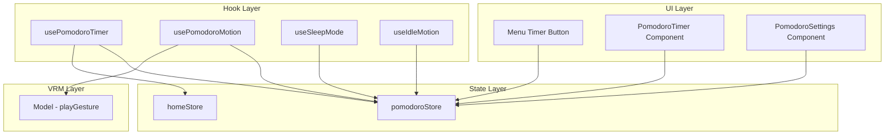
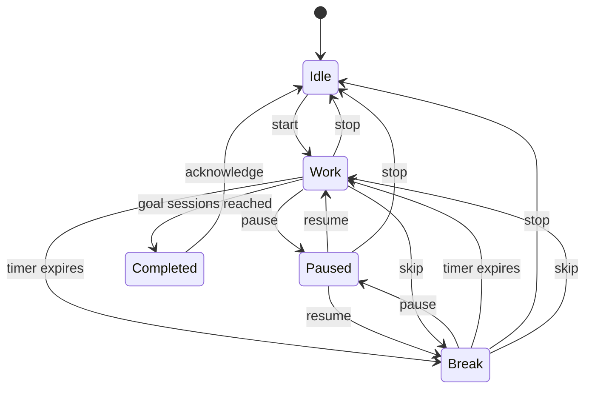
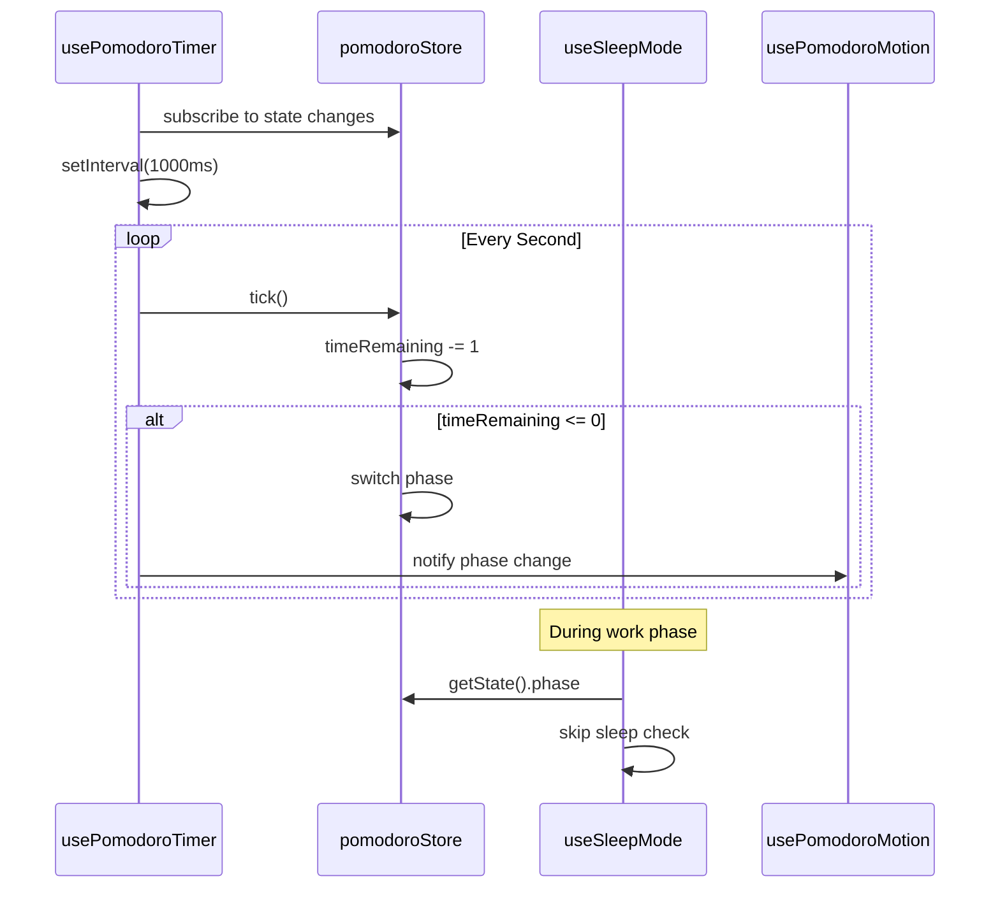
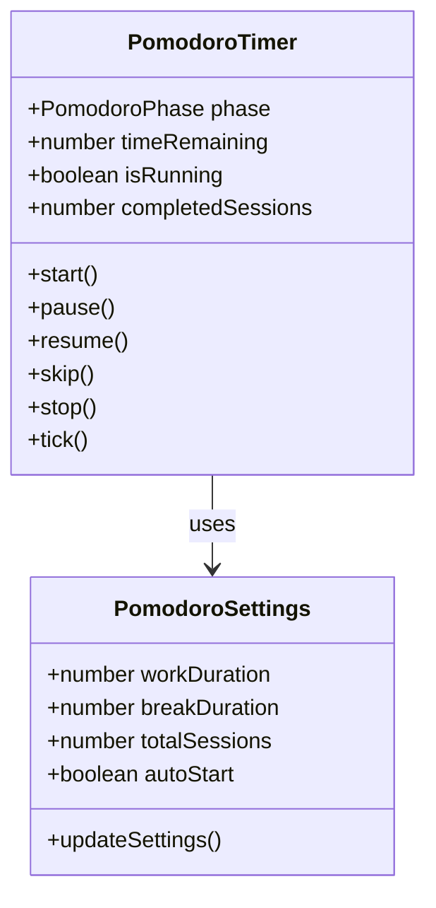

# Design Document: pomodoro-timer

## Overview

**Purpose**: ポモドーロタイマー機能は、Tonariユーザーに作業/休憩サイクルの時間管理を提供する。タイマーUIは画面右上に半透過の円形プログレスとして表示され、VRMアバターとの共存を実現する。

**Users**: Tonariユーザーが集中作業時に利用する。タイマー起動はメニューアイコンから行い、作業中はアバターが専用モーションを再生する。

**Impact**: メニューにタイマー起動ボタンを追加。新規Zustandストア、UIコンポーネント、フックを追加。既存の睡眠モードとアイドルモーションに連携ロジックを追加。

### Goals
- 作業/休憩を交互に繰り返すカウントダウンタイマーの提供
- 半透過の円形UIによるVRMアバターとの視覚的共存
- 設定のlocalStorage永続化
- 睡眠モード抑制と作業専用モーションによるアバター連携

### Non-Goals
- エージェント発話（音声/テキスト応答）の連携（別途対応）
- タイマーUIのドラッグ移動
- 作業履歴や統計機能
- デイリー目標やストリーク追跡

## Architecture

### Existing Architecture Analysis

既存システムの関連パターン:
- **状態管理**: Zustand + persist で `home.ts`（動的状態）、`settings.ts`（永続設定）に分離
- **フックパターン**: `useIdleMotion`（ランダム間隔ジェスチャー）、`useSleepMode`（タイマーベース睡眠制御）
- **UIオーバーレイ**: `gestureTestPanel.tsx`（absolute配置、z-30）、`newsNotification.tsx`（モーダル、z-40）
- **アイコンシステム**: `iconButton.tsx` の `iconNameToPath` マッピング

### Architecture Pattern & Boundary Map



**Architecture Integration**:
- Selected pattern: 専用Zustandストア + カスタムフック（既存パターン踏襲）
- Domain boundaries: タイマーロジック（pomodoroStore + usePomodoroTimer）、UI（コンポーネント）、アバター連携（usePomodoroMotion）を分離
- Existing patterns preserved: Zustand persist、IconButton、overlay配置パターン
- Steering compliance: Feature-based + Layer-based hybrid に準拠

### Technology Stack

| Layer | Choice / Version | Role in Feature | Notes |
|-------|------------------|-----------------|-------|
| Frontend | React + TypeScript | UIコンポーネント | 既存スタック |
| 状態管理 | Zustand + persist | タイマー状態・設定永続化 | 既存パターン |
| スタイリング | Tailwind CSS + SVG | 円形プログレスUI | SVG stroke-dashoffset |
| ストレージ | localStorage | 設定永続化 | Zustand persist経由 |

## System Flows

### タイマーライフサイクル



**Key Decisions**:
- `skip` は現在のセッションを即座に終了し、次のフェーズへ遷移
- `Completed` は目標セッション数達成時の状態。ユーザーの確認後にIdleへ戻る
- 自動開始がOFFの場合、Work→Break, Break→Work の遷移時にPausedで待機

### タイマーカウントダウンフロー



## Requirements Traceability

| Requirement | Summary | Components | Interfaces | Flows |
|-------------|---------|------------|------------|-------|
| 1.1-1.5 | タイマー基本機能 | pomodoroStore, usePomodoroTimer | PomodoroState | タイマーライフサイクル |
| 2.1-2.4 | タイマー操作 | pomodoroStore, PomodoroTimer | PomodoroActions | タイマーライフサイクル |
| 3.1-3.3 | 自動開始 | pomodoroStore, usePomodoroTimer | PomodoroSettings | タイマーライフサイクル |
| 4.1-4.4 | セッションカウント | pomodoroStore, PomodoroTimer | PomodoroState | タイマーライフサイクル |
| 5.1-5.6 | 設定・永続化 | pomodoroStore, PomodoroSettings | PomodoroSettings | — |
| 6.1-6.5 | 円形タイマーUI | CircularProgress, PomodoroTimer | CircularProgressProps | — |
| 7.1-7.5 | メニュー統合・表示位置 | menu.tsx, mobileHeader.tsx, PomodoroTimer | — | — |
| 8.1-8.3 | 睡眠モード連携 | useSleepMode, pomodoroStore | PomodoroState.phase | カウントダウンフロー |
| 9.1-9.3 | 作業中モーション | usePomodoroMotion | PomodoroMotionConfig | カウントダウンフロー |

## Components and Interfaces

| Component | Domain/Layer | Intent | Req Coverage | Key Dependencies | Contracts |
|-----------|------------|--------|--------------|-----------------|-----------|
| pomodoroStore | State | タイマー状態・設定管理 | 1-5 | Zustand (P0) | State |
| usePomodoroTimer | Hook | タイマーカウントダウン制御 | 1, 2, 3, 4 | pomodoroStore (P0) | Service |
| usePomodoroMotion | Hook | 作業中モーション再生 | 9 | pomodoroStore (P0), Model (P0) | Service |
| PomodoroTimer | UI | タイマーUI全体（円形プログレス+操作+カウント） | 2, 4, 6, 7 | pomodoroStore (P0) | — |
| CircularProgress | UI | 円形プログレス描画 | 6 | — | — |
| PomodoroSettings | UI | 設定モーダル | 5 | pomodoroStore (P0) | — |
| menu.tsx (変更) | UI | タイマー起動ボタン追加 | 7.1 | pomodoroStore (P1) | — |
| mobileHeader.tsx (変更) | UI | モバイルタイマー起動ボタン | 7.1 | pomodoroStore (P1) | — |
| useSleepMode.ts (変更) | Hook | 作業中の睡眠抑制 | 8 | pomodoroStore (P1) | — |
| useIdleMotion.ts (変更) | Hook | 作業中のアイドルモーション抑制 | 9 | pomodoroStore (P1) | — |

### State Layer

#### pomodoroStore

| Field | Detail |
|-------|--------|
| Intent | ポモドーロタイマーの全状態管理と設定永続化 |
| Requirements | 1.1-1.5, 2.1-2.4, 3.1-3.3, 4.1-4.4, 5.1-5.6 |

**Responsibilities & Constraints**
- タイマー状態（phase, timeRemaining, isRunning）の管理
- 設定値（workDuration, breakDuration, totalSessions, autoStart）の管理と永続化
- セッションカウント（completedSessions）の追跡
- タイマー操作メソッド（start, pause, resume, skip, stop, tick）の提供

**Dependencies**
- External: Zustand + persist — 状態管理 (P0)

**Contracts**: State [x]

##### State Management

```typescript
type PomodoroPhase = 'idle' | 'work' | 'break' | 'paused' | 'completed'

interface PomodoroSettings {
  workDuration: number       // 秒単位（デフォルト: 1500 = 25分）
  breakDuration: number      // 秒単位（デフォルト: 300 = 5分）
  totalSessions: number      // 目標セッション数（デフォルト: 4）
  autoStart: boolean         // 自動開始（デフォルト: true）
}

interface PomodoroTimerState {
  phase: PomodoroPhase
  timeRemaining: number      // 秒単位
  isRunning: boolean
  completedSessions: number
  previousPhase: PomodoroPhase  // paused時に元のphaseを保持
}

interface PomodoroActions {
  start: () => void
  pause: () => void
  resume: () => void
  skip: () => void
  stop: () => void
  tick: () => void
  updateSettings: (settings: Partial<PomodoroSettings>) => void
}

type PomodoroState = PomodoroSettings & PomodoroTimerState & PomodoroActions
```

- Persistence: `workDuration`, `breakDuration`, `totalSessions`, `autoStart` のみlocalStorage永続化
- localStorage key: `tonari-pomodoro`

**Implementation Notes**
- `tick()`: `timeRemaining` を1デクリメント。0到達時にフェーズ遷移ロジックを実行
- `pause()`: `previousPhase` に現在のphaseを保存し、`phase` を `paused` に設定
- `resume()`: `previousPhase` からphaseを復元
- `skip()`: 現在のphaseに応じて次のphaseへ強制遷移
- `stop()`: 全状態をリセットし `idle` に戻る
- フェーズ遷移時: `autoStart` がfalseならisRunningをfalseに設定

### Hook Layer

#### usePomodoroTimer

| Field | Detail |
|-------|--------|
| Intent | setIntervalベースのタイマーカウントダウン制御 |
| Requirements | 1.1-1.5, 2.1-2.4, 3.1-3.3, 4.3 |

**Responsibilities & Constraints**
- 1秒間隔の `setInterval` でpomodoroStore.tick()を呼び出し
- `isRunning` 状態の変化に応じてインターバルの開始/停止を管理
- ブラウザタブ非アクティブ時の時間補正（`visibilitychange` イベント）

**Dependencies**
- Inbound: pomodoroStore — タイマー状態参照 (P0)

**Contracts**: Service [x]

##### Service Interface

```typescript
// React Hook — index.tsxで呼び出し
function usePomodoroTimer(): void
```

- Preconditions: pomodoroStoreが初期化済み
- Postconditions: コンポーネントアンマウント時にintervalをクリーンアップ

**Implementation Notes**
- `visibilitychange` で復帰時に `Date.now()` ベースで経過時間を計算し、残り時間を補正
- `isRunning` がfalseの間はtick()を呼ばない

#### usePomodoroMotion

| Field | Detail |
|-------|--------|
| Intent | 作業セッション中に専用モーションをランダム再生 |
| Requirements | 9.1-9.3 |

**Responsibilities & Constraints**
- pomodoroStore.phaseが`work`の間、ランダム間隔でplayGestureを呼び出し
- phaseが`work`以外に変わったらモーション再生を停止
- useIdleMotionとの競合を避けるため、作業中はuseIdleMotionを抑制

**Dependencies**
- Inbound: pomodoroStore — phase監視 (P0)
- Outbound: Model.playGesture — モーション再生 (P0)
- Outbound: homeStore — viewer参照 (P0)

**Contracts**: Service [x]

##### Service Interface

```typescript
// React Hook — index.tsxで呼び出し
function usePomodoroMotion(): void
```

**Implementation Notes**
- 作業専用モーションセット: 既存の `GestureType` から選択（cheer, wave, present 等）+ 将来的にVRMAアニメーション追加
- 再生間隔: 60-180秒のランダム間隔
- useIdleMotion抑制: pomodoroStore.phaseが`work`のとき、useIdleMotionのスケジューリングをスキップ

### UI Layer

#### PomodoroTimer

| Field | Detail |
|-------|--------|
| Intent | タイマーUI全体の表示（円形プログレス、タイマー表示、操作ボタン、セッションカウント） |
| Requirements | 2.1-2.4, 4.1-4.2, 6.1-6.5, 7.2-7.5 |

**Responsibilities & Constraints**
- 画面右上に固定配置（absolute/fixed）
- 半透過背景でVRMアバターが見える
- phase === 'idle' のとき非表示
- 独立コンポーネントとして実装（表示位置はpropsまたはクラスで外部制御可能）

**Dependencies**
- Inbound: pomodoroStore — 全タイマー状態 (P0)
- Inbound: CircularProgress — 円形描画 (P1)

**Implementation Notes**
- `fixed top-4 right-4 z-25` で配置
- 操作ボタン: pause/resume（トグル）、skip、stop
- セッションカウント: `● ● ○ ○` 形式で `completedSessions / totalSessions` を表示

#### CircularProgress

| Field | Detail |
|-------|--------|
| Intent | SVGベースの円形プログレスインジケーター描画 |
| Requirements | 6.1-6.4 |

**Responsibilities & Constraints**
- SVG `circle` + `stroke-dasharray` / `stroke-dashoffset` でプログレス描画
- 作業時とブレイク時で色を変更
- 中心にchildren（デジタルタイマー表示）をレンダリング

```typescript
interface CircularProgressProps {
  progress: number          // 0-1
  size: number              // px
  strokeWidth: number       // px
  color: string             // stroke色
  backgroundColor: string   // 背景circle色
  children?: React.ReactNode  // 中央表示
}
```

**Implementation Notes**
- `stroke-dashoffset` をCSS transitionでスムーズにアニメーション
- 色分け: work → `#ef4444`（赤系）、break → `#22c55e`（緑系）

#### PomodoroSettings

| Field | Detail |
|-------|--------|
| Intent | タイマー設定のモーダルUI |
| Requirements | 5.1-5.3 |

**Responsibilities & Constraints**
- 作業時間、休憩時間（分単位入力）、目標セッション数、自動開始トグル
- 入力変更時に即座にpomodoroStore.updateSettingsを呼び出し
- タイマー動作中は設定変更を無効化

**Implementation Notes**
- PomodoroTimerコンポーネント内のギアアイコンから開閉
- 数値入力: `<input type="number" min="1">` で分単位
- 設定変更はリアルタイム反映（localStorageへの保存はZustand persistが自動処理）

### Existing Component Changes

#### menu.tsx (変更)
- `showControlPanel` 内にタイマー起動 `IconButton` を追加
- クリック時: `pomodoroStore.getState().start()` を呼び出し

#### mobileHeader.tsx (変更)
- ナビゲーション内にタイマー起動 `IconButton` を追加

#### iconButton.tsx (変更)
- `iconNameToPath` に `'24/Timer': '/images/icons/timer.svg'` を追加

#### useSleepMode.ts (変更)
- `scheduleCheck` 内の条件に `pomodoroStore.getState().phase === 'work'` を追加

#### useIdleMotion.ts (変更)
- `scheduleNext` 内の条件に `pomodoroStore.getState().phase === 'work'` を追加してスキップ

## Data Models

### Domain Model



- **Aggregate root**: PomodoroState（Zustandストア）
- **Invariants**:
  - `timeRemaining >= 0`
  - `completedSessions >= 0 && completedSessions <= totalSessions`
  - `workDuration > 0 && breakDuration > 0 && totalSessions > 0`

### Physical Data Model

**localStorage** (`tonari-pomodoro`):
```json
{
  "workDuration": 1500,
  "breakDuration": 300,
  "totalSessions": 4,
  "autoStart": true
}
```

## Error Handling

### Error Strategy
- タイマー操作のエラーは最小限（クライアントサイドのみ）
- 設定値のバリデーションはストアのupdateSettingsで実施

### Error Categories and Responses
- **Invalid settings input**: 最小値バリデーション（workDuration >= 60, breakDuration >= 60, totalSessions >= 1）。範囲外の値はデフォルト値にフォールバック
- **localStorage読み込み失敗**: Zustand persistのデフォルト動作でデフォルト値を使用
- **タブ非アクティブ時のドリフト**: `visibilitychange` で時間補正

## Testing Strategy

### Unit Tests
- pomodoroStore: tick(), フェーズ遷移、autoStart挙動、セッションカウント
- CircularProgress: progress値に応じたstroke-dashoffset計算

### Integration Tests
- usePomodoroTimer: setIntervalとstoreの連携、visibilitychange補正
- useSleepMode: ポモドーロ作業中の睡眠抑制
- useIdleMotion: ポモドーロ作業中のアイドルモーション抑制

### E2E/UI Tests
- メニューからタイマー起動 → 円形UI表示 → カウントダウン動作
- 一時停止/再開/スキップ/停止の各操作
- 設定変更 → リロード → 設定保持の確認
- モバイル/デスクトップ両方のレイアウト確認
