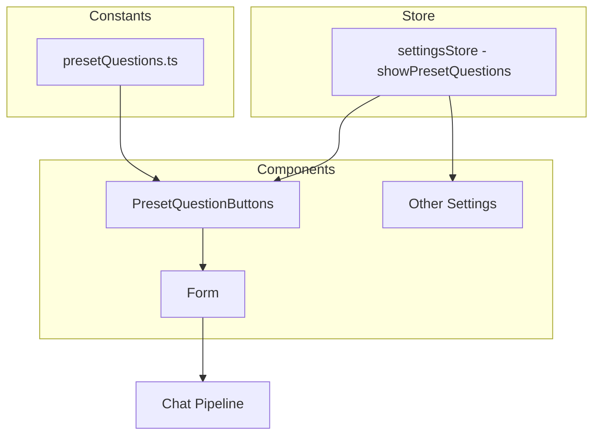

# Design Document: quick-question-buttons

## Overview

**Purpose**: 香水ソムリエAI「Scensei」のチャット画面に、コード固定のプリセット質問ボタンを提供し、初回利用者やデモ参加者が迷わず会話を開始できるようにする。

**Users**: 初回利用者・デモ参加者が、入力フォーム上部のボタンをワンクリックして香水に関する質問を即座に送信する。

**Impact**: 既存の `PresetQuestionButtons` コンポーネントを簡素化し、質問データをstore管理からコード固定に変更する。設定画面の質問エディタを削除し、表示/非表示トグルのみ残す。

### Goals
- 固定のプリセット質問をコード上で定義し、端末に依存しない一貫した表示を実現する
- 設定画面の質問事前設定欄（CRUD機能）を削除して簡素化する
- ボタンデザインをScenseiテーマに調和させる

### Non-Goals
- 質問内容のユーザーカスタマイズ機能
- 会話の文脈に応じた動的な質問生成
- バックエンド（AgentCore）側の変更

## Architecture

### Existing Architecture Analysis

現在の構成：
- `config/app.json` → `getInitialValuesFromEnv()` → Zustand store（`presetQuestions: PresetQuestion[]`）→ localStorage永続化
- `PresetQuestionButtons` が store から質問データを読み取り表示
- `settings/presetQuestions.tsx` が CRUD エディタ + `@hello-pangea/dnd` で並び替え提供

変更後の構成：
- `src/features/constants/presetQuestions.ts`（固定定数）→ `PresetQuestionButtons` が直接参照
- store の `presetQuestions` フィールドを削除、`showPresetQuestions` のみ残す
- `settings/presetQuestions.tsx` を削除、`other.tsx` にトグルをインライン記述

### Architecture Pattern & Boundary Map



**Architecture Integration**:
- Selected pattern: 定数直接参照（store を経由しない）
- Domain boundary: 質問データは `features/constants/` に属し、UI コンポーネントが直接 import する
- Existing patterns preserved: `Form` → `PresetQuestionButtons` → `hookSendChat` のコールバックチェーンは維持
- Steering compliance: Feature-based + Layer-based hybrid に準拠

### Technology Stack

| Layer | Choice / Version | Role in Feature | Notes |
|-------|------------------|-----------------|-------|
| Frontend | Next.js 14 / React 18 / TypeScript 5 | UIレンダリング | 既存スタック |
| State | Zustand 4.5 | `showPresetQuestions` の永続化 | `presetQuestions` データは除外 |
| Styling | Tailwind CSS 3.4 | ボタンデザイン | Scenseiテーマカラー適用 |

## Requirements Traceability

| Requirement | Summary | Components | Interfaces | Flows |
|-------------|---------|------------|------------|-------|
| 1.1, 1.2, 1.4 | 固定質問の定義と表示 | `PRESET_QUESTIONS` 定数, `PresetQuestionButtons` | `PresetQuestion` 型 | - |
| 1.3 | デフォルト有効 | settingsStore | `showPresetQuestions` 初期値 | - |
| 2.1, 2.2 | ワンクリック送信 | `PresetQuestionButtons`, `Form` | `onSelectQuestion` callback | 質問送信フロー |
| 2.3 | 処理中の無効化 | `PresetQuestionButtons` | `chatProcessingCount` 参照 | - |
| 3.1, 3.2, 3.3 | 配置とレスポンシブ | `PresetQuestionButtons`, `Form` | - | - |
| 4.1, 4.3 | 表示/非表示トグル | `other.tsx` 内トグル, settingsStore | `showPresetQuestions` | - |
| 4.2 | 設定エディタ削除 | `presetQuestions.tsx` 削除 | - | - |
| 5.1, 5.2, 5.3 | ビジュアルデザイン | `PresetQuestionButtons` | - | - |

## Components and Interfaces

| Component | Domain/Layer | Intent | Req Coverage | Key Dependencies | Contracts |
|-----------|-------------|--------|--------------|-----------------|-----------|
| `PRESET_QUESTIONS` | Constants | 固定質問データの定義 | 1.1, 1.2, 1.4 | なし | - |
| `PresetQuestionButtons` | UI | 質問ボタンの表示と送信 | 1.1-1.4, 2.1-2.3, 3.1-3.3, 5.1-5.3 | `PRESET_QUESTIONS` (P0), settingsStore (P0) | State |
| settingsStore（変更） | Store | `showPresetQuestions` の永続化 | 1.3, 4.1, 4.3 | Zustand (P0) | State |
| `other.tsx`（変更） | Settings UI | トグルのインライン表示 | 4.1, 4.2 | settingsStore (P0) | - |

### Constants Layer

#### `PRESET_QUESTIONS` 定数

| Field | Detail |
|-------|--------|
| Intent | Scenseiの香水ソムリエコンセプトに沿った固定質問データを提供する |
| Requirements | 1.1, 1.2, 1.4 |

**Responsibilities & Constraints**
- 質問データの唯一の定義元（Single Source of Truth）
- 質問内容の変更はコード変更+ビルドを要する

**Contracts**: State [x]

##### State Management

```typescript
// src/features/constants/presetQuestions.ts

interface PresetQuestion {
  readonly id: string
  readonly text: string
}

const PRESET_QUESTIONS: readonly PresetQuestion[]
// 例:
// { id: 'recommend-today', text: '今日のおすすめの香水は？' }
// { id: 'business', text: 'ビジネスにおすすめの香水はある？' }
// { id: 'beginner', text: '初心者におすすめの香水を教えて' }
// { id: 'seasonal', text: '春にぴったりの香水は？' }
// { id: 'gift', text: 'プレゼントにおすすめの香水はある？' }
```

- `order` フィールドは不要（配列の順序 = 表示順序）
- `readonly` で不変性を保証

**Implementation Notes**
- `PresetQuestion` 型を `src/features/stores/settings.ts` から移動・簡素化（`order` フィールド削除）
- 質問内容は上記を初期案とし、実装時に最終確定

### UI Layer

#### `PresetQuestionButtons`（変更）

| Field | Detail |
|-------|--------|
| Intent | 固定質問をボタンとして表示し、クリック時にチャットパイプラインに送信する |
| Requirements | 1.1-1.4, 2.1-2.3, 3.1-3.3, 5.1-5.3 |

**Responsibilities & Constraints**
- `PRESET_QUESTIONS` 定数から質問データを直接読み取る（store 経由しない）
- `showPresetQuestions` は store から読み取る（表示/非表示制御）
- `chatProcessingCount` を参照し、処理中はボタンを disabled にする
- Scenseiテーマカラーに沿ったスタイリング

**Dependencies**
- Inbound: `Form` — `onSelectQuestion` callback (P0)
- Outbound: `PRESET_QUESTIONS` — 質問データ (P0)
- Outbound: `settingsStore` — `showPresetQuestions` (P0)
- Outbound: `homeStore` — `chatProcessingCount` (P1)

**Contracts**: State [x]

##### State Management

- 読み取り: `settingsStore.showPresetQuestions`, `homeStore.chatProcessingCount`
- 定数参照: `PRESET_QUESTIONS`（import 時に確定、state ではない）

**Implementation Notes**
- ボタンスタイルを Scensei テーマに変更: 枠線ベース + テーマカラーアクセント
  - 通常: `border border-gold/30 text-white/90 bg-white/10 backdrop-blur-sm`
  - ホバー: `hover:bg-white/20 hover:border-gold/50`
  - 無効時: `opacity-50 cursor-not-allowed`
- スタイリングの詳細はテーマの CSS 変数に依存するため、実装時に既存テーマとの整合性を最終確認する

### Store Layer

#### settingsStore（変更）

| Field | Detail |
|-------|--------|
| Intent | `showPresetQuestions` のみを永続化し、質問データの store 管理を廃止する |
| Requirements | 1.3, 4.1, 4.3 |

**Responsibilities & Constraints**
- `presetQuestions` フィールドを `General` インターフェースから削除
- `partialize` から `presetQuestions` を除外
- `showPresetQuestions` のデフォルト値を `true` に変更（要件 1.3）
- `PresetQuestion` 型の export を削除（定数ファイルに移動）

**Contracts**: State [x]

##### State Management

変更前:
```typescript
interface General {
  presetQuestions: PresetQuestion[]
  showPresetQuestions: boolean
  // ...
}
```

変更後:
```typescript
interface General {
  showPresetQuestions: boolean
  // ...（presetQuestions を削除）
}
```

- `config/app.json` の `presetQuestions` フィールドも不要になるが、既存設定との互換性のため残置可
- `getInitialValuesFromEnv()` 内の `presetQuestions` 変換ロジックを削除
- `showPresetQuestions` の初期値を `config/app.json` から `true` に変更

### Settings UI Layer

#### `other.tsx`（変更）

| Field | Detail |
|-------|--------|
| Intent | プリセット質問の表示/非表示トグルをインラインで提供する |
| Requirements | 4.1, 4.2 |

**Implementation Notes**
- `import PresetQuestions from './presetQuestions'` と `<PresetQuestions />` を削除
- トグルボタンをインラインで配置（セクションヘッダー + ON/OFF ボタン）
- `presetQuestions.tsx` ファイル自体を削除

## Data Models

### Domain Model

変更前:
```typescript
export interface PresetQuestion {
  id: string
  text: string
  order: number
}
```

変更後:
```typescript
// src/features/constants/presetQuestions.ts
export interface PresetQuestion {
  readonly id: string
  readonly text: string
}
```

- `order` フィールドを削除（配列順序で管理）
- `readonly` 修飾子を追加（不変データ）
- 型定義の配置を `stores/settings.ts` から `constants/presetQuestions.ts` に移動

## Error Handling

### Error Strategy
- プリセット質問は固定データのため、データ取得エラーは発生しない
- チャット送信時のエラーは既存の `handleSendChatFn` のエラーハンドリングに委譲
- `showPresetQuestions` が localStorage から読み込めない場合、デフォルト `true` にフォールバック

## Testing Strategy

### Unit Tests
- `PRESET_QUESTIONS` 定数が空でないこと、全エントリに `id` と `text` が存在すること
- `PresetQuestionButtons` が `showPresetQuestions: false` の時に `null` を返すこと
- `PresetQuestionButtons` が `chatProcessingCount > 0` の時にボタンが `disabled` になること

### Integration Tests
- ボタンクリック時に `onSelectQuestion` が正しいテキストで呼び出されること
- 設定画面のトグル操作で `showPresetQuestions` が正しく切り替わること

### E2E Tests（手動確認）
- デスクトップ/モバイル両レイアウトでボタンが視認可能であること
- ボタンの横スクロールが機能すること
- AI応答処理中にボタンが無効化されること
