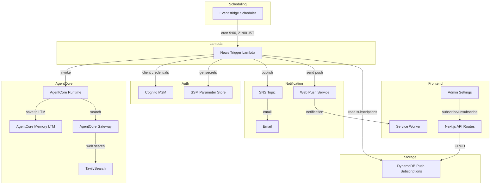
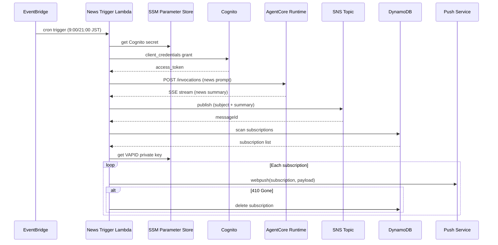
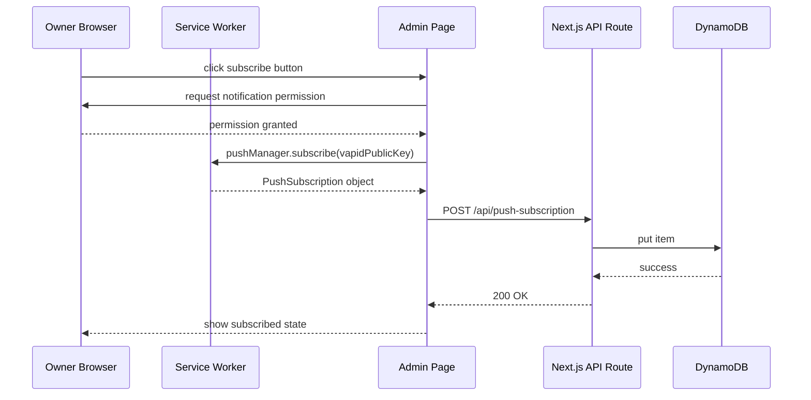

# Design Document

## Overview

**Purpose**: Tonari エージェントが朝晩の定時にニュースを収集・要約し、SNS メール通知と Web Push 通知の 2 経路でオーナーに届ける機能。エージェントの判断でオーナーの興味に合ったニュースもピックアップする。

**Users**: オーナー（個人）が、手動指示なしで最新ニュースを定期的に受け取る。

**Impact**: 既存の EventBridge → Lambda → AgentCore Runtime パターン（tweet-trigger）を踏襲し、新規の News Trigger Lambda と通知インフラを追加する。フロントエンドには Service Worker と Admin 設定画面への Web Push 管理機能を追加する。

### Goals
- 毎日 9:00 と 21:00（JST）に自動でニュースを収集・要約・通知する
- SNS メール と Web Push の 2 経路で確実にオーナーに届ける
- LTM にニュース要約を保存し、日常会話で自然に活用できるようにする
- 既存アーキテクチャパターンを踏襲し、CDK で一元管理する

### Non-Goals
- ニュースソースのカスタマイズ UI（プロンプトで制御）
- 通知時刻のユーザー変更機能（設定ファイルで固定）
- リアルタイムニュースアラート（定時実行のみ）
- メール本文の HTML テンプレート化（プレーンテキスト）

## Architecture

### Existing Architecture Analysis

現在の tweet-trigger パターン:
- EventBridge Scheduler（cron） → Tweet Trigger Lambda → Cognito M2M 認証 → AgentCore Runtime HTTP 呼び出し
- Lambda は SSM から Cognito client secret を取得
- AgentCore Runtime の応答は SSE ストリームだが、Lambda は全文読み取り
- `WorkloadConstruct` で Lambda・Schedule を定義、`TonariStack` で cross-construct wiring

踏襲するパターン:
- EventBridge cron → Lambda → Cognito 認証 → AgentCore Runtime の呼び出しチェーン
- SSM Parameter Store を使ったシークレット管理
- CDK の `WorkloadConstruct` への Lambda 追加

新規追加:
- News Trigger Lambda（AgentCore 呼び出し + SNS Publish + Web Push 送信）
- SNS Topic（メール通知）
- DynamoDB テーブル（Push サブスクリプション管理）
- Service Worker（Push 受信）
- Admin 設定画面（Push 購読管理 UI）
- Next.js API Routes（Push サブスクリプション CRUD）

### Architecture Pattern & Boundary Map



**Architecture Integration**:
- **Selected pattern**: tweet-trigger パターンの拡張。1 Lambda で収集 + 通知を一貫処理
- **Domain boundaries**: Lambda（オーケストレーション）、AgentCore（ニュース収集・要約・LTM保存）、フロントエンド（Push 購読管理）
- **Existing patterns preserved**: Cognito M2M 認証、SSM シークレット管理、EventBridge cron、CDK 一元管理
- **New components rationale**: SNS Topic（メール通知のマネージドサービス）、DynamoDB テーブル（Push サブスクリプションの永続化）、Service Worker（バックグラウンド Push 受信）

### Technology Stack

| Layer | Choice / Version | Role in Feature | Notes |
|-------|------------------|-----------------|-------|
| Frontend | Next.js 14 (Pages Router) | Service Worker 配信、Admin Push 管理 UI、API Routes | `public/sw.js` として配置 |
| Backend | Python 3.12 Lambda | News Trigger: AgentCore 呼び出し + 通知送信 | tweet-trigger と同一パターン |
| Backend | Strands Agent (AgentCore Runtime) | ニュース収集・要約・LTM 保存 | 既存 Runtime を再利用 |
| Data | DynamoDB | Push サブスクリプション管理 | PK=userId, SK=endpoint |
| Messaging | SNS | メール通知配信 | EmailSubscription |
| Messaging | Web Push API + pywebpush | ブラウザプッシュ通知 | VAPID 認証 |
| Infrastructure | CDK (TypeScript) | 全リソース管理 | WorkloadConstruct に統合 |
| Secrets | SSM Parameter Store | VAPID 秘密鍵、Cognito client secret | SecureString |

## System Flows

### ニュース収集・通知フロー



**Key Decisions**:
- AgentCore Runtime の応答全文を読み取ってから通知送信（ストリーミングは不要）
- Web Push 送信失敗（410 Gone）時はサブスクリプションを自動削除
- SNS と Web Push は独立して送信（片方の失敗が他方に影響しない）

### Push 購読管理フロー



## Requirements Traceability

| Requirement | Summary | Components | Interfaces | Flows |
|-------------|---------|------------|------------|-------|
| 1.1 | EventBridge 9:00/21:00 JST 起動 | EventBridge Schedule | cron expression | ニュース収集フロー |
| 1.2 | Cognito M2M 認証 + AgentCore 呼び出し | News Trigger Lambda | Cognito token API, AgentCore API | ニュース収集フロー |
| 1.3 | ニュース収集専用プロンプトで Web 検索 | News Trigger Lambda, AgentCore Runtime | AgentCore invocation payload | ニュース収集フロー |
| 1.4 | tweet-trigger パターン踏襲 | News Trigger Lambda | 同一パターン | ニュース収集フロー |
| 2.1 | TavilySearch で最新ニュース収集 | AgentCore Runtime, Gateway | TavilySearch tool | ニュース収集フロー |
| 2.2 | 総合ニュース幅広く収集 | ニュース収集プロンプト | — | — |
| 2.3 | LTM ベースのピックアップ | ニュース収集プロンプト, AgentCore Memory | Memory API | ニュース収集フロー |
| 2.4 | 通知フォーマットで要約出力 | ニュース収集プロンプト | — | — |
| 3.1 | ニュース収集専用プロンプト送信 | News Trigger Lambda | AgentCore invocation payload | ニュース収集フロー |
| 3.2 | ジャンル・フォーマット・ピックアップ指針 | ニュース収集プロンプト | — | — |
| 3.3 | 構造化出力指示 | ニュース収集プロンプト | — | — |
| 4.1 | SNS Topic にメッセージ発行 | News Trigger Lambda | SNS PublishCommand | ニュース収集フロー |
| 4.2 | 設定ファイルのメールアドレスに配信 | CDK Stack, config/infra.json | SNS EmailSubscription | — |
| 4.3 | 可読性の高いフォーマット | News Trigger Lambda | SNS message format | — |
| 4.4 | SNS 失敗時の CloudWatch ログ | News Trigger Lambda | CloudWatch Logs | — |
| 5.1 | Web Push 送信 | News Trigger Lambda | pywebpush API | ニュース収集フロー |
| 5.2 | タイトルと概要を含む通知 | News Trigger Lambda | Push payload | — |
| 5.3 | Service Worker 登録 | Service Worker, _app.tsx | SW registration API | — |
| 5.4 | 通知クリックでページ遷移 | Service Worker | notificationclick event | — |
| 5.5 | 無効サブスクリプション削除 | News Trigger Lambda | DynamoDB delete | ニュース収集フロー |
| 6.1 | 購読登録・解除ボタン | Admin Push Settings | — | Push 購読管理フロー |
| 6.2 | 通知許可要求 + サブスクリプション保存 | Admin Push Settings, API Route | Push API, POST /api/push-subscription | Push 購読管理フロー |
| 6.3 | サブスクリプション削除 | Admin Push Settings, API Route | DELETE /api/push-subscription | Push 購読管理フロー |
| 6.4 | 購読状態表示 | Admin Push Settings | pushManager.getSubscription() | — |
| 6.5 | VAPID キー認証 | SSM, Service Worker, Lambda | VAPID keys | — |
| 7.1 | LTM にニュース要約保存 | AgentCore Runtime, Memory | Memory API | ニュース収集フロー |
| 7.2 | 要約テキスト + 収集日時 | ニュース収集プロンプト | — | — |
| 7.3 | 通常会話で LTM 参照 | AgentCore Runtime, Memory | Memory retrieval | — |
| 8.1 | CDK で Lambda/Schedule/SNS/DynamoDB 定義 | WorkloadConstruct | CDK constructs | — |
| 8.2 | VAPID 鍵を SSM + フロントエンド設定に格納 | CDK Stack, Vercel env | SSM Parameter Store | — |
| 8.3 | メール通知先を設定ファイルから参照 | CDK Stack | config/infra.json | — |
| 8.4 | 既存 TonariStack に統合 | TonariStack | construct props | — |

## Components and Interfaces

| Component | Domain/Layer | Intent | Req Coverage | Key Dependencies | Contracts |
|-----------|--------------|--------|--------------|------------------|-----------|
| News Trigger Lambda | Backend/Lambda | ニュース収集オーケストレーション + 通知送信 | 1.1-1.4, 3.1, 4.1, 4.3-4.4, 5.1-5.2, 5.5 | AgentCore Runtime (P0), SNS (P0), DynamoDB (P1), pywebpush (P0) | Service, Batch |
| ニュース収集プロンプト | Backend/Prompt | エージェントへのニュース収集指示 | 2.1-2.4, 3.1-3.3, 7.2 | AgentCore Runtime (P0) | — |
| Service Worker | Frontend/SW | Push 通知受信・表示 | 5.3-5.4 | Browser Push API (P0) | Event |
| Admin Push Settings | Frontend/UI | Push 購読管理 UI | 6.1-6.4 | Push API (P0), API Route (P0) | State |
| Push Subscription API | Frontend/API | サブスクリプション CRUD | 6.2-6.3, 6.5 | DynamoDB (P0) | API |
| CDK Infrastructure | Infra/CDK | リソース定義・管理 | 8.1-8.4 | AWS CDK (P0) | — |

### Backend / Lambda

#### News Trigger Lambda

| Field | Detail |
|-------|--------|
| Intent | EventBridge 起動でニュース収集を AgentCore に依頼し、結果を SNS + Web Push で通知 |
| Requirements | 1.1, 1.2, 1.3, 1.4, 3.1, 4.1, 4.3, 4.4, 5.1, 5.2, 5.5 |

**Responsibilities & Constraints**
- AgentCore Runtime の呼び出し（Cognito M2M 認証経由）
- AgentCore 応答のパース（SSE ストリームからテキスト抽出）
- SNS Topic へのメッセージ発行
- DynamoDB からサブスクリプション一覧取得 + Web Push 送信
- 無効サブスクリプション（410 Gone）の自動削除
- タイムアウト: 5 分

**Dependencies**
- Outbound: Cognito — M2M トークン取得 (P0)
- Outbound: AgentCore Runtime — ニュース収集 (P0)
- Outbound: SNS — メール通知 (P0)
- Outbound: DynamoDB — サブスクリプション読み取り/削除 (P1)
- External: pywebpush — Web Push 送信 (P0)
- Outbound: SSM — VAPID 秘密鍵、Cognito client secret 取得 (P0)

**Contracts**: Service [x] / Batch [x]

##### Service Interface

```python
def handler(event: dict, context: LambdaContext) -> dict:
    """EventBridge から呼び出されるエントリポイント。

    Args:
        event: EventBridge イベント（内容は使用しない）
        context: Lambda コンテキスト

    Returns:
        {"statusCode": int, "body": str}
    """
    ...

def _build_news_prompt(now_str: str) -> str:
    """ニュース収集専用プロンプトを構築。"""
    ...

def _parse_agentcore_response(response_body: str) -> str:
    """SSE ストリーム応答からテキストを抽出。"""
    ...

def _send_push_notifications(
    news_summary: str,
    subscriptions: list[dict],
    vapid_private_key: str,
) -> list[str]:
    """各サブスクリプションに Web Push を送信。

    Returns:
        削除すべき無効サブスクリプションの endpoint リスト
    """
    ...
```

##### Batch / Job Contract
- **Trigger**: EventBridge Scheduler (cron: 9:00, 21:00 JST)
- **Input**: EventBridge イベント（ペイロードは使用しない）
- **Output**: CloudWatch Logs にステータス記録
- **Idempotency**: session_id に日付+時刻を含めることで同一時間帯の重複呼び出しを防止

**Implementation Notes**
- 既存の `tweet-trigger/index.py` をベースに `news-trigger/index.py` を新規作成
- `_get_cognito_token` と `_call_agentcore` は tweet-trigger と同一ロジック（共通化は将来検討）
- Lambda 環境変数: `AGENTCORE_RUNTIME_ARN`, `COGNITO_TOKEN_ENDPOINT`, `COGNITO_CLIENT_ID`, `COGNITO_SCOPE`, `SSM_COGNITO_CLIENT_SECRET`, `SNS_TOPIC_ARN`, `PUSH_SUBSCRIPTIONS_TABLE`, `SSM_VAPID_PRIVATE_KEY`, `VAPID_SUBJECT`

### Backend / Prompt

#### ニュース収集プロンプト

| Field | Detail |
|-------|--------|
| Intent | AgentCore Runtime に渡すニュース収集・要約の指示 |
| Requirements | 2.1, 2.2, 2.3, 2.4, 3.1, 3.2, 3.3, 7.2 |

**Responsibilities & Constraints**
- TavilySearch ツールの使用を指示
- 総合ニュースの幅広い収集を指示
- LTM のオーナー情報に基づくピックアップを指示
- 通知フォーマット（タイトル・要約・ソースURL）の出力を指示
- LTM への保存を指示
- ジェスチャータグ・感情タグは不要（通知用テキスト）

**Implementation Notes**
- News Trigger Lambda 内にプロンプト文字列として定義（`_build_news_prompt` 関数）
- tweet-trigger と同様に Lambda 内でプロンプトを構築し、AgentCore Runtime に送信
- actor_id は `"tonari-owner"` を使用（tweet-trigger と統一）

### Frontend / Service Worker

#### Service Worker (`public/sw.js`)

| Field | Detail |
|-------|--------|
| Intent | バックグラウンドで Web Push 通知を受信・表示し、クリック時にページ遷移 |
| Requirements | 5.3, 5.4 |

**Responsibilities & Constraints**
- `push` イベントハンドラでペイロードをパースし通知表示
- `notificationclick` イベントで Tonari ページを開く/フォーカス
- `install` イベントで `skipWaiting()` を呼び新バージョンを即座に有効化

**Dependencies**
- External: Browser Push API — 通知受信 (P0)

**Contracts**: Event [x]

##### Event Contract
- **Subscribed events**: `push`（Web Push サービスからの通知）、`notificationclick`（ユーザーの通知クリック）
- **Push payload format**:
  ```json
  {
    "title": "TONaRi ニュースまとめ",
    "body": "ニュース要約のプレビュー（先頭100文字程度）",
    "url": "/"
  }
  ```
- **Delivery guarantees**: ベストエフォート（ブラウザが起動していない場合は配信されない）

**Implementation Notes**
- `public/sw.js` に配置（Next.js が `/sw.js` として自動配信）
- 通知アイコンは既存の favicon を使用

### Frontend / UI

#### Admin Push Settings

| Field | Detail |
|-------|--------|
| Intent | Web Push 通知の購読登録・解除を管理する設定画面 |
| Requirements | 6.1, 6.2, 6.3, 6.4 |

**Responsibilities & Constraints**
- 現在の購読状態（登録済み/未登録）を表示
- 購読登録ボタン: ブラウザ通知許可要求 → `pushManager.subscribe()` → API 呼び出し
- 購読解除ボタン: `subscription.unsubscribe()` → API 呼び出し
- `PushManager` 非対応ブラウザでは非表示

**Dependencies**
- Outbound: Push Subscription API — サブスクリプション CRUD (P0)
- External: Browser Push API — pushManager (P0)

**Contracts**: State [x]

##### State Management

- `pushSubscriptionStatus`: `'loading' | 'subscribed' | 'unsubscribed' | 'unsupported'`
- コンポーネントローカルステート（Zustand 不要）。`useEffect` で `pushManager.getSubscription()` を確認して初期化

**Implementation Notes**
- `/admin` メニューに新しいカードを追加（通知設定）
- `/admin/notifications` ページを新規作成
- VAPID 公開鍵は `NEXT_PUBLIC_VAPID_PUBLIC_KEY` 環境変数から取得

### Frontend / API Route

#### Push Subscription API

| Field | Detail |
|-------|--------|
| Intent | Web Push サブスクリプションの登録・削除 |
| Requirements | 6.2, 6.3, 6.5 |

**Responsibilities & Constraints**
- POST: サブスクリプション登録（DynamoDB put）
- DELETE: サブスクリプション削除（DynamoDB delete）
- Admin 認証ミドルウェア適用下で動作

**Dependencies**
- Outbound: DynamoDB — サブスクリプション CRUD (P0)

**Contracts**: API [x]

##### API Contract

| Method | Endpoint | Request | Response | Errors |
|--------|----------|---------|----------|--------|
| POST | /api/push-subscription | `{ subscription: PushSubscriptionJSON }` | `{ success: true }` | 400 (invalid body), 500 |
| DELETE | /api/push-subscription | `{ endpoint: string }` | `{ success: true }` | 400 (missing endpoint), 500 |

**Implementation Notes**
- `@aws-sdk/client-dynamodb` + `@aws-sdk/lib-dynamodb` を使用
- DynamoDB テーブル名は環境変数 `PUSH_SUBSCRIPTIONS_TABLE` から取得
- userId は固定値 `"tonari-owner"` を使用

### Infrastructure / CDK

#### CDK Infrastructure

| Field | Detail |
|-------|--------|
| Intent | News Trigger Lambda、EventBridge Schedule、SNS Topic、DynamoDB テーブル等の定義 |
| Requirements | 8.1, 8.2, 8.3, 8.4 |

**Responsibilities & Constraints**
- 既存の `WorkloadConstruct` に News Trigger Lambda と関連リソースを追加
- `TonariStack` で cross-construct wiring（Runtime ARN の設定）
- `config/infra.json` からメールアドレスを参照

**Implementation Notes**
- `WorkloadConstructProps` に `newsScheduler` オプションを追加（`tweetScheduler` と同様のパターン）
- News Trigger Lambda の環境変数は `WorkloadConstruct` 内で設定（一部は `TonariStack` で cross-construct wiring）
- EventBridge Schedule は 2 つ（9:00、21:00 JST）
- SNS Topic は `WorkloadConstruct` 内で定義
- Push サブスクリプション DynamoDB テーブルも `WorkloadConstruct` 内で定義

## Data Models

### Domain Model

- **PushSubscription**: Web Push サブスクリプション情報（userId + ブラウザ固有の endpoint）
- **NewsNotification**: ニュース要約テキスト（Lambda 内の一時データ、永続化しない）
- ニュース要約の永続化は AgentCore Memory（LTM）に委譲

### Physical Data Model

**DynamoDB: `tonari-push-subscriptions`**

| Attribute | Type | Key | Description |
|-----------|------|-----|-------------|
| userId | String | PK | ユーザー識別子（`tonari-owner` 固定） |
| endpoint | String | SK | Web Push エンドポイント URL |
| p256dh | String | — | ECDH 公開鍵（base64url） |
| auth | String | — | 認証シークレット（base64url） |
| createdAt | String | — | 登録日時（ISO 8601） |

- Billing: PAY_PER_REQUEST
- Removal: DESTROY（開発段階）

### Data Contracts & Integration

**AgentCore Runtime 呼び出しペイロード**
```json
{
  "prompt": "<ニュース収集プロンプト>",
  "session_id": "tonari-news-pipeline-2026-02-26-09",
  "actor_id": "tonari-owner"
}
```

**SNS メッセージ**
```
Subject: TONaRi ニュースまとめ（2026/02/26 09:00）
Message: <ニュース要約全文（プレーンテキスト）>
```

**Web Push ペイロード**
```json
{
  "title": "TONaRi ニュースまとめ",
  "body": "<ニュース要約の先頭100文字程度>",
  "url": "/"
}
```

## Error Handling

### Error Strategy
- Lambda 内の各段階（Cognito認証、AgentCore呼び出し、SNS発行、Web Push送信）で独立してエラーハンドリング
- 一部の通知が失敗しても他の通知は継続

### Error Categories and Responses

**System Errors**:
- Cognito トークン取得失敗 → Lambda 即時終了、CloudWatch Logs に記録
- AgentCore Runtime 呼び出し失敗 → Lambda 即時終了、CloudWatch Logs に記録
- SNS Publish 失敗 → エラーログ記録、Web Push は継続
- Web Push 送信失敗（ネットワーク） → エラーログ記録、次のサブスクリプションに進む
- Web Push 410 Gone → サブスクリプション削除、次に進む

**User Errors**:
- Push 購読 API に不正なリクエスト → 400 Bad Request

### Monitoring
- Lambda の CloudWatch Logs で実行ステータスを記録
- 各通知チャネル（SNS、Web Push）の成功/失敗をログに記録

## Testing Strategy

### Unit Tests
- News Trigger Lambda: プロンプト構築、SSE レスポンスパース、Push 送信ロジック
- Push Subscription API: リクエストバリデーション

### Integration Tests
- Lambda → AgentCore Runtime 呼び出し（テスト環境）
- Lambda → SNS Publish（テスト Topic）
- API Route → DynamoDB CRUD

### E2E Tests
- Admin Push Settings: 購読登録/解除のフローを手動確認
- ニュース通知の全体フロー（EventBridge → メール + Push 受信）を手動確認

## Security Considerations

- VAPID 秘密鍵は SSM SecureString に保管。Lambda の IAM ロールで `ssm:GetParameter` を制限
- Push Subscription API は Admin 認証ミドルウェア保護下で動作
- DynamoDB テーブルへのアクセスは Lambda IAM ロール + API Route の AWS 認証情報で制限
- SNS メールアドレスは設定ファイル管理（ハードコードしない）

## Configuration

### config/infra.json への追加

```json
{
  "newsScheduler": {
    "notificationEmail": "owner@example.com",
    "vapidSubject": "mailto:owner@example.com"
  }
}
```

### 環境変数

**Vercel（フロントエンド）**:
- `NEXT_PUBLIC_VAPID_PUBLIC_KEY`: VAPID 公開鍵（URL-safe base64）
- `PUSH_SUBSCRIPTIONS_TABLE`: DynamoDB テーブル名
- `AWS_ACCESS_KEY_ID` / `AWS_SECRET_ACCESS_KEY`: DynamoDB アクセス用（既存の設定がある場合はそれを使用）

**SSM Parameter Store（手動作成）**:
- `/tonari/vapid/private-key`: VAPID 秘密鍵（SecureString）
- `/tonari/vapid/public-key`: VAPID 公開鍵（String）

### 初期セットアップ手順

1. `npx web-push generate-vapid-keys` で VAPID 鍵ペアを生成
2. SSM Parameter Store に鍵を保存
3. Vercel に `NEXT_PUBLIC_VAPID_PUBLIC_KEY` を設定
4. `config/infra.json` にメールアドレスを設定
5. `cd infra && npx cdk deploy` でインフラをデプロイ
6. SNS 確認メールを承認
