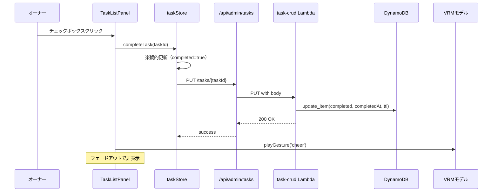
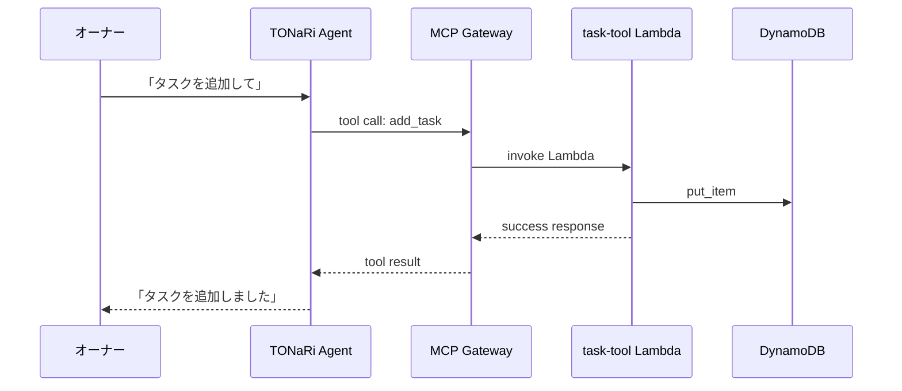
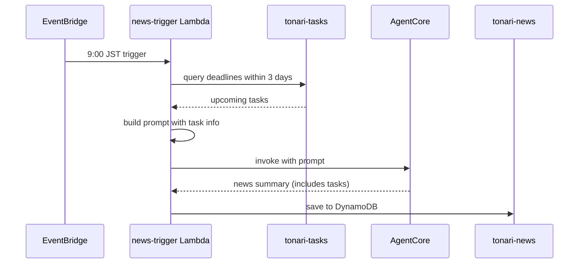
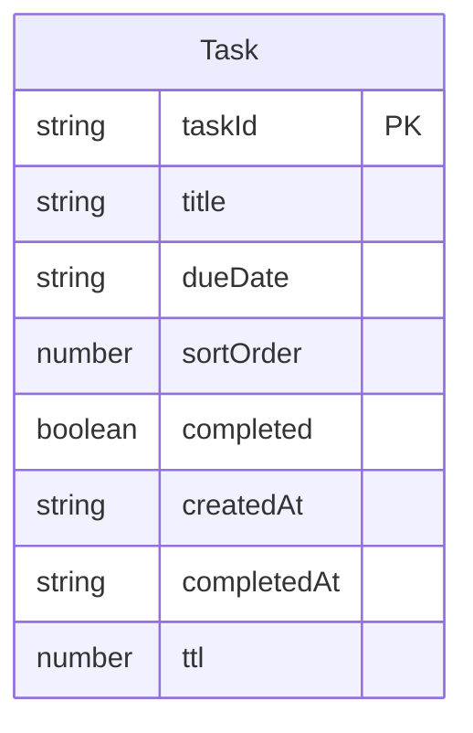

# Technical Design: タスク管理機能

## Overview

**Purpose**: オーナーがTonariアプリ上でタスクの作成・編集・完了・削除を行い、期限管理やTONaRiとの会話を通じたタスク操作を可能にする。

**Users**: オーナー（単一ユーザー）がタスクリストUI、TONaRiとの会話、朝のニュースブリーフィングを通じてタスクを管理する。

**Impact**: 既存のPomodoroTimerと同様のフローティングUI、MCP Gatewayツール、news-trigger Lambda、AgentCoreシステムプロンプトに変更を加える。

### Goals
- タスクのCRUD操作（UI + 会話経由）
- ドラッグ&ドロップによるタスク並び替え
- カレンダー型UIによる期限設定と期限アラート
- 朝のニュースブリーフィングへのタスク期限情報統合
- 会話中のタスク自動検出と追加提案

### Non-Goals
- マルチユーザー対応（単一オーナー前提）
- タスクのカテゴリ・タグ・プロジェクト分類
- サブタスク・依存関係の管理
- タスクの繰り返し（リカーリング）設定
- カレンダーアプリとの同期

## Architecture

### Existing Architecture Analysis

現在のTonariアーキテクチャは以下のパターンで構成されている:

- **フロントエンド**: Next.js Pages Router + Zustand状態管理 + VRM 3Dアバター
- **バックエンド**: AgentCore Runtime（Strands Agent）+ MCP Gateway + Lambda
- **データ**: DynamoDB（perfumes, diary, news各テーブル）
- **認証**: Admin Auth（WebAuthn）→ Cognito M2M（server-to-server）
- **API**: Next.js API Routes → Cognito M2Mトークン → API Gateway → Lambda

タスク管理機能はこの既存アーキテクチャの全レイヤーに統合する。

### Architecture Pattern & Boundary Map

```mermaid
graph TB
    subgraph Frontend
        TaskIcon[TaskIcon Button]
        TaskList[TaskListPanel]
        TaskStore[taskStore - Zustand]
        TaskAPI[/api/admin/tasks]
    end

    subgraph Backend
        APIGW[API Gateway]
        TaskCRUD[task-crud Lambda]
        TaskTool[task-tool Lambda]
        NewsTrigger[news-trigger Lambda]
    end

    subgraph Infrastructure
        TaskTable[(tonari-tasks DynamoDB)]
        Gateway[MCP Gateway]
        AgentCore[AgentCore Runtime]
    end

    TaskIcon -->|toggle| TaskList
    TaskList -->|CRUD| TaskStore
    TaskStore -->|fetch/mutate| TaskAPI
    TaskAPI -->|proxy| APIGW
    APIGW -->|route| TaskCRUD
    TaskCRUD -->|read/write| TaskTable
    Gateway -->|invoke| TaskTool
    TaskTool -->|read/write| TaskTable
    AgentCore -->|MCP tool call| Gateway
    NewsTrigger -->|read deadlines| TaskTable
```

**Architecture Integration**:
- Selected pattern: 既存のCRUD Lambda + Gateway Tool Lambda 分離パターンを踏襲
- Domain boundaries: UI層（React）→ API Proxy層（Next.js API Routes）→ Backend層（API Gateway + Lambda）→ Data層（DynamoDB）
- Existing patterns preserved: Zustand store、PointerEventsドラッグ、ガラスモーフィズムUI、Cognito M2M認証
- New components rationale: TaskListPanelはPomodoroTimerのフローティングUIを拡張、task-crudとtask-toolは既存のdiary系パターンを踏襲
- Steering compliance: 既存の技術スタック・コードパターンに完全準拠

### Technology Stack

| Layer | Choice / Version | Role in Feature | Notes |
|-------|------------------|-----------------|-------|
| Frontend | React 18 + Next.js 14 (Pages Router) | タスクリストUI、メニューアイコン | 既存スタック |
| State | Zustand 4 + persist middleware | タスクデータキャッシュ、UI状態管理 | `partialize`でUI状態のみローカル永続化 |
| Backend | Python 3.12 Lambda | タスクCRUD API + MCPツール | 既存パターン踏襲 |
| Data | DynamoDB (PAY_PER_REQUEST) | タスクデータ永続化 | TTLで完了タスク自動削除 |
| Infrastructure | AWS CDK | DynamoDB、Lambda、API Gateway、Gateway Target | 既存WorkloadConstruct拡張 |
| Agent | AgentCore Runtime (Strands) | 会話経由タスク操作、自動検出 | システムプロンプト + MCPツール |

## System Flows

### タスク完了フロー



### 会話経由タスク操作フロー



### ニュース統合フロー



## Requirements Traceability

| Requirement | Summary | Components | Interfaces | Flows |
|-------------|---------|------------|------------|-------|
| 1.1 | メニューバーのタスクアイコンクリックでリスト表示 | TaskIcon, TaskListPanel, taskStore | State | — |
| 1.2 | ドラッグで画面上を自由に移動 | TaskListPanel | — | — |
| 1.3 | Apple風ガラスモーフィズムUI | TaskListPanel | — | — |
| 1.4 | アイコン再クリックで非表示 | TaskIcon, TaskListPanel, taskStore | State | — |
| 1.5 | 丸型チェックボックス付きリスト表示 | TaskListPanel | — | — |
| 2.1 | 追加ボタンで入力欄表示 | TaskListPanel | — | — |
| 2.2 | タスク名入力で DynamoDB に保存 | TaskListPanel, taskStore, task-crud | API, State | — |
| 2.3 | タスク名クリックでインライン編集 | TaskListPanel | — | — |
| 2.4 | チェックボックスクリックで完了 | TaskListPanel, taskStore, task-crud | API, State | タスク完了フロー |
| 2.5 | 完了時 VRM cheer ジェスチャー | TaskListPanel | — | タスク完了フロー |
| 2.6 | 完了タスク TTL 30日自動削除 | task-crud | — | — |
| 3.1 | 期限エリアクリックでカレンダーUI | TaskListPanel | — | — |
| 3.2 | カレンダー日付選択で期限保存 | TaskListPanel, taskStore, task-crud | API, State | — |
| 3.3 | 期限日をタスク名近くに表示 | TaskListPanel | — | — |
| 3.4 | 期限超過を警告色で表示 | TaskListPanel | — | — |
| 4.1 | ドラッグ中の移動先フィードバック | TaskListPanel | — | — |
| 4.2 | ドロップで表示順更新・DynamoDB保存 | TaskListPanel, taskStore, task-crud | API, State | — |
| 4.3 | ドラッグ中のタスク視覚区別 | TaskListPanel | — | — |
| 5.1 | 完了タスク表示用矢印アイコン | TaskListPanel | — | — |
| 5.2 | 矢印クリックで完了タスク一覧表示 | TaskListPanel, taskStore | State | — |
| 5.3 | 完了日時を各タスクに表示 | TaskListPanel | — | — |
| 5.4 | 矢印再クリックで非表示 | TaskListPanel | — | — |
| 6.1 | 期限3日以内でアイコンにバッジ表示 | TaskIcon, taskStore | State | — |
| 6.2 | 朝9時ニュースに期限タスク含める | news-trigger Lambda | — | ニュース統合フロー |
| 6.3 | 期限近いタスクを視覚的に強調 | TaskListPanel | — | — |
| 7.1 | MCPツール経由でタスクCRUD | task-tool Lambda, MCP Gateway | API | 会話経由タスク操作フロー |
| 7.2 | 会話で「タスク追加して」でタスク追加 | task-tool Lambda, AgentCore prompt | API | 会話経由タスク操作フロー |
| 7.3 | 会話で期限の近いタスク回答 | task-tool Lambda | API | — |
| 7.4 | ネクストアクション提案 | AgentCore prompt | — | — |
| 8.1 | タスクっぽい発言を自動検出・提案 | AgentCore prompt | — | — |
| 8.2 | 承認でタスク自動追加 | task-tool Lambda | API | — |
| 8.3 | 拒否で会話続行 | AgentCore prompt | — | — |
| 9.1 | DynamoDB PK:taskId | tonari-tasks table | — | — |
| 9.2 | タスク属性（ID, 名前, 期限, 順序, 完了, 日時, TTL） | tonari-tasks table | — | — |
| 9.3 | 完了時TTL = 完了日+30日 | task-crud Lambda | — | — |
| 9.4 | API Gateway + Lambda + Cognito認証 | task-crud Lambda, API Gateway | API | — |

## Components and Interfaces

| Component | Domain/Layer | Intent | Req Coverage | Key Dependencies | Contracts |
|-----------|-------------|--------|--------------|------------------|-----------|
| TaskIcon | UI | メニューバーのタスクアイコン + バッジ | 1.1, 1.4, 6.1 | taskStore (P0) | State |
| TaskListPanel | UI | フローティングタスクリストパネル | 1.1-1.5, 2.1-2.5, 3.1-3.4, 4.1-4.3, 5.1-5.4, 6.3 | taskStore (P0), VRM Viewer (P1) | State |
| taskStore | State | タスクデータのZustand状態管理 | 全UI要件 | Task API (P0) | State, Service |
| Task API Proxy | API Proxy | Next.js API → API Gateway プロキシ | 9.4 | API Gateway (P0) | API |
| task-crud Lambda | Backend | タスクCRUD API（HTTP経由） | 2.2, 2.4, 2.6, 3.2, 4.2, 9.1-9.4 | DynamoDB (P0) | API |
| task-tool Lambda | Backend | タスクMCPゲートウェイツール | 7.1-7.3, 8.2 | DynamoDB (P0) | API |
| news-trigger 拡張 | Backend | ニュースプロンプトにタスク情報統合 | 6.2 | DynamoDB (P0) | — |
| AgentCore prompt 拡張 | Agent | タスク操作・自動検出のプロンプト指示 | 7.2-7.4, 8.1, 8.3 | MCP Gateway (P0) | — |

### UI Layer

#### TaskIcon

| Field | Detail |
|-------|--------|
| Intent | メニューバーにタスクアイコンを表示し、タスクリストの表示/非表示を切り替える |
| Requirements | 1.1, 1.4, 6.1 |

**Responsibilities & Constraints**
- タスクリストパネルの開閉トグル
- 期限3日以内の未完了タスク数をバッジ表示
- `showControlPanel` ブロック内に配置（Admin機能）

**Dependencies**
- Inbound: menu.tsx, mobileHeader.tsx — ボタン配置 (P0)
- Outbound: taskStore — 表示状態トグル、バッジ数取得 (P0)

**Contracts**: State [x]

**Implementation Notes**
- `menu.tsx` と `mobileHeader.tsx` の両方にIconButtonとして配置
- バッジは `taskStore` の `urgentTaskCount` ゲッターから取得
- アイコンは既存の `IconButton` コンポーネントを使用、新規SVGアイコンを作成

#### TaskListPanel

| Field | Detail |
|-------|--------|
| Intent | ドラッグ可能なフローティングパネルでタスクリストを表示・操作する |
| Requirements | 1.1-1.5, 2.1-2.5, 3.1-3.4, 4.1-4.3, 5.1-5.4, 6.3 |

**Responsibilities & Constraints**
- フローティングパネル（PointerEventsドラッグ、ガラスモーフィズム）
- タスクの一覧表示（丸型チェックボックス + タスク名 + 期限）
- インライン追加・編集・完了・削除
- カレンダー型日付ピッカーによる期限設定
- ドラッグ&ドロップによるタスク並び替え
- 完了タスク一覧の表示/非表示
- 期限超過の警告色、期限3日以内の強調表示
- 完了時のVRM cheerジェスチャー再生

**Dependencies**
- Inbound: taskStore — タスクデータ、UI状態 (P0)
- Outbound: taskStore — CRUD操作、並び替え (P0)
- External: homeStore — VRM Viewer参照 (P1)

**Contracts**: State [x]

**Implementation Notes**
- PomodoroTimerのドラッグ/リサイズ/フェードパターンを踏襲
- ガラスモーフィズム: `rgba(255,255,255,0.55)`, `backdrop-filter: blur(20px) saturate(1.4)`
- 日付ピッカーは `<input type="date">` のネイティブUI（軽量で十分）
- タスク並び替え: リスト内PointerEventsドラッグ（移動先インジケーター + 半透明ドラッグ要素）
- z-index: `z-[25]`（PomodoroTimerと同レベル）
- パネル位置の `localStorage` 永続化キー: `tonari-task-layout`

### State Layer

#### taskStore

| Field | Detail |
|-------|--------|
| Intent | タスクデータのフェッチ・キャッシュ・楽観的更新・UI状態管理 |
| Requirements | 全UI要件のデータ管理 |

**Responsibilities & Constraints**
- APIからのタスクデータフェッチとキャッシュ
- 楽観的更新（追加・編集・完了・削除・並び替え）
- エラー時のリフェッチによるリカバリ
- UI状態（パネル表示/非表示）の管理
- 期限アラート用の計算（urgentTaskCount）

**Dependencies**
- Outbound: Task API Proxy — CRUD操作 (P0)

**Contracts**: State [x] / Service [x]

##### Service Interface
```typescript
interface Task {
  taskId: string
  title: string
  dueDate: string | null  // ISO 8601 date string (YYYY-MM-DD) or null
  sortOrder: number
  completed: boolean
  createdAt: string  // ISO 8601 datetime
  completedAt: string | null  // ISO 8601 datetime or null
}

interface TaskState {
  // Data
  tasks: Task[]
  completedTasks: Task[]
  loading: boolean

  // UI State (persisted via partialize)
  isVisible: boolean
  showCompleted: boolean

  // Computed
  urgentTaskCount: number  // tasks with dueDate within 3 days

  // Actions
  toggle: () => void
  fetchTasks: () => Promise<void>
  addTask: (title: string) => Promise<void>
  updateTask: (taskId: string, updates: Partial<Pick<Task, 'title' | 'dueDate'>>) => Promise<void>
  completeTask: (taskId: string) => Promise<void>
  deleteTask: (taskId: string) => Promise<void>
  reorderTasks: (taskId: string, newIndex: number) => Promise<void>
  toggleShowCompleted: () => void
}
```

##### State Management
- Persistence: `partialize` で `isVisible`, `showCompleted` のみローカル永続化
- タスクデータはAPIから取得（ローカルストレージには保存しない）
- 楽観的更新: アクション呼び出し時に即座にUIを更新、API成功/失敗後に整合性を確保
- `urgentTaskCount` はタスクリストから動的に計算

### API Proxy Layer

#### Task API Proxy

| Field | Detail |
|-------|--------|
| Intent | フロントエンドからバックエンドAPI Gatewayへの認証済みプロキシ |
| Requirements | 9.4 |

**Responsibilities & Constraints**
- Admin認証チェック
- Cognito M2Mトークン取得
- API Gatewayへのリクエストプロキシ
- 既存の `diary/index.ts` パターンに準拠

**Dependencies**
- Inbound: taskStore — fetch/mutate (P0)
- Outbound: API Gateway — proxy (P0)

**Contracts**: API [x]

##### API Contract

| Method | Endpoint | Request | Response | Errors |
|--------|----------|---------|----------|--------|
| GET | /api/admin/tasks | — | `{ tasks: Task[] }` | 401, 500 |
| POST | /api/admin/tasks | `{ title: string, dueDate?: string }` | `{ task: Task }` | 400, 401, 500 |
| PUT | /api/admin/tasks/[taskId] | `{ title?: string, dueDate?: string, completed?: boolean, sortOrder?: number }` | `{ task: Task }` | 400, 401, 404, 500 |
| DELETE | /api/admin/tasks/[taskId] | — | `{ success: true }` | 401, 404, 500 |
| PUT | /api/admin/tasks/reorder | `{ taskIds: string[] }` | `{ success: true }` | 400, 401, 500 |

### Backend Layer

#### task-crud Lambda

| Field | Detail |
|-------|--------|
| Intent | HTTPリクエスト経由のタスクCRUD操作 |
| Requirements | 2.2, 2.4, 2.6, 3.2, 4.2, 9.1-9.4 |

**Responsibilities & Constraints**
- HTTP method + path parameter ルーティング
- DynamoDB CRUD操作
- 完了時のTTL設定（完了日+30日）
- UUIDv4によるタスクID生成
- sortOrder の管理（並び替え時のバッチ更新）

**Dependencies**
- Inbound: API Gateway — HTTP requests (P0)
- Outbound: DynamoDB tonari-tasks — read/write (P0)

**Contracts**: API [x]

##### API Contract

| Method | Path | Request Body | Response | Errors |
|--------|------|-------------|----------|--------|
| GET | /tasks | — | `{ tasks: [...] }` | 500 |
| POST | /tasks | `{ title, dueDate? }` | `{ task: {...} }` | 400, 500 |
| PUT | /tasks/{taskId} | `{ title?, dueDate?, completed?, sortOrder? }` | `{ task: {...} }` | 400, 404, 500 |
| DELETE | /tasks/{taskId} | — | `{ success: true }` | 404, 500 |
| PUT | /tasks/reorder | `{ taskIds: [...] }` | `{ success: true }` | 400, 500 |

**Implementation Notes**
- `GET /tasks` は `completed=false` のタスクをデフォルトで返す。クエリパラメータ `?includeCompleted=true` で完了タスクも含める
- `PUT /tasks/reorder` は `taskIds` 配列の順序に従って各タスクの `sortOrder` をバッチ更新
- 完了時: `completed=true`, `completedAt=now`, `ttl=now+30days(unix timestamp)`
- userId は `tonari-owner` 固定（シングルユーザー）

#### task-tool Lambda

| Field | Detail |
|-------|--------|
| Intent | MCPゲートウェイ経由のタスク操作ツール |
| Requirements | 7.1-7.3, 8.2 |

**Responsibilities & Constraints**
- MCP Gateway Toolイベント処理（プレーンJSON）
- 4つのツール操作: `list_tasks`, `add_task`, `complete_task`, `update_task`
- diary-tool Lambdaのパターンに準拠

**Dependencies**
- Inbound: MCP Gateway — tool invocation (P0)
- Outbound: DynamoDB tonari-tasks — read/write (P0)

**Contracts**: API [x]

##### Tool Schema

```
Tool: list_tasks
  Description: List active tasks with optional deadline filter
  Input: { user_id: string, include_completed?: boolean, days_until_due?: number }
  Output: { tasks: [...], count: number, message: string }

Tool: add_task
  Description: Add a new task
  Input: { user_id: string, title: string, due_date?: string }
  Output: { success: boolean, task: {...}, message: string }

Tool: complete_task
  Description: Mark a task as completed
  Input: { user_id: string, task_id: string }
  Output: { success: boolean, message: string }

Tool: update_task
  Description: Update task title or due date
  Input: { user_id: string, task_id: string, title?: string, due_date?: string }
  Output: { success: boolean, task: {...}, message: string }
```

**Implementation Notes**
- `list_tasks` の `days_until_due` パラメータで期限が N 日以内のタスクのみフィルタ可能（会話で「期限の近いタスクは？」に対応）
- Gateway Target名: `task-tool`、AgentCoreConstruct propsに `taskToolLambda` を追加

#### news-trigger 拡張

| Field | Detail |
|-------|--------|
| Intent | 朝のニュースブリーフィングに期限が近いタスク情報を統合する |
| Requirements | 6.2 |

**Responsibilities & Constraints**
- 朝9時のニュース配信時にタスクテーブルをクエリ
- 期限3日以内のタスクをプロンプトに含める

**Implementation Notes**
- `_build_news_prompt()` にタスク情報セクションを追加
- news-trigger LambdaにタスクテーブルのRead権限を付与（環境変数 `TASKS_TABLE`）
- タスクがない場合はセクションを省略
- プロンプト追記例: `"【期限の近いタスク】\n{task_list}\n上記のタスクがある場合は、ニュースの冒頭でリマインドしてください。"`

#### AgentCore prompt 拡張

| Field | Detail |
|-------|--------|
| Intent | TONaRiのシステムプロンプトにタスク操作・自動検出の指示を追加 |
| Requirements | 7.2-7.4, 8.1, 8.3 |

**Implementation Notes**
- システムプロンプト（`agentcore/src/agent/prompts.py`）に以下を追記:
  - タスク管理ツール（`task-tool___list_tasks` 等）の使用指示
  - 会話中のタスク自動検出ルール（期限・行動表現の検出 → 「タスクに追加しましょうか？」提案）
  - ネクストアクション提案のガイドライン
  - 拒否時の振る舞い（追加せず会話続行）

## Data Models

### Domain Model



**Business Rules**:
- タスクは作成時に `completed=false`, `sortOrder=既存最大値+1`
- 完了時に `completedAt=now`, `ttl=completedAt+30days`
- `sortOrder` は並び替え時にバッチ更新（配列のインデックス値）
- `dueDate` は任意（null許可）

### Physical Data Model (DynamoDB)

**Table: `tonari-tasks`**

| Attribute | Type | Description |
|-----------|------|-------------|
| taskId (PK) | String | タスクID（UUIDv4） |
| title | String | タスク名 |
| dueDate | String / null | 期限（YYYY-MM-DD）、未設定時は属性なし |
| sortOrder | Number | 表示順（0始まり） |
| completed | Boolean | 完了フラグ |
| createdAt | String | 作成日時（ISO 8601） |
| completedAt | String / null | 完了日時（ISO 8601）、未完了時は属性なし |
| ttl | Number / null | TTL（UNIX timestamp）、完了時にセット |

**Key Design**:
- PK=`taskId` — シングルユーザーのためソートキー不要
- TTL属性: `ttl` — DynamoDBのTTL機能で完了30日後に自動削除
- Billing: PAY_PER_REQUEST
- RemovalPolicy: DESTROY（非本番環境）
- 全タスク取得は `scan` で実施（シングルユーザー・少量データのため問題なし）

### Data Contracts

**Frontend ↔ Backend API**

```typescript
// GET /tasks response
interface TaskListResponse {
  tasks: Array<{
    taskId: string
    title: string
    dueDate: string | null
    sortOrder: number
    completed: boolean
    createdAt: string
    completedAt: string | null
  }>
}

// POST /tasks request
interface CreateTaskRequest {
  title: string
  dueDate?: string  // YYYY-MM-DD
}

// PUT /tasks/{taskId} request
interface UpdateTaskRequest {
  title?: string
  dueDate?: string | null
  completed?: boolean
  sortOrder?: number
}

// PUT /tasks/reorder request
interface ReorderTasksRequest {
  taskIds: string[]  // ordered array of task IDs
}
```

## Error Handling

### Error Strategy

| Error Type | Handling | Recovery |
|------------|----------|----------|
| API通信エラー | トースト通知 + リフェッチ | 楽観的更新をロールバック、最新データで再描画 |
| 認証エラー (401) | Admin認証画面にリダイレクト | — |
| バリデーションエラー (400) | インラインエラーメッセージ | ユーザーが入力を修正 |
| タスク未検出 (404) | トースト通知 + リフェッチ | 最新データで再描画 |
| DynamoDB書き込みエラー | Lambda内でログ出力、500返却 | フロントエンドがリトライ |

### Monitoring
- Lambda CloudWatch Logs: エラーログ
- API Gateway 4xx/5xx メトリクス
- DynamoDB ConsumedCapacity 監視（既存パターン）

## Testing Strategy

### Unit Tests
- `taskStore` のアクション（addTask, completeTask, reorderTasks）
- task-crud Lambda のルーティングとDynamoDB操作
- task-tool Lambda のツール操作ディスパッチ
- `urgentTaskCount` 計算ロジック

### Integration Tests
- フロントエンド → API Proxy → API Gateway → Lambda → DynamoDB の一連フロー
- MCP Gateway → task-tool Lambda → DynamoDB のツール呼び出しフロー
- news-trigger Lambda のタスク情報統合

### E2E Tests
- タスク追加 → 一覧表示 → 完了 → cheerジェスチャー再生
- ドラッグ&ドロップによる並び替え → 順序永続化
- 期限設定 → バッジ表示 → 強調表示

## Security Considerations

- 全APIエンドポイントはCognito M2Mオーソライザで保護（既存パターン）
- Admin認証（WebAuthn）でフロントエンドAPIプロキシを保護
- userId は `tonari-owner` 固定（シングルユーザー、権限分離不要）
- DynamoDB アクセスは Lambda IAM ロール経由（最小権限原則）
