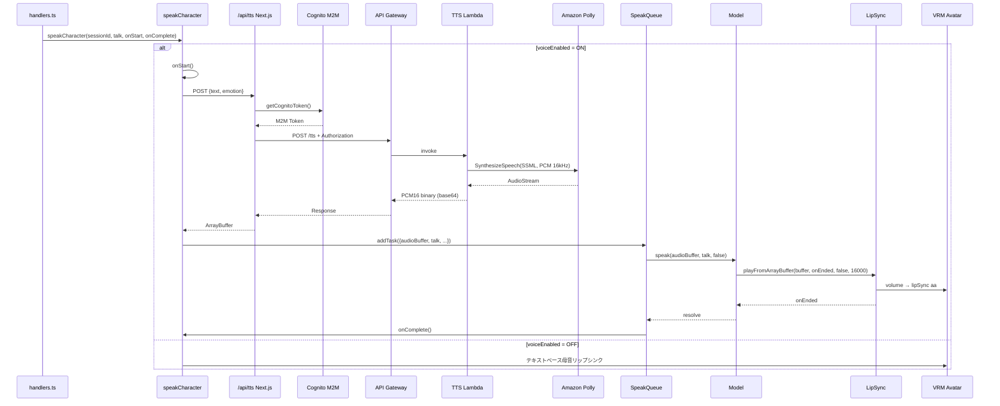

# Design Document: TTS Polly LipSync

## Overview

**Purpose**: AI応答テキストをAmazon Pollyで音声合成し、VRMモデルのリップシンクと連動させることで、テキストのみの対話から音声付きの対話体験にアップグレードする。

**Users**: Tonariを利用するすべてのユーザー。設定画面から音声出力のON/OFFを選択できる。

**Impact**: 無効化されていた音声再生インフラ（LipSync, SpeakQueue）を再有効化し、TTS Lambda + API Gatewayを新規追加する。既存のテキストベース口パクは音声OFF時にそのまま維持。

### Goals
- Amazon Pollyによる日本語ニューラル音声合成（Kazuha, PCM16 16kHz）
- 感情に応じたSSML prosody制御（6種の感情対応）
- 音声波形の音量解析によるリアルタイムリップシンク
- SpeakQueueによるキュー管理でスムーズな連続再生
- 設定画面から音声ON/OFFを切り替え可能（デフォルトOFF、永続化）
- 既存のCognito M2M認証を活用（新規IAMアクセスキー不要）

### Non-Goals
- 多言語音声対応（日本語のみ）
- 複数の音声キャラクター選択機能
- 音声ストリーミング再生（文単位のバッチ処理で十分）
- 音声入力（STT）機能

## Architecture

### Existing Architecture Analysis

現在の音声パイプラインは以下の状態：
- `LipSync`クラス（`src/features/lipSync/lipSync.ts`）: Web Audio APIベースの音声再生・音量解析が完全実装済み。PCM16対応。未使用状態
- `SpeakQueue`（`src/features/messages/speakQueue.ts`）: Singletonキュー管理。`model.speak()`呼び出しが完備。未使用状態
- `speakCharacter`（`src/features/messages/speakCharacter.ts`）: テキストベースの母音リップシンクのみ稼働中。音声再生なし
- `Model.speak()`（`src/features/vrmViewer/model.ts`）: 感情設定のみ実行。音声再生無効化済み

既存のAWSインフラパターン：
- CDKスタック（`infra/lib/tonari-stack.ts`）: Lambda + API Gateway + Lambda Authorizer (Cognito M2M)
- フロントエンドからの呼び出し: Next.js API Route → `getCognitoToken()` → API Gateway

### Architecture Pattern & Boundary Map



**Architecture Integration**:
- Selected pattern: 既存のCDK Lambda + API Gateway + Cognito M2Mパターンを踏襲。TTS LambdaのIAMロールでPolly認証（アクセスキー不要）
- Domain boundaries: Lambda（音声合成） / Next.js API Route（認証プロキシ） / speakCharacter（分岐ロジック） / Model（音声再生・リップシンク）
- Existing patterns preserved: CDK Lambda pattern, Cognito M2M auth, Zustand persist store, handlers.ts→speakCharacter呼び出し
- New components: TTS Lambda（CDK）、Next.js API Route（プロキシ）

### Technology Stack

| Layer | Choice / Version | Role in Feature | Notes |
|-------|------------------|-----------------|-------|
| Frontend | Next.js 14 (Pages Router) | speakCharacter分岐、設定UI | 既存 |
| API Proxy | Next.js API Route | Cognito認証+API Gatewayプロキシ | 新規 |
| API Gateway | AWS API Gateway | TTS LambdaへのHTTPエンドポイント | CDK既存リソース拡張 |
| Auth | Cognito M2M + Lambda Authorizer | API Gateway認証 | 既存・変更なし |
| TTS | TTS Lambda (Python 3.12) + Amazon Polly | テキスト→PCM16音声変換 | CDK新規 |
| Audio | Web Audio API (LipSync class) | 音声再生、音量解析 | 既存・未変更 |
| State | Zustand (persist) | voiceEnabled設定の永続化 | 既存パターン拡張 |

## System Flows

上記Architecture Pattern & Boundary Mapのシーケンス図を参照。

**Key Decisions**:
- テキスト表示は即座に行い、音声再生は非同期で実行。ユーザーはテキストを先に読める
- SpeakQueueが文の再生順序を保証。先行文の再生完了を待ってから次の文を再生
- Stop時はSpeakQueue.stopAll()→model.stopSpeaking()→LipSync.stopCurrentPlayback()の連鎖で即座に停止
- Cognito M2M認証はNext.js API Routeが担当。`getCognitoToken()`（`src/lib/cognito.ts`）を再利用

## Requirements Traceability

| Requirement | Summary | Components | Interfaces | Flows |
|-------------|---------|------------|------------|-------|
| 1.1 | テキスト→PCM16音声変換 | TTS Lambda | API Contract | Main Sequence |
| 1.2 | 日本語ニューラル音声 | TTS Lambda | - | - |
| 1.3 | エラーレスポンス | TTS Lambda, Next.js API Route | API Contract | - |
| 1.4 | APIキー非露出 | TTS Lambda (IAMロール認証) | - | - |
| 2.1 | 感情別音声パラメータ | TTS Lambda | Service Interface | Main Sequence |
| 2.2 | 6感情対応 | TTS Lambda | Service Interface | - |
| 2.3 | 未知感情のフォールバック | TTS Lambda | Service Interface | - |
| 3.1 | 音声リップシンク | Model (LipSync) | State Management | Main Sequence |
| 3.2 | 再生完了時の口閉じ | Model (LipSync) | - | Main Sequence |
| 3.3 | 音量連動の口開閉 | Model (LipSync) | - | - |
| 4.1 | 順序維持再生 | SpeakQueue (既存) | - | Main Sequence |
| 4.2 | Stop機能 | SpeakQueue (既存) | - | - |
| 4.3 | セッション管理 | SpeakQueue (既存) | - | - |
| 4.4 | 発話中状態保持 | SpeakQueue (既存) | State Management | - |
| 5.1 | ON/OFFトグル | Settings UI | State Management | - |
| 5.2 | デフォルトOFF | Settings Store | State Management | - |
| 5.3 | 設定永続化 | Settings Store | State Management | - |
| 5.4 | OFF時テキストリップシンク | speakCharacter | - | Alt Flow |
| 5.5 | ON時音声リップシンク | speakCharacter | - | Main Flow |
| 6.1 | API失敗時フォールバック | speakCharacter | - | Error Flow |
| 6.2 | ネットワーク不安定時 | speakCharacter | - | Error Flow |
| 6.3 | AutoPlay制約対応 | LipSync (既存) | - | - |

## Components and Interfaces

| Component | Domain/Layer | Intent | Req Coverage | Key Dependencies | Contracts |
|-----------|--------------|--------|--------------|-----------------|-----------|
| TTS Lambda | Infra / Lambda | Polly音声合成 | 1.1-1.4, 2.1-2.3 | Amazon Polly (P0) | API |
| Next.js TTS Route | Backend / API | 認証プロキシ | 1.3, 1.4 | Cognito (P0), API Gateway (P0) | API |
| CDK Stack Extension | Infra / CDK | Lambda+API GW定義 | 1.4 | - | - |
| Settings Store | State | voiceEnabled永続化 | 5.2, 5.3 | Zustand (P0) | State |
| Model LipSync | Feature / VRM | 音声再生＋リップシンク | 3.1-3.3 | LipSync (P0), EmoteController (P1) | Service, State |
| speakCharacter | Feature / Messages | 音声/テキスト分岐 | 5.4, 5.5, 6.1, 6.2 | TTS Route (P0), SpeakQueue (P0), Model (P0) | Service |
| Settings UI | UI / Settings | 音声ON/OFFトグル | 5.1 | Settings Store (P0) | - |
| LipSync | Feature / Audio | Web Audio再生・音量解析 | 3.1, 3.3, 6.3 | - | **既存・変更なし** |
| SpeakQueue | Feature / Messages | キュー管理・Stop | 4.1-4.4 | Model (P0) | **既存・変更なし** |

### Infra / Lambda

#### TTS Lambda

| Field | Detail |
|-------|--------|
| Intent | テキストと感情をAmazon Polly経由でPCM16音声に変換して返却する |
| Requirements | 1.1, 1.2, 1.3, 1.4, 2.1, 2.2, 2.3 |

**Responsibilities & Constraints**
- Amazon Polly SynthesizeSpeechの呼び出しとSSML生成を担当
- LambdaのIAMロールでPolly認証（アクセスキー不要）
- 1リクエスト = 1文の音声合成。レスポンスはbase64エンコードされたPCM16バイナリ

**Dependencies**
- External: Amazon Polly (boto3) — 音声合成 (P0)
- Inbound: API Gateway — Lambda Authorizer経由のHTTPリクエスト (P0)

**Contracts**: API [x]

##### API Contract

| Method | Endpoint | Request | Response | Errors |
|--------|----------|---------|----------|--------|
| POST | /tts (API Gateway) | TtsRequest JSON | TtsResponse JSON (base64 audio) | 400, 500 |

```typescript
// リクエスト（API Gateway → Lambda）
interface TtsRequest {
  text: string
  emotion: string  // EmotionType
}

// レスポンス（Lambda → API Gateway）
interface TtsResponse {
  audio: string       // base64エンコードされたPCM16バイナリ
  sampleRate: number  // 16000
}
```

##### Service Interface

```python
# 感情→SSMLパラメータのマッピング (Lambda内部)
PROSODY_MAP = {
    "happy":     {"rate": "105%", "pitch": "+5%"},
    "angry":     {"rate": "110%", "pitch": "-5%", "volume": "loud"},
    "sad":       {"rate": "85%",  "pitch": "-10%", "volume": "soft"},
    "surprised": {"rate": "115%", "pitch": "+15%"},
    "relaxed":   {"rate": "90%",  "pitch": "-3%"},
    "neutral":   {}  # prosody調整なし
}
# 未知の感情 → neutralとして処理
```

- Preconditions: textが空でないこと
- Postconditions: base64エンコードされたPCM16 16kHzバイナリが返却される
- Invariants: SSMLのXML特殊文字（`<>&"'`）がエスケープされる

**Implementation Notes**
- ファイルパス: `infra/lambda/tts/index.py`
- Python 3.12, boto3（Lambda標準ランタイムに含まれる）
- Polly SynthesizeSpeech パラメータ: `Engine='neural'`, `VoiceId='Kazuha'`, `LanguageCode='ja-JP'`, `OutputFormat='pcm'`, `SampleRate='16000'`
- レスポンスは `base64.b64encode(AudioStream.read())` でエンコード

#### CDK Stack Extension

| Field | Detail |
|-------|--------|
| Intent | TTS Lambda + API Gatewayエンドポイントをインフラに追加する |
| Requirements | 1.4 |

**Implementation Notes**
- ファイルパス: `infra/lib/tonari-stack.ts`
- 既存のPythonFunction + API Gatewayパターンを踏襲
- IAMポリシー: `polly:SynthesizeSpeech` のみ
- API Gateway: 既存の `crudApi` に `/tts` リソースを追加し、既存の `lambdaAuthorizer` で保護
- CfnOutput: `TtsApiEndpoint` を出力

### Backend / API

#### Next.js TTS Route

| Field | Detail |
|-------|--------|
| Intent | Cognito M2Mトークンを取得してAPI Gatewayにプロキシする |
| Requirements | 1.3, 1.4 |

**Responsibilities & Constraints**
- `getCognitoToken()` でM2Mトークンを取得
- API Gateway の `/tts` エンドポイントにリクエストをプロキシ
- レスポンスのbase64をデコードしてArrayBufferとしてクライアントに返却

**Dependencies**
- Outbound: Cognito (`src/lib/cognito.ts`) — M2Mトークン取得 (P0)
- Outbound: API Gateway — TTS Lambda呼び出し (P0)

**Contracts**: API [x]

##### API Contract

| Method | Endpoint | Request | Response | Errors |
|--------|----------|---------|----------|--------|
| POST | /api/tts | TtsRequest JSON | PCM16 ArrayBuffer (audio/pcm) | 400, 500 |

```typescript
// クライアント → Next.js API Route
interface TtsRequest {
  text: string
  emotion: EmotionType
}
```

Response: `Content-Type: audio/pcm`, body は PCM16 16kHz バイナリ（base64デコード済み）

**Implementation Notes**
- ファイルパス: `src/pages/api/tts.ts`
- API Gateway URLは環境変数 `PERFUME_API_URL` から取得（既存のAPI Gatewayと同じベースURL）
- `getCognitoToken()` を `src/lib/cognito.ts` から再利用
- レスポンスの `audio` フィールド (base64) を `Buffer.from(audio, 'base64')` でデコードして返却

### State / Settings

#### Settings Store Extension

| Field | Detail |
|-------|--------|
| Intent | voiceEnabled設定をZustandストアに追加し永続化する |
| Requirements | 5.2, 5.3 |

**Contracts**: State [x]

##### State Management

```typescript
// General interfaceに追加
interface General {
  // ... 既存フィールド
  voiceEnabled: boolean
}
```

- State model: `voiceEnabled: boolean`（デフォルト: `false`）
- Persistence: `partialize`に`voiceEnabled: state.voiceEnabled`を追加
- ファイルパス: `src/features/stores/settings.ts`

### Feature / VRM

#### Model LipSync Restoration

| Field | Detail |
|-------|--------|
| Intent | LipSyncクラスを統合し、音声再生とリアルタイムリップシンクを実現する |
| Requirements | 3.1, 3.2, 3.3 |

**Responsibilities & Constraints**
- LipSyncインスタンスの遅延初期化（音声ON時に初めて作成）
- speak()でPromiseを返し、SpeakQueueの順次処理に対応
- update()ループでLipSync音量→EmoteController lipSync('aa', volume)を駆動

**Dependencies**
- Inbound: SpeakQueue — speak()呼び出し (P0)
- Outbound: LipSync — 音声再生・音量解析 (P0)
- Outbound: EmoteController — lipSync('aa', volume)呼び出し (P1)

**Contracts**: Service [x] / State [x]

##### Service Interface

```typescript
class Model {
  // 遅延初期化: 初回呼び出し時にAudioContextとLipSyncを作成
  initLipSync(): void

  // 音声再生（SpeakQueueから呼ばれる）
  // 音声再生完了までawait可能なPromiseを返す
  speak(buffer: ArrayBuffer, talk: Talk, isNeedDecode: boolean): Promise<void>

  // 再生停止
  stopSpeaking(): void
}
```

- Preconditions: VRMモデルがロード済み
- Postconditions: speak()完了後、口が閉じた状態に戻る

##### State Management

- `private _lipSync: LipSync | undefined` — 遅延初期化
- update()内: `_lipSync?.update()` → volume取得 → `emoteController.lipSync('aa', volume)`
- ファイルパス: `src/features/vrmViewer/model.ts`

### Feature / Messages

#### speakCharacter (分岐ロジック)

| Field | Detail |
|-------|--------|
| Intent | voiceEnabled設定に基づき、音声パスとテキストパスを分岐する |
| Requirements | 5.4, 5.5, 6.1, 6.2 |

**Responsibilities & Constraints**
- voiceEnabled=OFF: 既存のテキストベース母音リップシンク（変更なし）
- voiceEnabled=ON: /api/tts呼び出し→SpeakQueueへキュー追加
- APIエラー時はテキストベースリップシンクにフォールバック

**Dependencies**
- Inbound: handlers.ts — speakCharacter()呼び出し (P0)
- Outbound: Next.js TTS Route — 音声合成 (P0)
- Outbound: SpeakQueue — キュー管理 (P0)
- Outbound: Model — initLipSync() (P1)

**Contracts**: Service [x]

##### Service Interface

```typescript
// 既存のシグネチャを維持（handlers.tsの変更不要）
function speakCharacter(
  sessionId: string,
  talk: Talk,
  onStart?: () => void,
  onComplete?: () => void
): void
```

- Preconditions: なし（voiceEnabled設定を内部で参照）
- Postconditions: 音声再生またはテキストリップシンクが完了した時点でonComplete()が呼ばれる

**Implementation Notes**
- 音声パス: onStart()を即座に呼び出し → fetch('/api/tts') → SpeakQueue.addTask() → onCompleteはSpeakQueueのタスク完了時
- フォールバック: fetch失敗時は既存のテキストベース処理を実行
- ファイルパス: `src/features/messages/speakCharacter.ts`

### UI / Settings

#### Settings UI Toggle

| Field | Detail |
|-------|--------|
| Intent | 音声出力ON/OFFトグルを設定画面に追加する |
| Requirements | 5.1 |

**Implementation Notes**
- ShowControlPanelセクションの後に配置
- 既存のTextButtonトグルパターンに準拠: `settingsStore.setState((s) => ({ voiceEnabled: !s.voiceEnabled }))`
- 翻訳キー追加: ja `"VoiceOutput": "音声出力"`, en `"VoiceOutput": "Voice Output"`
- ファイルパス: `src/components/settings/based.tsx`
- 翻訳ファイル: `locales/ja/translation.json`, `locales/en/translation.json`

## Data Models

### Data Contracts & Integration

**API Data Transfer (Lambda)**

TTS Lambdaリクエスト:
```json
{
  "text": "こんにちは",
  "emotion": "happy"
}
```

TTS Lambdaレスポンス:
```json
{
  "audio": "<base64 encoded PCM16 binary>",
  "sampleRate": 16000
}
```

**Next.js TTS Route レスポンス（クライアント向け）**:
- Content-Type: `audio/pcm`
- Body: PCM16 signed 16-bit little-endian, mono, 16000Hz (base64デコード済みバイナリ)

**SpeakQueue タスク（既存）**:
```typescript
type SpeakTask = {
  sessionId: string
  audioBuffer: ArrayBuffer  // PCM16バイナリ
  talk: Talk
  isNeedDecode: boolean     // false（PCM16直接再生）
  onComplete?: () => void
}
```

## Error Handling

### Error Categories and Responses

**User Errors (400)**:
- 空テキスト → Lambda: `{ error: "Text is required" }` (400)
- 不正なリクエストボディ → Next.js Route: `{ error: "Invalid request" }` (400)

**System Errors (500)**:
- Polly API呼び出し失敗 → Lambda: `{ error: "TTS synthesis failed" }` (500)
- Cognito認証失敗 → Next.js Route: `{ error: "Authentication failed" }` (500)
- API Gateway到達不可 → Next.js Route: `{ error: "TTS service unavailable" }` (500)

**Client-side エラー対応**:
- fetch失敗 → テキストベースリップシンクにフォールバック（ユーザーへのエラー表示なし）
- AudioContext制約 → LipSyncクラスのpendingPlaybacksキューで自動対応

## Testing Strategy

### Unit Tests
- TTS Lambda: 感情→SSML prosodyマッピングの正確性
- TTS Lambda: XML特殊文字エスケープ
- TTS Lambda: 空テキスト・不正リクエストのバリデーション

### Integration Tests
- speakCharacter: voiceEnabled=ON時にfetch→SpeakQueue→model.speak()フロー
- speakCharacter: API失敗時のフォールバック動作

### E2E Tests
- 設定画面でvoiceEnabledをONにし、チャットメッセージを送信して音声が再生されることを確認
- Stopボタンで音声が即座に停止することを確認
- voiceEnabled=OFF切替後、テキストベースリップシンクが正常動作することを確認

## Security Considerations

- AWS認証はLambdaのIAMロールで管理。IAMアクセスキーの発行・管理は不要
- API Gatewayは既存のLambda Authorizer (Cognito M2M) で保護
- Next.js API Routeは `getCognitoToken()` でサーバーサイドのみからトークンを取得
- SSMLインジェクション防止: ユーザー入力テキスト内のXML特殊文字（`<>&"'`）をLambda内でエスケープしてからSSMLに埋め込む
