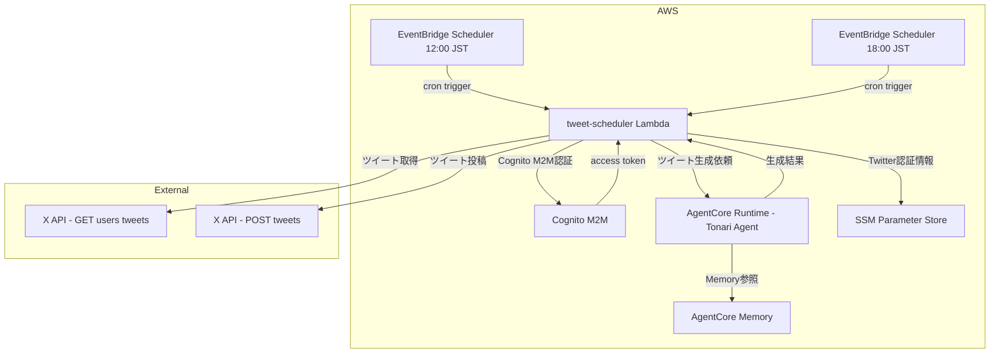
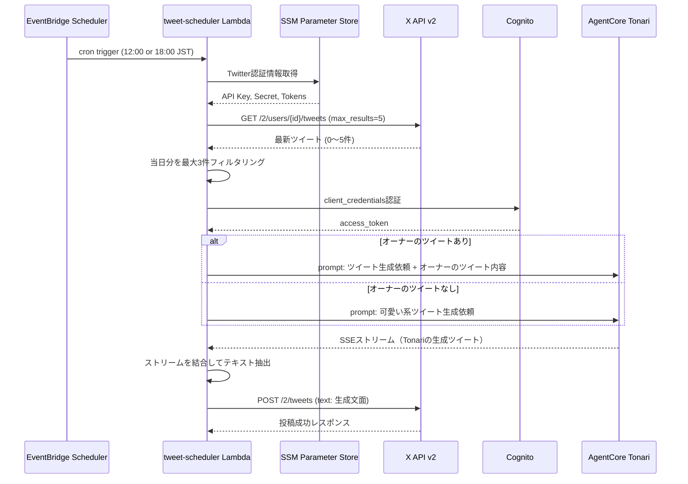
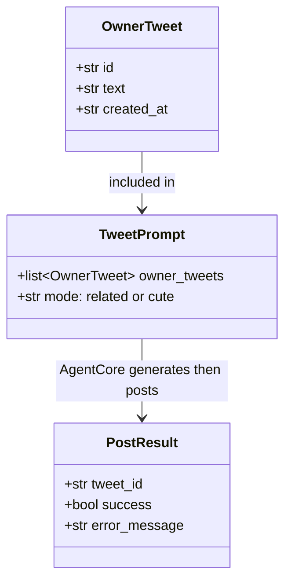

# Design Document: twitter-auto-post

## Overview

**Purpose**: Tonari専用のTwitter/Xアカウントから、オーナーの最近のツイートに関連した投稿を1日2回自動的に行う機能。ツイート生成はAgentCore Runtime上のTonariエージェントを通じて行い、キャラクター設定とMemory（過去の会話記憶）を活用する。

**Users**: オーナー（Tonari利用者）が手動操作なしで、Tonariキャラクターによる日常的なTwitter投稿を楽しめる。

**Impact**: 既存CDKスタックにEventBridge Scheduler + Lambda関数を追加。AgentCoreへのコード変更なし（既存のTonariエージェントをそのまま利用）。

### Goals
- 毎日12:00 JSTと18:00 JSTに、Tonariらしいツイートを自動投稿する
- AgentCore Runtime経由でTonariのキャラクター設定・Memoryを活用したツイートを生成する
- オーナーのツイート内容やMemoryの会話履歴を参照し、パーソナライズされた投稿を生成する
- Twitter/X APIの月間コストを$3以下に抑える

### Non-Goals
- リプライ・引用ツイート・メディア添付の投稿
- 投稿内容の事前承認ワークフロー（管理画面での確認UI等）
- ツイートの分析・エンゲージメント追跡
- AgentCoreのコード修正（既存エージェントをそのまま利用）

## Architecture

### Existing Architecture Analysis

現在のシステムは以下の2つの呼び出しパスを持つ:

1. **フロントエンド → AgentCore Runtime**: Next.js API Route → Cognito M2M認証 → InvokeAgentRuntime API（SSEストリーミング）
2. **CDKインフラ**: DynamoDB、Lambda x3（perfume-search, perfume-crud, api-authorizer）、API Gateway

新機能は(1)のAgentCore Runtime呼び出しパターンを再利用し、(2)のCDKパターンで新規Lambdaを追加する。

### Architecture Pattern & Boundary Map



**Architecture Integration**:
- **Selected pattern**: EventBridge Scheduler + Lambda（オーケストレーター） + AgentCore Runtime（ツイート生成）
- **Domain boundaries**: Lambdaはオーケストレーション（Twitter API操作 + スケジューリング）、AgentCoreはAI生成（キャラクター + Memory）に責務を分離
- **Existing patterns preserved**: フロントエンドと同じCognito M2M → InvokeAgentRuntime呼び出しパターンを再利用。CDKは既存のPython Lambda + `aws-lambda-python-alpha`パターン踏襲
- **New components rationale**: Lambdaオーケストレーターを追加。AgentCoreは既存のまま利用（変更なし）
- **Steering compliance**: 既存CDKスタックへの追加、Python 3.12、Cognito M2M認証

### Technology Stack

| Layer | Choice / Version | Role in Feature | Notes |
|-------|------------------|-----------------|-------|
| Orchestrator | AWS Lambda (Python 3.12) | Twitter API操作 + AgentCore呼び出し | 既存CDKパターン踏襲 |
| Twitter Client | tweepy >= 4.14.0 | X API v2 連携（OAuth 1.0a） | 最も成熟したPython Twitter ライブラリ |
| AI Generation | AgentCore Runtime (Tonari Agent) | キャラクター + Memory活用のツイート生成 | 既存エージェントをそのまま利用 |
| Authentication | Cognito M2M (client_credentials) | AgentCore Runtime呼び出し認証 | フロントエンドと同じフロー |
| Scheduling | EventBridge Scheduler | 12:00/18:00 JST cron実行 | L2 Construct GA済み、TZ対応 |
| Secrets | SSM Parameter Store SecureString | Twitter API認証情報 | 無料、KMS暗号化付き |
| Infrastructure | AWS CDK v2.170.0 | IaC定義 | 既存`tonari-stack.ts`に追加 |

## System Flows

### ツイート自動投稿フロー



**Key Decisions**:
- AgentCore Runtimeはフロントエンドと同じCognito M2M + InvokeAgentRuntime APIで呼び出す
- SSEストリーミングレスポンスをLambda内で全て受信し、テキストを結合する
- session_idは`tweet-auto-{date}`形式、actor_idは`tonari-owner`（フロントエンドと同じ）でMemory共有
- Tonariの生成プロンプトで「140文字以内のツイート」「感情タグ・ジェスチャータグなし」を指示

## Requirements Traceability

| Requirement | Summary | Components | Interfaces | Flows |
|-------------|---------|------------|------------|-------|
| 1.1 | オーナーのツイート1日3件取得 | TweetFetcher | X API GET | ツイート取得 |
| 1.2 | 取得ツイートを生成処理に渡す | TweetFetcher → AgentCoreInvoker | プロンプト構築 | ツイート取得→生成 |
| 1.3 | API取得失敗時のフォールバック | TweetFetcher | エラーハンドリング | 代替フロー |
| 1.4 | オーナーアカウントID環境変数 | CDK Stack | 環境変数 | - |
| 2.1 | オーナーツイート関連の生成 | AgentCoreInvoker | InvokeAgentRuntime | ツイート生成 |
| 2.2 | ツイートなし時の可愛い系生成 | AgentCoreInvoker | InvokeAgentRuntime | 代替フロー |
| 2.3 | Tonariキャラクター + Memory活用 | AgentCoreInvoker | InvokeAgentRuntime | ツイート生成 |
| 2.4 | 140文字以内 | AgentCoreInvoker | プロンプト + バリデーション | - |
| 2.5 | 生成失敗時のスキップ | AgentCoreInvoker | エラーハンドリング | 代替フロー |
| 3.1 | 12:00/18:00 JST 1日2回投稿 | EventBridge Schedule | cron式 | スケジュール |
| 3.2 | 自動パイプライン実行 | Lambda handler | handler関数 | 全体フロー |
| 3.3 | 投稿失敗時のログ記録 | TweetPoster | エラーハンドリング | 代替フロー |
| 3.4 | スケジュール設定変更可能 | CDK Stack | 環境変数 | - |
| 4.1 | X API v2使用 | TweetFetcher, TweetPoster | tweepy Client | API呼び出し |
| 4.2 | 認証情報を環境変数管理 | CDK Stack | SSM Parameter Store | 認証 |
| 4.3 | OAuth 1.0a認証 | TwitterClient | tweepy OAuth | 認証 |
| 4.4 | 認証情報の非出力 | 全コンポーネント | ログフィルタ | - |
| 5.1 | 1日のAPIリクエスト制限 | TweetFetcher, TweetPoster | 設計制約 | - |
| 5.2 | 月間コスト$3以下 | 全体設計 | 設計制約 | - |
| 5.3 | 不要リクエスト排除 | TweetFetcher | 1リクエスト取得 | - |

## Components and Interfaces

| Component | Domain/Layer | Intent | Req Coverage | Key Dependencies | Contracts |
|-----------|-------------|--------|-------------|-----------------|-----------|
| TweetSchedulerHandler | Lambda/Entry | パイプラインオーケストレーション | 3.1, 3.2 | 全コンポーネント (P0) | Batch |
| TwitterClient | Infra/External | tweepyクライアント初期化 | 4.1, 4.2, 4.3, 4.4 | SSM Parameter Store (P0) | Service |
| TweetFetcher | Domain/Read | オーナーのツイート取得 | 1.1, 1.2, 1.3, 5.1, 5.3 | TwitterClient (P0) | Service |
| AgentCoreInvoker | Domain/AI | Tonariエージェント経由のツイート生成 | 2.1, 2.2, 2.3, 2.4, 2.5 | Cognito (P0), AgentCore Runtime (P0) | Service |
| TweetPoster | Domain/Write | ツイート投稿 | 3.3, 4.1, 5.1 | TwitterClient (P0) | Service |
| CDK Stack Extension | Infra/IaC | Lambda、Schedule、IAMの定義 | 1.4, 3.1, 3.4, 4.2 | aws-cdk-lib (P0) | - |

### Lambda Layer

#### TweetSchedulerHandler

| Field | Detail |
|-------|--------|
| Intent | Lambda実行のエントリポイント。ツイート取得→生成→投稿パイプラインをオーケストレーション |
| Requirements | 3.1, 3.2 |

**Responsibilities & Constraints**
- ツイート取得 → AgentCore生成 → 投稿のパイプラインを順番に実行
- 各ステップのエラーをキャッチし、CloudWatch Logsに記録
- 全体の実行時間はLambdaタイムアウト（5分）以内

**Dependencies**
- Outbound: TweetFetcher — ツイート取得 (P0)
- Outbound: AgentCoreInvoker — ツイート生成 (P0)
- Outbound: TweetPoster — ツイート投稿 (P0)

**Contracts**: Batch [x]

##### Batch / Job Contract
- Trigger: EventBridge Scheduler (cron: 0 12,18 * * ? * Asia/Tokyo)
- Input: EventBridge event payload（使用しない）
- Output: 実行結果ログ（CloudWatch Logs）
- Idempotency: EventBridge Schedulerはat-least-once配信。同一時刻の重複実行リスクは極めて低い

```python
def handler(event: dict, context: Any) -> dict:
    """Lambda handler - ツイート自動投稿パイプライン"""
    ...
    return {"statusCode": 200, "body": "Tweet posted successfully"}
```

### Domain Layer

#### TwitterClient

| Field | Detail |
|-------|--------|
| Intent | SSM Parameter Storeから認証情報を取得し、tweepy Clientを初期化する |
| Requirements | 4.1, 4.2, 4.3, 4.4 |

**Responsibilities & Constraints**
- SSM Parameter Store SecureStringから認証情報を取得
- OAuth 1.0aでtweepy.Clientを初期化
- 認証情報をログ出力しない

**Dependencies**
- External: SSM Parameter Store — 認証情報取得 (P0)
- External: tweepy — X API v2 Client (P0)

**Contracts**: Service [x]

##### Service Interface
```python
class TwitterClient:
    """Twitter/X API v2 クライアント"""

    def __init__(self, ssm_prefix: str, region: str) -> None:
        """SSM Parameter Storeから認証情報を取得してクライアントを初期化

        Args:
            ssm_prefix: SSMパラメータのプレフィックス（例: /tonari/twitter）
            region: AWSリージョン
        """
        ...

    @property
    def client(self) -> tweepy.Client:
        """初期化済みのtweepy.Clientを返す"""
        ...
```
- Preconditions: SSM Parameter Storeに認証情報パラメータが設定済み
- Postconditions: OAuth 1.0aで認証されたtweepy.Clientが利用可能
- Invariants: 認証情報はメモリ上にのみ保持、ログ出力しない

**Implementation Notes**
- SSMパラメータ構成: `/tonari/twitter/api_key`, `/tonari/twitter/api_secret`, `/tonari/twitter/access_token`, `/tonari/twitter/access_token_secret`
- `boto3.client('ssm').get_parameters_by_path()`で一括取得
- SecureString型は自動的にKMS復号される（`WithDecryption=True`）

#### TweetFetcher

| Field | Detail |
|-------|--------|
| Intent | オーナーのTwitterアカウントから最新ツイートを取得しフィルタリングする |
| Requirements | 1.1, 1.2, 1.3, 5.1, 5.3 |

**Responsibilities & Constraints**
- `GET /2/users/{id}/tweets`で最新5件を1リクエストで取得
- 当日分（JST基準）のツイートを最大3件抽出
- リツイート・リプライを除外（`exclude=retweets,replies`）
- API取得失敗時は空リストを返す（フォールバック）

**Dependencies**
- Inbound: TweetSchedulerHandler — パイプライン呼び出し (P0)
- Outbound: TwitterClient — tweepy Client (P0)

**Contracts**: Service [x]

##### Service Interface
```python
from dataclasses import dataclass

@dataclass
class OwnerTweet:
    """オーナーのツイート情報"""
    id: str
    text: str
    created_at: str

def fetch_owner_tweets(
    client: tweepy.Client,
    owner_user_id: str,
    max_count: int = 3,
) -> list[OwnerTweet]:
    """オーナーの当日ツイートを取得する

    Returns:
        当日のツイートリスト（最大max_count件）。取得失敗時は空リスト。
    """
    ...
```
- Preconditions: clientが認証済み、owner_user_idが有効なXユーザーID
- Postconditions: 0〜max_count件のOwnerTweetリストを返す
- Invariants: APIリクエストは1回のみ発行（コスト最適化）

#### AgentCoreInvoker

| Field | Detail |
|-------|--------|
| Intent | Cognito M2M認証でAgentCore Runtimeを呼び出し、Tonariエージェントにツイートを生成させる |
| Requirements | 2.1, 2.2, 2.3, 2.4, 2.5 |

**Responsibilities & Constraints**
- フロントエンドと同じCognito M2M → InvokeAgentRuntime APIパターンを使用
- session_id: `tweet-auto-{YYYY-MM-DD}`（日付ごとに新規セッション）
- actor_id: `tonari-owner`（フロントエンドと共通、Memory共有）
- SSEストリーミングレスポンスを全て受信し、テキストを結合
- プロンプトで「140文字以内」「感情タグ・ジェスチャータグなし」「ツイート本文のみ」を指示
- 生成失敗時はNoneを返す

**Dependencies**
- Inbound: TweetSchedulerHandler — パイプライン呼び出し (P0)
- External: Cognito — M2M認証 (P0)
- External: AgentCore Runtime — Tonariエージェント呼び出し (P0)

**Contracts**: Service [x]

##### Service Interface
```python
def invoke_tonari_for_tweet(
    owner_tweets: list[OwnerTweet],
    cognito_client_id: str,
    cognito_client_secret: str,
    cognito_token_endpoint: str,
    cognito_scope: str,
    runtime_arn: str,
    region: str,
) -> str | None:
    """AgentCore RuntimeのTonariエージェントにツイート生成を依頼する

    Args:
        owner_tweets: オーナーの当日ツイート（空リストの場合は可愛い系ツイート）
        cognito_*: Cognito M2M認証情報
        runtime_arn: AgentCore Runtime ARN
        region: AWSリージョン

    Returns:
        生成されたツイート文面（140文字以内）。生成失敗時はNone。
    """
    ...
```
- Preconditions: Cognito M2M認証情報とRuntime ARNが有効
- Postconditions: 140文字以内のツイート文面またはNone
- Invariants: actor_idは常に`tonari-owner`（Memory共有のため）

**Implementation Notes**
- Cognito token取得: `POST {tokenEndpoint}` with `client_credentials` grant
- AgentCore呼び出し: `POST https://bedrock-agentcore.{region}.amazonaws.com/runtimes/{arn}/invocations`
- SSEパース: `data:` プレフィックスの行を収集し、JSON文字列をデコードしてテキスト結合
- プロンプト例（オーナーツイートあり）:
  ```
  あなたのオーナーが今日Twitterでこんなことを投稿しています:
  {tweets}
  これを踏まえて、あなた（Tonari）としてのツイートを1つ作ってください。
  ルール: 140文字以内、感情タグやジェスチャータグは不要、ツイート本文のみ出力
  ```
- プロンプト例（オーナーツイートなし）:
  ```
  今日のオーナーのTwitter投稿はまだありません。
  あなた（Tonari）として、日常の何気ない可愛い系のツイートを1つ作ってください。
  ルール: 140文字以内、センシティブな個人情報は含めない、感情タグやジェスチャータグは不要、ツイート本文のみ出力
  ```

#### TweetPoster

| Field | Detail |
|-------|--------|
| Intent | 生成されたツイートをTonari専用アカウントから投稿する |
| Requirements | 3.3, 4.1, 5.1 |

**Responsibilities & Constraints**
- `POST /2/tweets`でツイートを投稿
- 投稿失敗時はエラーログを記録（リトライなし）
- 投稿成功時はツイートIDをログ記録

**Dependencies**
- Inbound: TweetSchedulerHandler — パイプライン呼び出し (P0)
- Outbound: TwitterClient — tweepy Client (P0)

**Contracts**: Service [x]

##### Service Interface
```python
def post_tweet(client: tweepy.Client, text: str) -> str | None:
    """ツイートを投稿する

    Returns:
        投稿されたツイートID。失敗時はNone。
    """
    ...
```
- Preconditions: clientがwrite権限を持つOAuth 1.0aで認証済み、textが140文字以内
- Postconditions: ツイートが投稿される、またはエラーログが記録される
- Invariants: リトライは行わない

### Infrastructure Layer

#### CDK Stack Extension

新規リソースを既存の`tonari-stack.ts`に追加する。

**追加リソース**:

1. **SSM Parameter Store** (`/tonari/twitter/*`)
   - `/tonari/twitter/api_key` (SecureString)
   - `/tonari/twitter/api_secret` (SecureString)
   - `/tonari/twitter/access_token` (SecureString)
   - `/tonari/twitter/access_token_secret` (SecureString)
   - 手動でAWSコンソールまたはCLIから設定（CDKでは参照のみ）

2. **Lambda Function** (`tonari-tweet-scheduler`)
   - Runtime: Python 3.12
   - Handler: `index.handler`
   - Timeout: 5分
   - Memory: 256MB
   - 環境変数:
     - `SSM_TWITTER_PREFIX`: `/tonari/twitter`
     - `OWNER_TWITTER_USER_ID`: オーナーのTwitter数値ID
     - `AGENTCORE_REGION`: `ap-northeast-1`
     - `AGENTCORE_RUNTIME_ARN`: Runtime ARN
     - `COGNITO_TOKEN_ENDPOINT`: Cognitoトークンエンドポイント
     - `COGNITO_CLIENT_ID`: CognitoクライアントID
     - `COGNITO_SCOPE`: Cognitoスコープ
   - IAMポリシー: SSM GetParameter/GetParametersByPath（SecureString復号含む）

3. **EventBridge Schedule x2**
   - `TweetScheduleNoon`: cron(0 12 * * ? *) Asia/Tokyo
   - `TweetScheduleEvening`: cron(0 18 * * ? *) Asia/Tokyo
   - Target: tweet-scheduler Lambda

**ディレクトリ構成**:
```
infra/lambda/tweet-scheduler/
├── index.py              # Lambda handler + パイプライン
├── twitter_client.py     # TwitterClient クラス
├── tweet_fetcher.py      # fetch_owner_tweets 関数
├── agentcore_invoker.py  # invoke_tonari_for_tweet 関数
├── tweet_poster.py       # post_tweet 関数
└── requirements.txt      # tweepy>=4.14.0
```

## Data Models

### Domain Model



すべてのデータはLambda実行中のインメモリのみで保持。永続化は行わない（CloudWatch Logsのみ）。
AgentCore側ではMemory（STM/LTM）でツイート生成時の会話が記録される。

### Data Contracts & Integration

**SSM Parameter Store構成**:
```
/tonari/twitter/api_key          (SecureString)
/tonari/twitter/api_secret       (SecureString)
/tonari/twitter/access_token     (SecureString)
/tonari/twitter/access_token_secret (SecureString)
```

**AgentCore Runtime呼び出し**:
```
POST https://bedrock-agentcore.{region}.amazonaws.com/runtimes/{encodedArn}/invocations
Headers:
  Authorization: Bearer {cognito_access_token}
  Content-Type: application/json
  Accept: text/event-stream
  X-Amzn-Bedrock-AgentCore-Runtime-Session-Id: tweet-auto-{date}
Body:
  {"prompt": "...", "session_id": "tweet-auto-{date}", "actor_id": "tonari-owner"}
```

## Error Handling

### Error Strategy

すべてのエラーは「ログ記録 + スキップ」方式。1日2回の定期実行のため、1回の失敗は次回実行で自然にリカバリされる。

### Error Categories and Responses

| エラー種別 | 原因 | 対応 | Req |
|-----------|------|------|-----|
| Twitter API認証エラー | 無効なクレデンシャル | エラーログ記録、処理中断 | 4.2, 4.3 |
| ツイート取得失敗 | APIエラー、レート制限 | エラーログ記録、空リストとして続行 | 1.3 |
| Cognito認証失敗 | 無効なクレデンシャル | エラーログ記録、投稿スキップ | 2.5 |
| AgentCore呼び出し失敗 | Runtime停止、タイムアウト | エラーログ記録、投稿スキップ | 2.5 |
| 文字数超過 | 生成文が140文字超 | 再度AgentCore呼び出し（1回のみ）、それでも超過なら投稿スキップ | 2.4 |
| ツイート投稿失敗 | APIエラー、重複投稿 | エラーログ記録、リトライなし | 3.3 |

### Monitoring

- CloudWatch Logs: Lambda実行ログ（全ステップのINFO/ERRORログ）
- CloudWatch Metrics: Lambda実行回数、エラー数、実行時間
- CloudWatch Alarm（任意）: 連続失敗時の通知

## Testing Strategy

### Unit Tests
- `test_tweet_fetcher.py`: ツイート取得ロジック（当日フィルタリング、空結果、API失敗フォールバック）
- `test_agentcore_invoker.py`: プロンプト構築（関連モード、可愛い系モード）、SSEパース、140文字バリデーション
- `test_tweet_poster.py`: 投稿成功/失敗時の挙動

### Integration Tests
- `test_handler.py`: Lambda handler全体フロー（モック使用）
- Cognito M2M認証→AgentCore Runtime呼び出しの結合テスト

## Security Considerations

- Twitter API認証情報はSSM Parameter Store SecureStringで管理（KMS暗号化）
- Cognito Client SecretはSSM Parameter Storeまたは環境変数で管理
- 認証情報はログ出力から除外
- Lambda IAMロールには最小権限のみ付与（SSM GetParameter, SSM GetParametersByPath）
- AgentCore Runtimeへのアクセスは既存のCognito M2M認証で制御
