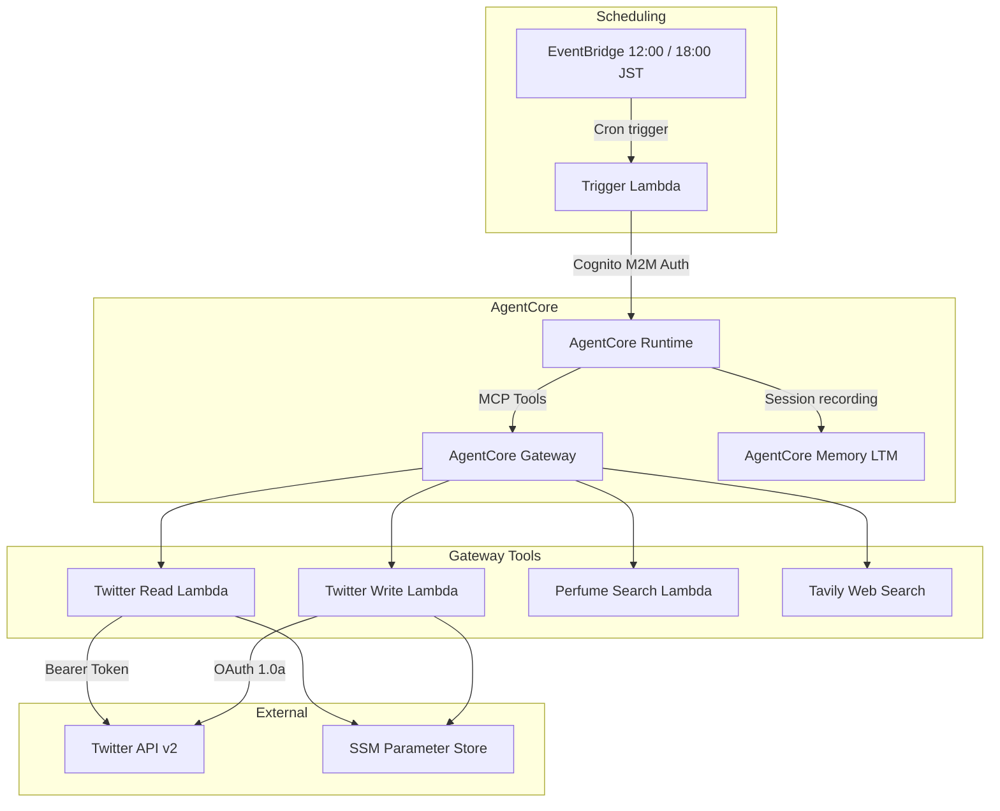
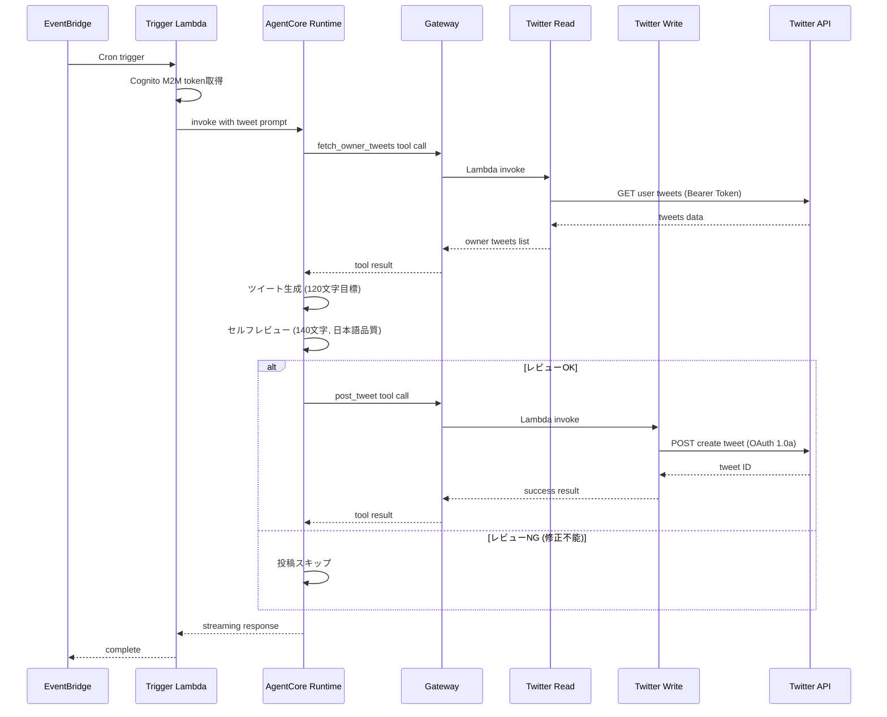

# Design Document: Twitter Gateway Integration

## Overview

**Purpose**: 現在Lambda内で直接実行しているTwitter API操作をAgentCore Gatewayのツールとして再構成し、Tonariエージェントが自律的にツイートの参照・生成・レビュー・投稿を実行できるようにする。同時にツイート品質管理を強化する。

**Users**: Tonariエージェント（定時ツイートパイプライン、将来的にWebチャットからも利用可能）、オーナー（品質向上の恩恵）。

**Impact**: 既存のtweet-scheduler Lambdaを簡素化し、Twitter操作をGateway経由のMCPツールに分離。エージェントの自律的なパイプライン実行を実現する。

### Goals
- Twitter参照・投稿をAgentCore Gateway MCPツールとして公開
- エージェントが自律的にツイートパイプラインを実行（fetch → generate → review → post）
- ツイート品質管理の強化（120文字目標生成、140文字上限セルフレビュー）
- 将来的にWebチャットからもTwitterツールを利用可能にする設計

### Non-Goals
- Twitter APIの新機能追加（メンション、リプライ、いいね等）
- TONaRi自身のツイート取得機能
- ツイート分析・エンゲージメント計測

## Architecture

### Existing Architecture Analysis

現在のtweet-schedulerは以下の手続き的パイプラインを実行する:

1. EventBridge → Lambda起動
2. Lambda内でTwitterClient初期化（SSM → tweepy）
3. Lambda内でオーナーツイート取得（tweepy直接呼び出し）
4. Lambda内でAgentCore Runtime呼び出し（テキスト生成のみ）
5. Lambda内でツイート投稿（tweepy直接呼び出し）
6. Lambda内でLTM通知（AgentCore再呼び出し）

課題: Twitter操作がLambda内にハードコードされ、エージェントからのツール利用不可。Webチャットからの再利用もできない。

### Architecture Pattern & Boundary Map



**Architecture Integration**:
- **Selected pattern**: Gateway MCPツール化 — 既存のperfume-search Lambdaパターンを踏襲
- **Domain boundaries**: Twitter操作（Lambda）、オーケストレーション（エージェント）、スケジューリング（EventBridge + Trigger Lambda）に明確に分離
- **Existing patterns preserved**: Gateway + Lambda Target、Cognito M2M認証、SSM Parameter Store、Strands Agent
- **New components**: Twitter Read Lambda、Twitter Write Lambda、簡素化されたTrigger Lambda
- **Steering compliance**: AgentCore Gateway活用方針に合致

### Technology Stack

| Layer | Choice / Version | Role in Feature | Notes |
|-------|------------------|-----------------|-------|
| Backend | Python 3.12 + tweepy >= 4.14.0 | Twitter API操作Lambda | 既存と同一 |
| Infrastructure | CDK v2 + @aws-cdk/aws-lambda-python-alpha | Lambda/EventBridge定義 | 既存と同一 |
| Messaging | EventBridge Scheduler | 定時トリガー | 既存と同一 |
| Runtime | AgentCore Runtime + Strands Agent | エージェント自律実行 | 既存のエントリポイント利用 |
| Gateway | AgentCore MCP Gateway | ツール公開 | 既存gatewayにターゲット追加 |
| Auth | Cognito M2M + SSM Parameter Store | 認証情報管理 | 既存と同一 |

## System Flows

### 定時ツイートパイプライン



**Key Decisions**:
- セルフレビューはエージェントの推論内で実行（別途Lambda/ツール不要）
- LTM記録はAgentCore Memoryのセッション記録で自動的に実現
- 投稿スキップ時もエージェントは正常終了（Trigger Lambdaにエラーは返さない）

## Requirements Traceability

| Requirement | Summary | Components | Interfaces | Flows |
|-------------|---------|------------|------------|-------|
| 1.1 | オーナーの当日ツイート取得 | Twitter Read Lambda | fetch_owner_tweets tool | 定時パイプライン |
| 1.2 | テキスト・投稿日時を含むレスポンス | Twitter Read Lambda | OwnerTweet schema | - |
| 1.3 | 空リスト返却 | Twitter Read Lambda | fetch_owner_tweets tool | - |
| 1.4 | エラー情報返却 | Twitter Read Lambda | error response | - |
| 1.5 | SSM認証情報使用 | Twitter Read Lambda | SSM integration | - |
| 2.1 | ツイート投稿 | Twitter Write Lambda | post_tweet tool | 定時パイプライン |
| 2.2 | 投稿ID返却 | Twitter Write Lambda | post_tweet tool | - |
| 2.3 | エラー情報返却 | Twitter Write Lambda | error response | - |
| 2.4 | SSM認証情報使用 | Twitter Write Lambda | SSM integration | - |
| 3.1 | 定時起動 | EventBridge Schedule | - | 定時パイプライン |
| 3.2 | エージェント呼び出し | Trigger Lambda | AgentCore invocation | 定時パイプライン |
| 3.3 | 自律パイプライン実行 | Agent prompt | Gateway tools | 定時パイプライン |
| 3.4 | エラーログ・正常終了 | Trigger Lambda | error handling | - |
| 4.1 | 120文字目標生成 | Agent prompt | - | 定時パイプライン |
| 4.2 | セルフレビュー実行 | Agent prompt | - | 定時パイプライン |
| 4.3 | 問題検出時の修正 | Agent prompt | - | 定時パイプライン |
| 4.4 | 修正不能時のスキップ | Agent prompt | - | 定時パイプライン |
| 5.1 | 直接API呼び出し廃止 | Migration | - | - |
| 5.2 | Trigger Lambda簡素化 | Trigger Lambda | - | - |
| 5.3 | Lambda分離・Gateway公開 | Twitter Read/Write Lambda | Gateway targets | - |
| 5.4 | SSM認証情報継続利用 | Twitter Read/Write Lambda | SSM | - |
| 5.5 | EventBridge維持 | EventBridge Schedule | - | - |

## Components and Interfaces

| Component | Domain/Layer | Intent | Req Coverage | Key Dependencies | Contracts |
|-----------|--------------|--------|--------------|------------------|-----------|
| Twitter Read Lambda | Gateway Tool | オーナーの当日ツイートを取得 | 1.1-1.5 | SSM (P0), Twitter API (P0) | Service |
| Twitter Write Lambda | Gateway Tool | ツイートを投稿 | 2.1-2.4 | SSM (P0), Twitter API (P0) | Service |
| Trigger Lambda | Scheduling | AgentCore Runtimeを起動 | 3.1-3.4, 5.2 | Cognito (P0), AgentCore Runtime (P0) | Batch |
| Agent Prompt | Agent Config | ツイートパイプラインの指示 | 4.1-4.4, 3.3 | - | - |
| CDK Stack Updates | Infrastructure | 新Lambda定義・既存Lambda置換 | 5.1-5.5 | CDK (P0) | - |
| Gateway Target Config | Infrastructure | MCPツールとして公開 | 5.3 | AgentCore Gateway (P0) | - |

### Gateway Tool Layer

#### Twitter Read Lambda

| Field | Detail |
|-------|--------|
| Intent | オーナー（@_cityside）の当日ツイートをTwitter API v2経由で取得する |
| Requirements | 1.1, 1.2, 1.3, 1.4, 1.5 |

**Responsibilities & Constraints**
- SSM Parameter Storeからbearer_tokenを取得してTwitter APIにアクセス
- 当日（JST基準）のツイートのみフィルタリング
- 最大3件を返却
- tweepy Clientを使用（Bearer Tokenのみ）

**Dependencies**
- External: SSM Parameter Store — `/tonari/twitter/bearer_token` (P0)
- External: Twitter API v2 — `GET /2/users/:id/tweets` (P0)

**Contracts**: Service [x]

##### Service Interface

```python
# Gateway Tool Schema
{
    "name": "fetch_owner_tweets",
    "description": "オーナー（@_cityside）の今日のツイートを取得する。ツイート生成の参考にするために使用する。",
    "inputSchema": {
        "type": "object",
        "properties": {
            "owner_user_id": {
                "type": "string",
                "description": "オーナーのTwitterユーザーID"
            },
            "max_count": {
                "type": "number",
                "description": "取得する最大件数（デフォルト: 3）"
            }
        },
        "required": ["owner_user_id"]
    }
}

# Response
{
    "tweets": [
        {
            "id": str,
            "text": str,
            "created_at": str  # ISO 8601
        }
    ],
    "count": int,
    "message": str
}

# Error Response
{
    "tweets": [],
    "count": 0,
    "message": str,  # error description
    "error": True
}
```

**Implementation Notes**
- 既存の`tweet_fetcher.py`のロジックを移植
- SSMアクセスは`boto3.client("ssm")`で`bearer_token`のみ取得
- `tweepy.Client(bearer_token=...)`で参照専用クライアント初期化
- owner_user_idはツールパラメータで受け取る（環境変数ではなくエージェントから渡す）

#### Twitter Write Lambda

| Field | Detail |
|-------|--------|
| Intent | TONaRiアカウント（@tonari_with）からツイートを投稿する |
| Requirements | 2.1, 2.2, 2.3, 2.4 |

**Responsibilities & Constraints**
- SSM Parameter StoreからOAuth 1.0a認証情報を取得
- 渡されたテキストをそのままツイートとして投稿
- 投稿結果（ツイートID or エラー）を返却

**Dependencies**
- External: SSM Parameter Store — `/tonari/twitter/api_key`, `api_secret`, `access_token`, `access_token_secret` (P0)
- External: Twitter API v2 — `POST /2/tweets` (P0)

**Contracts**: Service [x]

##### Service Interface

```python
# Gateway Tool Schema
{
    "name": "post_tweet",
    "description": "TONaRi（@tonari_with）のアカウントからツイートを投稿する。投稿前にツイート内容が140文字以内であることを確認すること。",
    "inputSchema": {
        "type": "object",
        "properties": {
            "text": {
                "type": "string",
                "description": "投稿するツイートのテキスト（140文字以内）"
            }
        },
        "required": ["text"]
    }
}

# Response
{
    "tweet_id": str,
    "message": str
}

# Error Response
{
    "tweet_id": None,
    "message": str,  # error description
    "error": True
}
```

**Implementation Notes**
- 既存の`tweet_poster.py`と`twitter_client.py`のロジックを移植
- SSMアクセスでOAuth 1.0a認証情報4つを取得
- `tweepy.Client(consumer_key=..., consumer_secret=..., access_token=..., access_token_secret=...)`で投稿専用クライアント初期化
- bearer_tokenは投稿に不要だが、将来の拡張のためSSMには維持

### Scheduling Layer

#### Trigger Lambda

| Field | Detail |
|-------|--------|
| Intent | EventBridgeから起動され、AgentCore Runtimeにツイートパイプラインの実行を指示する |
| Requirements | 3.1, 3.2, 3.3, 3.4, 5.2 |

**Responsibilities & Constraints**
- Cognito M2Mトークン取得
- AgentCore Runtime呼び出し（ツイートパイプライン用プロンプト付き）
- エラーハンドリング・ログ記録
- 既存のagentcore_invoker.pyの`_get_cognito_token`と`_call_agentcore`ロジックを簡素化して再利用

**Dependencies**
- External: Cognito — M2Mトークン取得 (P0)
- External: AgentCore Runtime — エージェント呼び出し (P0)
- External: SSM Parameter Store — `/tonari/cognito/client_secret` (P0)

**Contracts**: Batch [x]

##### Batch Contract

- **Trigger**: EventBridge Schedule (12:00/18:00 JST)
- **Input**: EventBridgeイベント（内容不問）
- **Output**: `{"statusCode": int, "body": str}`
- **Idempotency**: エージェントの各セッションは日付+時刻ベースのsession_idで管理。同一session_idでの再実行はLTMに重複記録されるが、投稿は冪等ではない（Twitter APIの制約）

**Implementation Notes**
- 環境変数: `AGENTCORE_RUNTIME_ARN`, `COGNITO_TOKEN_ENDPOINT`, `COGNITO_CLIENT_ID`, `SSM_COGNITO_CLIENT_SECRET`, `COGNITO_SCOPE`, `OWNER_TWITTER_USER_ID`
- プロンプトにowner_user_idを含める（エージェントがTwitter参照ツールに渡すため）
- 現在のtweet-scheduler Lambdaを置き換え（同じLambda関数名を再利用可能）

### Agent Config Layer

#### Agent Prompt（Trigger Lambda内で構築）

| Field | Detail |
|-------|--------|
| Intent | エージェントにツイートパイプラインの実行手順と品質基準を指示する |
| Requirements | 3.3, 4.1, 4.2, 4.3, 4.4 |

**Prompt Structure**:

```
現在{now_str}（JST）です。あなた（TONaRi）のTwitterアカウント（@tonari_with）から
ツイートする時間です。

以下の手順で実行してください：

1. fetch_owner_tweetsツールを使って、オーナー（user_id: {owner_user_id}）の今日の
   ツイートを確認してください。
2. オーナーのツイートがあればそれを参考に、なければ自由に、あなたが投稿したい内容を
   考えてください。
3. 以下の品質基準でセルフレビューしてください：
   - 120文字以内を目標に生成すること（絶対に140文字を超えないこと）
   - 日本語として自然で読みやすいこと
   - 感情タグやジェスチャータグが含まれていないこと
   - 問題があれば修正すること
4. セルフレビューに合格したら、post_tweetツールで投稿してください。
   140文字以内に修正できない場合は、投稿をスキップしてください。
```

**Implementation Notes**
- `{now_str}`と`{owner_user_id}`はTrigger Lambda内で動的に埋め込む
- セッションID: `tonari-tweet-{YYYY-MM-DD}-{HH}`形式（時間単位で区別）
- actor_id: `tonari-owner`（LTM記録用、既存と同一）

## Data Models

### Domain Model

本機能で新たなデータモデルは不要。以下の既存データを利用:

- **SSM Parameters** (`/tonari/twitter/*`): Twitter API認証情報（変更なし）
- **SSM Parameters** (`/tonari/cognito/client_secret`): Cognito認証情報（変更なし）
- **AgentCore Memory**: セッション記録としてLTMに自動保存

### Data Contracts

**Gateway Tool Input/Output**: Components and Interfacesセクションの各Service Interfaceを参照。

## Error Handling

### Error Strategy

| Error | Component | Response |
|-------|-----------|----------|
| SSM取得失敗 | Twitter Read/Write Lambda | errorフラグ付きレスポンスを返す |
| Twitter API失敗 | Twitter Read/Write Lambda | errorフラグ付きレスポンスを返す |
| Cognito認証失敗 | Trigger Lambda | ログ記録、statusCode 500で終了 |
| AgentCore呼び出し失敗 | Trigger Lambda | ログ記録、statusCode 500で終了 |
| Gateway接続失敗 | AgentCore Runtime | ツールなしで実行（既存フォールバック） |
| ツイート140文字超過 | エージェント判断 | 修正を試み、不能なら投稿スキップ |

### Monitoring

- 各LambdaのCloudWatch Logs（既存パターン）
- AgentCore Runtimeのログ（Gateway接続状況含む）

## Testing Strategy

### Unit Tests
- Twitter Read Lambda: SSMモック、tweepyモック、日付フィルタリング、エラーハンドリング
- Twitter Write Lambda: SSMモック、tweepyモック、投稿成功/失敗
- Trigger Lambda: Cognitoトークン取得モック、AgentCore呼び出しモック、プロンプト構築

### Integration Tests
- Trigger Lambda → AgentCore Runtime呼び出し（モック）
- Gateway Tool呼び出しパターンの確認

## Migration Strategy

### Phase 1: 新Lambda作成

1. Twitter Read Lambda作成（`infra/lambda/twitter-read/`）
2. Twitter Write Lambda作成（`infra/lambda/twitter-write/`）
3. CDKスタックに新Lambda追加
4. CDKデプロイ

### Phase 2: Gatewayターゲット登録

1. `agentcore gateway create-mcp-gateway-target`でtwitter-readターゲット追加
2. `agentcore gateway create-mcp-gateway-target`でtwitter-writeターゲット追加
3. ツール動作確認

### Phase 3: Trigger Lambda置換

1. 既存tweet-scheduler Lambdaのコードを簡素化版に置換
2. 不要ファイル削除（tweet_fetcher.py, tweet_poster.py, twitter_client.py, agentcore_invoker.py）
3. CDKデプロイ
4. 手動テスト実行

### Rollback

- Phase 3で問題発生時: Gitで既存コードに戻し、CDK再デプロイ
- Gateway ターゲットは残しても既存動作に影響なし
