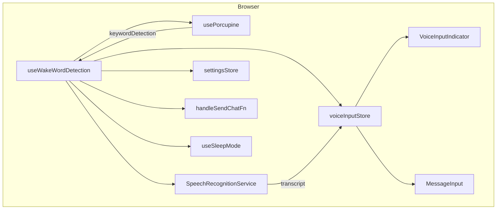
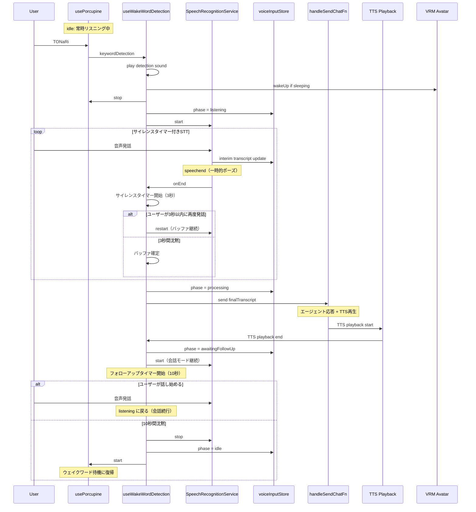
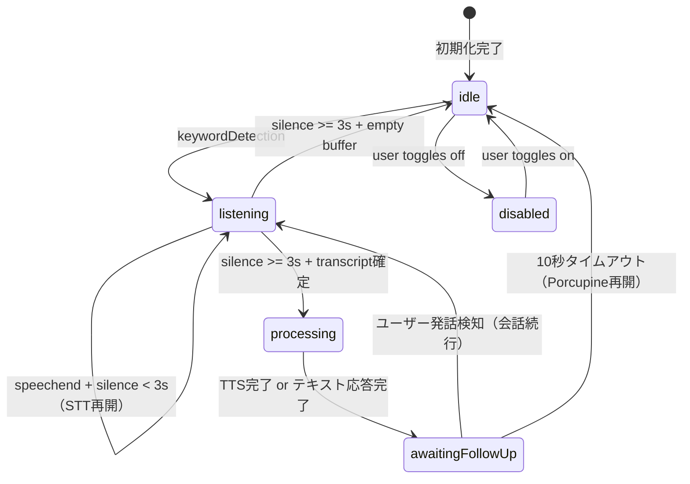

# Design Document: Wake Word Detection

## Overview

**Purpose**: Tonariに「TONaRi」ウェイクワード検知と音声入力機能を追加し、ユーザーが別ウィンドウで作業中でも声で指示を送信できるようにする。

**Users**: Tonariを別ディスプレイに常時表示しているユーザーが、フォーカスを切り替えずに音声で対話する。

**Impact**: フロントエンドに新しいhookとストアを追加。バックエンドの変更は不要。既存のチャットフローをそのまま利用する。

### Goals
- Porcupine WASMによるブラウザ内完結のウェイクワード検知
- Web Speech APIによる日本語音声認識とテキスト変換
- 既存チャットフロー（ストリーミング応答、TTS、チャットログ）との統合
- ユーザー操作なしの自動テキスト送信（無音検出）
- サイレンスタイマー付きSTT再開（発話途中のポーズで途切れない）
- 会話モード（エージェント応答後、ウェイクワードなしで続けて音声入力可能）

### Non-Goals
- フォールバック（Companion Script + WebSocket）の実装
- バックエンド側の音声処理
- カスタムSTTエンジンの統合（Web Speech APIで開始、将来差し替え可能に設計）
- Chrome以外のブラウザでのWeb Speech API対応

## Architecture

### Existing Architecture Analysis

Tonariのフロントエンドは以下のパターンで構成されている：
- **Hook-based機能**: `useSleepMode`, `useIdleMotion`等のカスタムHookが`src/pages/index.tsx`にマウント
- **Zustand Store**: `settingsStore`（永続化）と`homeStore`（トランジェント状態）で状態管理
- **チャットフロー**: `messageInputContainer` → `handleSendChatFn()` → AgentCore API → ストリーミング応答
- **AudioContext**: `src/features/lipSync/lipSync.ts`でTTS出力分析用に使用（入力側とは独立）

ウェイクワード検知は既存パターンに完全に沿った形で統合する。

### Architecture Pattern & Boundary Map



**Architecture Integration**:
- **Selected pattern**: React Hook + Zustand Store（既存パターンと整合）
- **Domain boundary**: 音声入力機能は`src/features/voiceInput/`に集約。チャット送信は既存の`handleSendChatFn()`を利用
- **Existing patterns preserved**: Hook-based機能マウント、Zustand永続化、settingsStore拡張
- **New components rationale**: Porcupine統合とSTT管理は独自のライフサイクルを持つため専用hook/serviceが必要

### Technology Stack

| Layer | Choice / Version | Role in Feature | Notes |
|-------|------------------|-----------------|-------|
| Wake Word Engine | @picovoice/porcupine-react | ウェイクワード検知React Hook | usePorcupine Hook提供 |
| Speech-to-Text | Web Speech API (built-in) | 音声→テキスト変換 | Chrome内蔵、日本語対応 |
| State Management | Zustand (既存) | 音声入力状態管理 | voiceInputStore新規追加 |
| Settings Persistence | localStorage (既存) | 設定永続化 | settingsStore拡張 |
| Audio Feedback | HTMLAudioElement | ウェイクワード検知音 | public/に効果音配置 |

## System Flows

### ウェイクワード検知 → 会話モードフロー



### 状態遷移



### タイマー定数

| タイマー | 値 | 目的 |
|---------|-----|------|
| SILENCE_TIMEOUT | 3秒 | 発話途中のポーズ許容。この間はSTTを再開し、バッファに追記 |
| FOLLOW_UP_TIMEOUT | 10秒 | TTS応答後、次の発話を待つ時間。超過で会話モード終了 |

## Requirements Traceability

| Requirement | Summary | Components | Interfaces | Flows |
|-------------|---------|------------|------------|-------|
| 1.1 | ウェイクワード検知で音声入力開始 | useWakeWordDetection, usePorcupine | PorcupineKeywordDetection | 検知→STTフロー |
| 1.2 | visible but unfocusedで動作継続 | usePorcupine (WebVoiceProcessor) | — | — |
| 1.3 | 無効化時にマイク停止 | useWakeWordDetection | WakeWordConfig | — |
| 1.4 | ブラウザ内完結 | usePorcupine (WASM) | — | — |
| 2.1 | Web Speech APIで音声認識開始 | SpeechRecognitionService | SpeechRecognitionConfig | 検知→STTフロー |
| 2.2 | リアルタイムバッファ蓄積 | SpeechRecognitionService, voiceInputStore | VoiceInputState | — |
| 2.3 | 無音検出で認識終了 | SpeechRecognitionService | — | 状態遷移 |
| 2.4 | 日本語認識 | SpeechRecognitionService | SpeechRecognitionConfig | — |
| 2.5 | STT非対応時の処理 | useWakeWordDetection | — | — |
| 3.1 | 無音終了で自動送信 | useWakeWordDetection | — | 送信フロー |
| 3.2 | フォーカス時に入力フォーム書き込み | useWakeWordDetection, voiceInputStore | VoiceInputState | 送信フロー |
| 3.3 | 既存チャットフロー統合 | handleSendChatFn (既存) | — | 送信フロー |
| 3.4 | 空バッファ時は送信しない | useWakeWordDetection | — | 状態遷移 |
| 4.1 | 検知時効果音 | useWakeWordDetection | — | 検知→STTフロー |
| 4.2 | 睡眠モーション解除 | useWakeWordDetection | — | 検知→STTフロー |
| 4.3 | リスニングインジケーター | VoiceInputIndicator | VoiceInputState | — |
| 4.4 | テキストリアルタイムプレビュー | VoiceInputIndicator | VoiceInputState | — |
| 5.1 | マイク許可リクエスト | usePorcupine (内部処理) | — | — |
| 5.2 | マイク拒否時通知 | useWakeWordDetection | — | — |
| 5.3 | 無効化時リソース解放 | useWakeWordDetection | WakeWordConfig | — |
| 5.4 | マイクストリーム切り替え | useWakeWordDetection | — | 検知→STTフロー |
| 6.1 | 設定トグルUI | WakeWordSettings | WakeWordConfig | — |
| 6.2 | localStorage永続化 | settingsStore (拡張) | WakeWordConfig | — |
| 6.3 | 再読み込み時の自動開始 | useWakeWordDetection | WakeWordConfig | — |
| 6.4 | Access Key設定欄 | WakeWordSettings | WakeWordConfig | — |
| 6.5 | Access Key未設定時通知 | WakeWordSettings | — | — |

## Components and Interfaces

| Component | Domain/Layer | Intent | Req Coverage | Key Dependencies | Contracts |
|-----------|-------------|--------|--------------|------------------|-----------|
| useWakeWordDetection | Feature Hook | Porcupine/STT/送信のオーケストレーション | 1.1-1.4, 2.5, 3.1-3.4, 4.1-4.2, 5.2-5.4, 6.3 | usePorcupine (P0), SpeechRecognitionService (P0), voiceInputStore (P0), homeStore (P1) | State |
| SpeechRecognitionService | Feature Service | Web Speech APIラッパー | 2.1-2.4 | Web Speech API (P0) | Service |
| voiceInputStore | State | 音声入力状態管理 | 2.2, 3.2, 4.3, 4.4 | Zustand (P0) | State |
| VoiceInputIndicator | UI | リスニング状態・テキストプレビュー表示 | 4.3, 4.4 | voiceInputStore (P0) | — |
| WakeWordSettings | UI | 設定トグル・Access Key入力 | 6.1, 6.4, 6.5 | settingsStore (P0) | — |

### Feature Hook Layer

#### useWakeWordDetection

| Field | Detail |
|-------|--------|
| Intent | Porcupine/STTライフサイクル管理と送信フローのオーケストレーション |
| Requirements | 1.1, 1.3, 2.5, 3.1, 3.2, 3.4, 4.1, 4.2, 5.2, 5.3, 5.4, 6.3 |

**Responsibilities & Constraints**
- Porcupine検知イベントを受信し、STTへの切り替えを制御
- サイレンスタイマーによるSTT再開ループ管理（発話途中のポーズ許容）
- 会話モード制御（エージェント応答後の自動STT再開、フォローアップタイムアウト）
- 音声認識完了後のテキスト送信（自動送信 or 入力フォーム書き込み）を判定
- マイクリソースのライフサイクル管理（Porcupine ↔ STT切り替え）
- 設定変更時（有効/無効）のリソース管理

**Dependencies**
- Inbound: settingsStore — wakeWordEnabled/accessKey取得 (P0)
- Outbound: usePorcupine — ウェイクワード検知 (P0)
- Outbound: SpeechRecognitionService — 音声認識 (P0)
- Outbound: voiceInputStore — 状態更新 (P0)
- Outbound: homeStore — isSleeping判定、viewer.model.wakeUp()、chatProcessing/isSpeaking監視 (P1)
- Outbound: handleSendChatFn — テキスト送信 (P0)

**Contracts**: State [x]

##### State Management

```typescript
// Hook lifecycle
// Mount: settingsのwakeWordEnabledを確認 → trueならPorcupine初期化・start
// Unmount: Porcupine release, STT abort, clear all timers

// --- Phase: idle ---
// Porcupine listening for wake word

// --- Keyword detection handler (idle → listening) ---
// 1. Play detection sound (HTMLAudioElement)
// 2. Check homeStore.isSleeping → wakeUp if true
// 3. Porcupine stop()
// 4. voiceInputStore.phase = 'listening'
// 5. SpeechRecognitionService.start()

// --- STT onEnd handler (listening) ---
// サイレンスタイマー付き再開ループ:
// 1. STT onEnd fires (speechend)
// 2. Start SILENCE_TIMEOUT (3s) timer
// 3. If STT fires onResult before timeout → clear timer, continue
// 4. If timeout expires:
//    a. finalTranscript is empty → phase = 'idle', Porcupine start()
//    b. finalTranscript has content → proceed to send

// --- Send handler (listening → processing) ---
// 1. voiceInputStore.phase = 'processing'
// 2. If document.hasFocus() → write to input form via voiceInputStore
// 3. If !document.hasFocus() → handleSendChatFn()(finalTranscript)
// 4. Clear interimTranscript, finalTranscript

// --- Conversation mode (processing → awaitingFollowUp) ---
// 1. Subscribe to homeStore: chatProcessing=false AND isSpeaking=false
// 2. When both false (agent response + TTS complete):
//    voiceInputStore.phase = 'awaitingFollowUp'
// 3. SpeechRecognitionService.start()
// 4. Start FOLLOW_UP_TIMEOUT (10s) timer
// 5. If STT detects speech → clear timer, phase = 'listening'（会話続行）
// 6. If timeout expires → STT stop(), phase = 'idle', Porcupine start()
```

**Implementation Notes**
- `document.hasFocus()`でタブフォーカス状態を判定
- 効果音は`/public/sounds/wake-word-detected.mp3`等に配置し`new Audio()`で再生
- usePorcupineの`keywordDetection`状態変更をuseEffectで監視
- `homeStore.subscribe()`で`chatProcessing`と`isSpeaking`を監視し、TTS完了を検知
- タイマーはuseRef管理。phase変更時やunmount時に確実にclearTimeout

### Feature Service Layer

#### SpeechRecognitionService

| Field | Detail |
|-------|--------|
| Intent | Web Speech APIのラッパー。開始/停止と認識結果のコールバックを提供 |
| Requirements | 2.1, 2.2, 2.3, 2.4 |

**Responsibilities & Constraints**
- SpeechRecognition APIの初期化と設定（lang: 'ja-JP', continuous: false, interimResults: true）
- 中間結果（interimResults）と確定結果（final）のコールバック提供
- onEndイベントの通知（呼び出し元のhookがサイレンスタイマーを管理）
- ブラウザ非対応時のフォールバック判定
- 注: 無音によるSTT再開ループの制御はuseWakeWordDetection側で行う。本サービスは単純なstart/stop/再startを提供

**Dependencies**
- External: Web Speech API (SpeechRecognition / webkitSpeechRecognition) — 音声認識 (P0)

**Contracts**: Service [x]

##### Service Interface

```typescript
interface SpeechRecognitionCallbacks {
  onInterimResult: (transcript: string) => void
  onFinalResult: (transcript: string) => void
  onEnd: () => void
  onError: (error: string) => void
}

interface SpeechRecognitionService {
  readonly isSupported: boolean
  start(callbacks: SpeechRecognitionCallbacks): void
  stop(): void
  abort(): void
}
```

- Preconditions: ブラウザがSpeechRecognition APIをサポート
- Postconditions: start()後、onFinalResultまたはonEnd/onErrorが必ず呼ばれる
- Invariants: 同時に1つのSpeechRecognitionインスタンスのみ

**Implementation Notes**
- `window.SpeechRecognition || window.webkitSpeechRecognition`でAPI取得
- `continuous: false`, `interimResults: true`, `lang: 'ja-JP'`で初期化
- `result`イベントで`isFinal`フラグを確認し中間/確定を振り分け
- 将来のSTT差し替え（Whisper等）に備え、このインターフェースを維持

### State Layer

#### voiceInputStore

| Field | Detail |
|-------|--------|
| Intent | 音声入力の状態管理。UIコンポーネントとhook間の状態共有 |
| Requirements | 2.2, 3.2, 4.3, 4.4 |

**Responsibilities & Constraints**
- 音声入力フェーズ（idle/listening/processing/awaitingFollowUp/disabled）の管理
- 中間テキスト（interimTranscript）と確定テキスト（finalTranscript）の保持
- UIコンポーネント（VoiceInputIndicator、MessageInput）への状態提供

**Dependencies**
- External: Zustand — 状態管理 (P0)

**Contracts**: State [x]

##### State Management

```typescript
type VoiceInputPhase =
  | 'idle'              // Porcupineがウェイクワード待機中
  | 'listening'         // STT実行中（ユーザー発話中）
  | 'processing'        // テキスト送信 → エージェント応答待ち + TTS再生中
  | 'awaitingFollowUp'  // TTS完了 → ユーザーの次の発話を待機中
  | 'disabled'          // ウェイクワード検知が無効

interface VoiceInputState {
  phase: VoiceInputPhase
  interimTranscript: string
  finalTranscript: string
  pendingInputText: string  // フォーカス時にinput formに書き込むテキスト
}

interface VoiceInputActions {
  setPhase: (phase: VoiceInputPhase) => void
  setInterimTranscript: (text: string) => void
  setFinalTranscript: (text: string) => void
  appendToFinalTranscript: (text: string) => void  // サイレンスタイマー再開時のバッファ追記
  setPendingInputText: (text: string) => void
  reset: () => void
}
```

- Persistence: なし（トランジェント状態のみ）
- Concurrency: 単一hookからのみ更新。UIは読み取り専用

### UI Layer

#### VoiceInputIndicator

| Field | Detail |
|-------|--------|
| Intent | リスニング中の視覚的フィードバックとテキストプレビュー |
| Requirements | 4.3, 4.4 |

**Implementation Notes**
- `phase === 'listening'`: マイクアイコン + パルスアニメーション + `interimTranscript`プレビュー
- `phase === 'processing'`: 処理中インジケーター（既存のchatProcessing表示で代替可）
- `phase === 'awaitingFollowUp'`: マイクアイコン + 「続けてどうぞ」的な表示。ユーザーが話せる状態であることを示す
- `src/pages/index.tsx`のチャットエリア付近にマウント
- アニメーション: シンプルなCSS animation（パルス、フェードイン/アウト）

#### WakeWordSettings

| Field | Detail |
|-------|--------|
| Intent | ウェイクワード検知のオン/オフトグルとAccess Key入力 |
| Requirements | 6.1, 6.4, 6.5 |

**Implementation Notes**
- 既存の設定タブ（`src/components/settings/`）に追加
- `settingsStore`に`wakeWordEnabled: boolean`と`picovoiceAccessKey: string`を追加
- Access Keyが空の状態でトグルON → 入力を促すメッセージ表示
- `partialize()`にプロパティを追加しlocalStorage永続化

### settingsStore拡張

既存の`settingsStore`に以下を追加：

```typescript
// 追加プロパティ
interface General {
  // ...existing
  wakeWordEnabled: boolean      // default: false
  picovoiceAccessKey: string    // default: ''
}
```

- `getInitialValuesFromEnv()`にデフォルト値追加
- `partialize()`に永続化対象として追加

## Data Models

### Domain Model

この機能はサーバーサイドのデータ永続化を伴わない。全状態はブラウザ内（メモリ + localStorage）で管理される。

- **VoiceInputState**: トランジェント（ページリロードでリセット）
- **WakeWordConfig**: `settingsStore`経由でlocalStorageに永続化

### Static Assets

| File | Location | Purpose |
|------|----------|---------|
| Porcupineモデル (.pv) | public/models/porcupine/ | ウェイクワードエンジン用言語モデル |
| カスタムキーワード (.ppn) | public/models/porcupine/ | 「TONaRi」ウェイクワード定義 |
| 検知効果音 (.mp3) | public/sounds/ | ウェイクワード検知通知音 |

## Error Handling

### Error Categories and Responses

**User Errors**:
- マイク許可拒否 → 「マイクの使用許可が必要です」トースト通知、wakeWordEnabledをfalseに戻す
- Access Key未設定 → 設定画面にインライン警告表示
- Access Key無効 → 「Picovoice Access Keyが無効です」トースト通知

**System Errors**:
- Porcupine初期化失敗 → トースト通知、wakeWordEnabledをfalseに戻す
- Web Speech API非対応 → 「お使いのブラウザは音声認識に対応していません」通知、ウェイクワード検知のみ有効
- SpeechRecognition error event → リスニング終了、Porcupine再開、必要に応じリトライ

**Recovery Flow**:
- エラー発生時は必ずvoiceInputStore.phaseを'idle'に戻す
- Porcupineリスニングを再開（stop状態で放置しない）

## Testing Strategy

### Unit Tests
- SpeechRecognitionService: start/stop/abort、コールバック呼び出し、非対応ブラウザ判定
- voiceInputStore: phase遷移、transcript更新、reset
- settingsStore拡張: wakeWordEnabled/picovoiceAccessKey永続化

### Integration Tests
- useWakeWordDetection: keywordDetection → STT開始 → 自動送信フロー
- useWakeWordDetection: フォーカス時の入力フォーム書き込み
- useWakeWordDetection: 睡眠中の検知 → wakeUp → STT開始
- useWakeWordDetection: 設定無効化時のリソース解放
- useWakeWordDetection: サイレンスタイマー（3秒以内のポーズでSTT再開、バッファ継続）
- useWakeWordDetection: サイレンスタイマー（3秒超過でバッファ確定・送信）
- useWakeWordDetection: 会話モード（TTS完了後にSTT自動再開 → ユーザー発話 → 再送信）
- useWakeWordDetection: フォローアップタイムアウト（10秒沈黙で会話モード終了 → Porcupine再開）

### E2E Tests
- 手動テスト: 実マイクでのウェイクワード検知 → 音声入力 → エージェント応答（自動化困難）

## Performance & Scalability

- **Porcupine WASM CPU使用率**: シングルスレッド動作（SharedArrayBufferフォールバック）。ウェイクワード検知は軽量処理のため影響軽微
- **メモリ使用量**: Porcupineモデル（数MB）+ WASMランタイム。ページロード時に初期化、ブラウザキャッシュで再利用
- **初回ロード**: .pvモデルと.ppnキーワードファイルの初回ダウンロード。合計数MB程度
