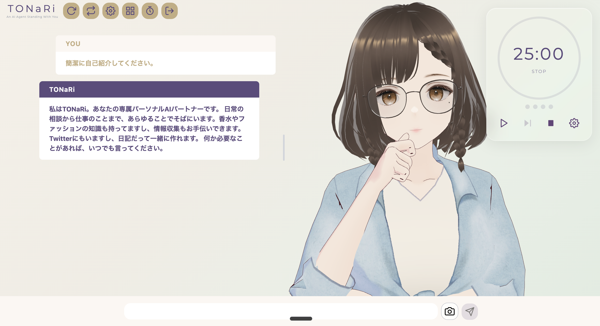

# Tonari

AWS Bedrock AgentCoreを活用した、3D VRMアバター付きパーソナルAIアシスタントです。

[AITuber-kit](https://github.com/tegnike/aituber-kit)をベースに、会話AIバックエンド、永続的メモリ、ドメイン固有の知識（香水の専門知識）を追加して構築しています。

## 機能

- **3Dアバター** — ジェスチャー、感情表現、リップシンク、自動まばたき/視線追従を備えたVRMモデル
- **ストリーミングチャット** — AgentCore SSEによるリアルタイム応答
- **永続的メモリ** — パーソナライズされた会話のための短期・長期記憶
- **香水ソムリエ** — 詳細な香調プロフィール付き香水データベース検索
- **Web検索** — Tavily連携による最新情報の取得
- **マルチモーダル入力** — テキストとカメラ画像のサポート
- **管理ダッシュボード** — WebAuthn認証付き香水データ管理

## 技術スタック

| レイヤー | 技術 |
|---------|------|
| フロントエンド | Next.js 14, TypeScript, React 18, Tailwind CSS |
| 3D/アバター | Three.js, @pixiv/three-vrm |
| 状態管理 | Zustand |
| バックエンド | Python 3.12, Strands Agents |
| AIモデル | Claude (AWS Bedrock経由) |
| メモリ | AgentCore Memory (LTM + STM) |
| インフラ | AWS Bedrock AgentCore, Lambda, DynamoDB |
| デプロイ | Vercel (フロントエンド), AgentCore Runtime (バックエンド) |

## ドキュメント

- [エージェントツール一覧](docs/tools.md) — Tonariエージェントが使用可能なMCPツールのリファレンス
- [ツール設計](docs/tool-design/architecture.md) — 各ツールのアーキテクチャと設計ドキュメント

## ライセンス

本プロジェクトは[AITuber-kit](https://github.com/tegnike/aituber-kit)をベースとしており、非商用目的での利用を想定しています。詳細は[LICENSE](LICENSE)ファイルをご確認ください。

AITuber-kitのオリジナル部分のCopyright (c) 2024 tegnike.
