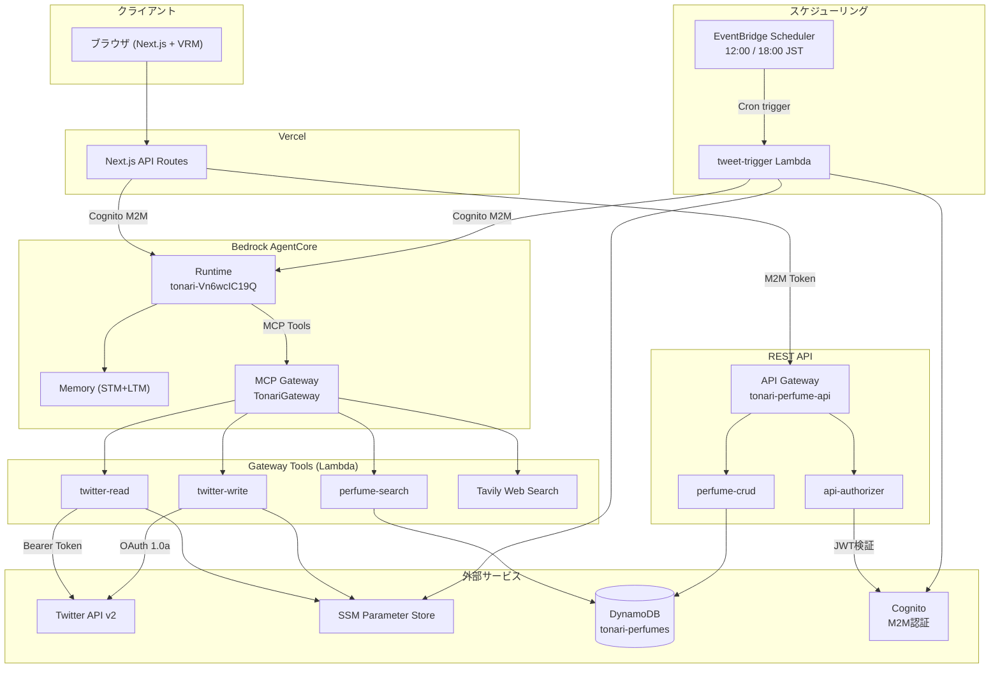

# Lambda アーキテクチャ全体設計

## システム構成図



## Lambda 関数一覧

| 関数名 | 用途 | トリガー | Timeout | Memory |
|--------|------|----------|---------|--------|
| [tonari-api-authorizer](./api-authorizer.md) | API Gateway M2M認証 | API Gateway Authorizer | 10s | 128MB |
| [tonari-perfume-crud](./perfume-crud.md) | 香水データCRUD | API Gateway | 30s | 128MB |
| [tonari-perfume-search](./perfume-search.md) | 香水キーワード検索 | AgentCore Gateway | 30s | 128MB |
| [tonari-twitter-read](./twitter-read.md) | オーナーの当日ツイート取得 | AgentCore Gateway | 30s | 128MB |
| [tonari-twitter-write](./twitter-write.md) | ツイート投稿 | AgentCore Gateway | 30s | 128MB |
| [tonari-tweet-trigger](./tweet-trigger.md) | ツイートパイプライン起動 | EventBridge Scheduler | 5min | 128MB |

## トリガーパターン

### 1. API Gateway 経由（REST API）

```
Client → API Gateway → api-authorizer (JWT検証) → perfume-crud
```

サーバーサイド（Next.js API Routes, AgentCore）からCognito M2Mトークンを使用してアクセスする。

### 2. AgentCore Gateway 経由（MCP Tool）

```
AgentCore Runtime → MCP Gateway → perfume-search / twitter-read / twitter-write
```

エージェントがツールとして呼び出す。Gateway IAM Roleで認証される。

### 3. EventBridge Scheduler 経由（定時バッチ）

```
EventBridge (12:00/18:00 JST) → tweet-trigger → AgentCore Runtime
```

定時でエージェントを起動し、ツイートパイプラインを実行させる。

## 認証・認可

| 対象 | 方式 | 認証情報の保管 |
|------|------|---------------|
| API Gateway → Lambda | Cognito M2M (JWT) | Cognito User Pool |
| Gateway → Lambda | Gateway IAM Role | IAM |
| twitter-read → Twitter API | Bearer Token (OAuth 2.0) | SSM `/tonari/twitter/bearer_token` |
| twitter-write → Twitter API | OAuth 1.0a (4 credentials) | SSM `/tonari/twitter/*` |
| tweet-trigger → AgentCore | Cognito M2M (client_credentials) | SSM `/tonari/cognito/client_secret` |

## CDK スタック構成

**ファイル:** `infra/lib/tonari-stack.ts`
**設定:** `infra/cdk.json`

CDKスタック `TonariStack` が全Lambda、DynamoDB、API Gateway、EventBridgeスケジュールを管理する。
AgentCore Runtime / Memory / Gatewayは CDK管理外（CLI で個別管理）。
