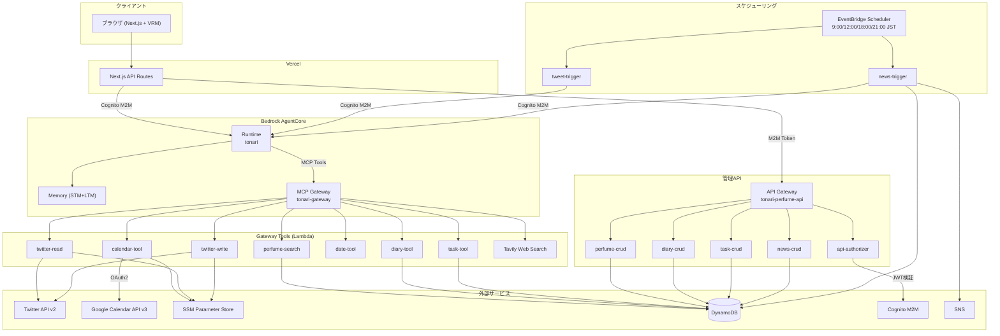

# ツールアーキテクチャ全体設計

## システム構成図



## ツール一覧

### エージェントツール（MCP Gateway Target）

| ツール | Lambda | 用途 | データソース |
|--------|--------|------|-------------|
| [perfume-search](./perfume.md) | `tonari-perfume-search` | 香水データベース検索 | DynamoDB |
| [diary-tool](./diary.md) | `tonari-diary-tool` | 日記の保存・取得 | DynamoDB |
| [task-tool](./task.md) | `tonari-task-tool` | タスク管理 | DynamoDB |
| [calendar-tool](./calendar.md) | `tonari-calendar-tool` | Googleカレンダー操作 | Google Calendar API |
| [date-tool](./date.md) | `tonari-date-tool` | 日付計算ユーティリティ | なし（純粋計算） |
| [twitter-read / twitter-write](./twitter.md) | `tonari-twitter-read/write` | ツイート取得・投稿 | Twitter API v2 |
| Tavily Web Search | ― | Web検索 | Tavily API |

### 管理API・バッチ処理

| Lambda | 用途 | トリガー | 設計ドキュメント |
|--------|------|----------|-----------------|
| `tonari-api-authorizer` | JWT認証 | API Gateway Authorizer | [auth](./auth.md) |
| `tonari-perfume-crud` | 香水CRUD | API Gateway | [perfume](./perfume.md) |
| `tonari-diary-crud` | 日記取得 | API Gateway | [diary](./diary.md) |
| `tonari-task-crud` | タスクCRUD | API Gateway | [task](./task.md) |
| `tonari-news-crud` | ニュース取得 | API Gateway | [news](./news.md) |
| `tonari-tweet-trigger` | ツイートパイプライン | EventBridge Scheduler | [twitter](./twitter.md) |
| `tonari-news-trigger` | ニュースパイプライン | EventBridge Scheduler | [news](./news.md) |

## トリガーパターン

### 1. MCP Gateway 経由（エージェントツール）

```
AgentCore Runtime → MCP Gateway → Lambda (Tool)
```

エージェントがツールとして呼び出す。Gateway IAM Roleで認証。

### 2. API Gateway 経由（管理API）

```
Client → API Gateway → api-authorizer (JWT検証) → Lambda (CRUD)
```

フロントエンドからCognito M2Mトークンで認証してアクセス。

### 3. EventBridge Scheduler 経由（定時バッチ）

```
EventBridge → Lambda (Trigger) → AgentCore Runtime
```

定時でエージェントを起動してパイプラインを実行。

## 認証・認可

| 対象 | 方式 | 認証情報の保管 |
|------|------|---------------|
| API Gateway → Lambda | Cognito M2M (JWT) | Cognito User Pool |
| Gateway → Lambda | Gateway IAM Role | IAM |
| calendar-tool → Google Calendar | OAuth2 (refresh token) | SSM `/tonari/google/*` |
| twitter-read → Twitter API | Bearer Token (OAuth 2.0) | SSM `/tonari/twitter/bearer_token` |
| twitter-write → Twitter API | OAuth 1.0a (4 credentials) | SSM `/tonari/twitter/*` |
| Triggers → AgentCore | Cognito M2M (client_credentials) | SSM `/tonari/cognito/client_secret` |

## CDK スタック構成

```
infra/lib/
├── tonari-stack.ts          # スタックのルート（構成要素の結合）
├── cognito-construct.ts     # Cognito User Pool / Client
├── workload-construct.ts    # 全Lambda + DynamoDB + API Gateway
└── agentcore-construct.ts   # AgentCore Runtime / Memory / Gateway
```
