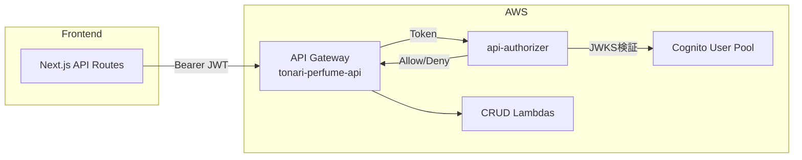

# API認証設計

## 構成図

## Lambda Authorizer: api-authorizer

API GatewayのLambda Authorizerとして動作し、Cognito M2M (Machine-to-Machine) JWTトークンを検証する。

### 基本情報

| 項目 | 値 |
|------|-----|
| Lambda | `tonari-api-authorizer` |
| ソース | `infra/lambda/api-authorizer/` |
| Runtime | Python 3.12 / 10s / 128MB |
| トリガー | API Gateway Token Authorizer |
| キャッシュTTL | 5分 |
| 依存パッケージ | `python-jose[cryptography]>=3.3.0` |

### 処理フロー

1. `authorizationToken` から Bearer トークンを抽出
2. Cognito JWKS エンドポイントから公開鍵を取得
3. JWT署名を検証（RS256）
4. クレーム（`client_id`, `token_use`, `iss`）を検証
5. Allow/Deny ポリシードキュメントを返却

### 環境変数

| 変数 | 説明 |
|------|------|
| `COGNITO_REGION` | Cognitoリージョン |
| `COGNITO_USER_POOL_ID` | Cognito User Pool ID |
| `COGNITO_CLIENT_ID` | Cognito Client ID |

### 保護対象エンドポイント

| パス | CRUD Lambda | 説明 |
|------|------------|------|
| `/perfumes/**` | perfume-crud | 香水データ操作 |
| `/diaries/**` | diary-crud | 日記データ閲覧 |
| `/tasks/**` | task-crud | タスクデータ操作 |
| `/news` | news-crud | ニュースデータ閲覧 |
| `/tts` | tts | 音声合成 |
