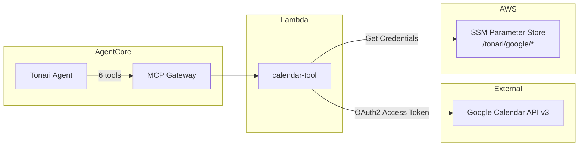
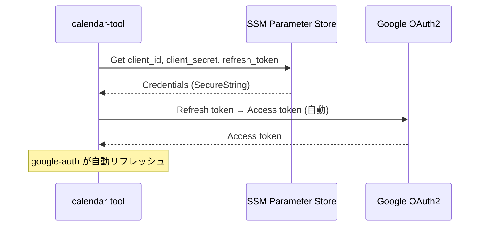

# Googleカレンダーツール設計

## 構成図



## エージェントツール: calendar-tool

Googleカレンダーの予定の閲覧・作成・変更・削除・空き時間確認・スケジュール提案を行う。DynamoDBは使用せず、Google Calendar API v3への中継として機能する。

### 基本情報

| 項目 | 値 |
|------|-----|
| Lambda | `tonari-calendar-tool` |
| Gateway Target | `calendar-tool` |
| ソース | `infra/lambda/calendar-tool/` |
| Runtime | Python 3.12 / 30s / 128MB |
| 依存パッケージ | `google-api-python-client`, `google-auth` |

### ツールスキーマ

| ツール名 | パラメータ | 説明 |
|---------|-----------|------|
| `list_events` | `date`, `date_from`, `date_to` | 予定一覧取得（省略時は今日） |
| `check_availability` | `check_type` (必須), `date`, `date_from`, `date_to`, `time_from`, `time_to` | 空き状況確認 |
| `create_event` | `title` (必須), `start` (必須), `end`, `location`, `description` | 予定作成 |
| `update_event` | `event_id` (必須), `title`, `start`, `end`, `location`, `description` | 予定更新 |
| `delete_event` | `event_id` (必須) | 予定削除 |
| `suggest_schedule` | `date_from` (必須), `date_to` (必須), `duration_minutes` (必須), `preferred_time_from`, `preferred_time_to` | 空き枠候補提案（最大5件） |

### ディスパッチロジック

```
duration_minutes あり                           → suggest_schedule
event_id あり + 更新フィールドあり               → update_event
event_id あり + 更新フィールドなし               → delete_event
title あり                                      → create_event
check_type あり                                 → check_availability
それ以外                                        → list_events
```

### 認証フロー



**SSM パラメータ:**

| パス | 説明 |
|------|------|
| `/tonari/google/client_id` | OAuth2 Client ID |
| `/tonari/google/client_secret` | OAuth2 Client Secret |
| `/tonari/google/refresh_token` | OAuth2 Refresh Token |

初回セットアップは `scripts/setup-google-calendar.py` で実行。

### check_availability のモード

| check_type | 用途 | 必要パラメータ | 使用API |
|-----------|------|--------------|---------|
| `day` | 特定日の空き確認 | `date` | Freebusy API |
| `time_slot` | 特定時間帯の空き確認 | `date`, `time_from`, `time_to` | Freebusy API |
| `range` | 期間内の空き日リスト | `date_from`, `date_to` | Events API |

### レスポンス例

**list_events:**

```json
{
  "events": [
    {
      "event_id": "abc123",
      "title": "ミーティング",
      "start": "2026-03-01T14:00:00+09:00",
      "end": "2026-03-01T15:00:00+09:00",
      "location": "会議室A",
      "all_day": false
    }
  ],
  "count": 1,
  "message": "1件の予定が見つかりました。"
}
```

**suggest_schedule:**

```json
{
  "suggestions": [
    {
      "date": "2026-03-03",
      "start": "2026-03-03T10:00:00+09:00",
      "end": "2026-03-03T11:00:00+09:00"
    }
  ],
  "count": 1,
  "message": "1件の候補が見つかりました。"
}
```

### エラーハンドリング

| Google API エラー | HTTPコード | Lambda レスポンス |
|-----------------|-----------|-----------------|
| 認証失敗 | 401 | `カレンダーにアクセスできません。認証情報を確認してください。` |
| イベント未検出 | 404 | `指定された予定が見つかりません。` |
| レート制限 | 429 | `カレンダーへのアクセスが一時的に制限されています。` |
| サーバーエラー | 5xx | `カレンダーサービスに接続できません。` |

401エラー時はキャッシュされたサービスインスタンスをクリアし、次回呼び出し時に再認証を行う。

### 設計判断

- **DynamoDB不要**: Google Calendar APIへの中継のみでデータの永続化は不要
- **グローバルキャッシュ**: `_calendar_service` をモジュールレベルでキャッシュし、Lambda warm start時の再認証を回避
- **タイムゾーン**: 全ての日時はJST（Asia/Tokyo）を基準とする
- **終日イベント**: start/end に `YYYY-MM-DD` 形式を使用。Google APIの排他的終了日（翌日）を内部で処理
