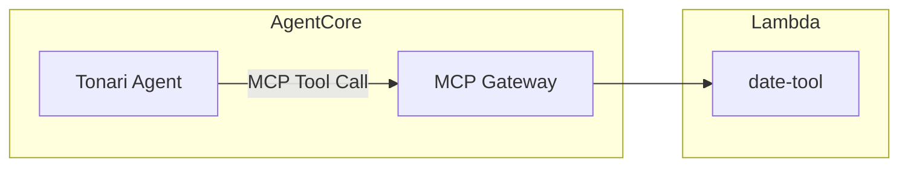

# 日付計算ツール設計

## 構成図



## エージェントツール: date-tool

LLMが苦手な日付演算（相対日付の解決、曜日の列挙）を正確に処理するユーティリティ。外部APIやデータソースへのアクセスは不要で、Python標準ライブラリのみで動作する。

### 基本情報

| 項目 | 値 |
|------|-----|
| Lambda | `tonari-date-tool` |
| ソース | `infra/lambda/date-tool/` |
| Runtime | Python 3.12 / 10s / 128MB |
| 依存パッケージ | なし（標準ライブラリのみ） |
| タイムゾーン | JST (Asia/Tokyo) 固定 |

### ツール一覧

| ツール名 | 説明 | 主要パラメータ |
|---------|------|---------------|
| `get_current_datetime` | 現在の日時・曜日・週番号を取得 | なし |
| `calculate_date` | 基準日からの加減算 | `base_date`, `offset_days/weeks/months` |
| `list_dates_in_range` | 期間内の特定曜日を列挙 | `start_date`, `end_date`, `weekday` |

### ディスパッチロジック

```
event に start_date + end_date + weekday → list_dates_in_range
event に offset_days / offset_weeks / offset_months → calculate_date
それ以外 → get_current_datetime
```

### ユースケース

| ユーザーの発言 | エージェントの使い方 |
|--------------|-------------------|
| 「2週間後に予定入れて」 | `calculate_date(offset_weeks=2)` → 日付確定 → `create_event` |
| 「来月の火曜日は？」 | `calculate_date(offset_months=1)` → 来月の日付確定 → `list_dates_in_range(weekday="火")` |
| 「3月の毎週水曜にミーティング」 | `list_dates_in_range(start_date, end_date, weekday="水")` → 日付リスト → 順次 `create_event` |
| 「今日って何曜日？」 | `get_current_datetime` |
| 「5日前は何日だった？」 | `calculate_date(offset_days=-5)` |

### 曜日の指定

日本語・英語の両方に対応する。

| 曜日 | 受け付ける値 |
|------|------------|
| 月曜日 | `月`, `月曜`, `月曜日`, `monday`, `mon` |
| 火曜日 | `火`, `火曜`, `火曜日`, `tuesday`, `tue` |
| 水曜日 | `水`, `水曜`, `水曜日`, `wednesday`, `wed` |
| 木曜日 | `木`, `木曜`, `木曜日`, `thursday`, `thu` |
| 金曜日 | `金`, `金曜`, `金曜日`, `friday`, `fri` |
| 土曜日 | `土`, `土曜`, `土曜日`, `saturday`, `sat` |
| 日曜日 | `日`, `日曜`, `日曜日`, `sunday`, `sun` |

### レスポンス例

#### get_current_datetime

```json
{
  "success": true,
  "current": {
    "date": "2026-03-01",
    "time": "17:20",
    "weekday": "日曜日",
    "weekday_number": 6,
    "iso_week": 9,
    "iso_year": 2026
  },
  "message": "現在は 2026-03-01（日曜日）17:20 です。第9週。"
}
```

#### calculate_date (2週間後)

```json
{
  "success": true,
  "base_date": { "date": "2026-03-01", "weekday": "日曜日", "weekday_number": 6 },
  "result": { "date": "2026-03-15", "weekday": "日曜日", "weekday_number": 6 },
  "offset": { "days": 0, "weeks": 2, "months": 0 },
  "message": "今日の2週間後は 2026-03-15（日曜日）です。"
}
```

#### list_dates_in_range (3月の火曜日)

```json
{
  "success": true,
  "weekday": "火曜日",
  "range": { "start": "2026-03-01", "end": "2026-03-31" },
  "dates": [
    { "date": "2026-03-03", "weekday": "火曜日", "weekday_number": 1 },
    { "date": "2026-03-10", "weekday": "火曜日", "weekday_number": 1 },
    { "date": "2026-03-17", "weekday": "火曜日", "weekday_number": 1 },
    { "date": "2026-03-24", "weekday": "火曜日", "weekday_number": 1 },
    { "date": "2026-03-31", "weekday": "火曜日", "weekday_number": 1 }
  ],
  "count": 5,
  "message": "2026-03-01 〜 2026-03-31 の火曜日は 5 日あります。"
}
```

### 制約事項

- `list_dates_in_range` の検索範囲は最大1年（366日）
- 月の加減算で日が存在しない場合は月末に丸める（例: 1/31 + 1ヶ月 → 2/28）
