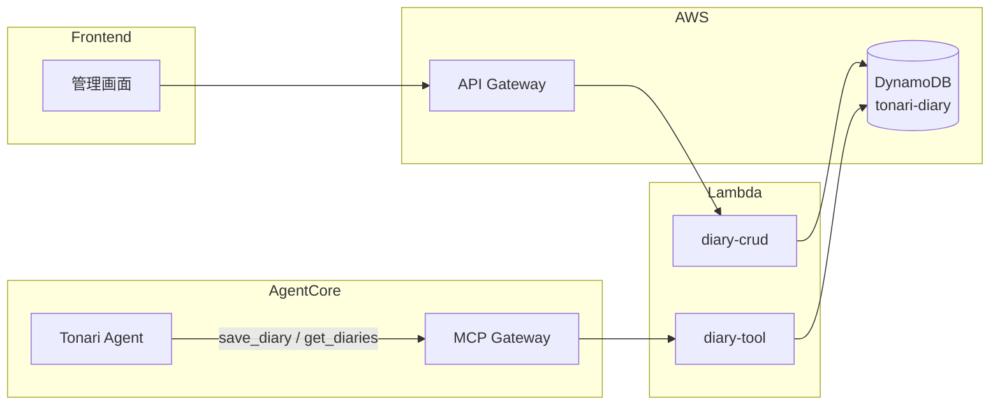

# 日記ツール設計

## 構成図



## エージェントツール: diary-tool

オーナーの日記の保存と取得を行う。エージェントがヒアリングモードで日記を作成した後に保存する。

### 基本情報

| 項目 | 値 |
|------|-----|
| Lambda | `tonari-diary-tool` |
| Gateway Target | `diary-tool` |
| ソース | `infra/lambda/diary-tool/` |
| Runtime | Python 3.12 / 30s / 128MB |

### ツールスキーマ

| ツール名 | パラメータ | 説明 |
|---------|-----------|------|
| `save_diary` | `user_id` (必須), `date` (必須), `body` (必須) | 日記エントリーを保存 |
| `get_diaries` | `user_id` (必須), `limit` | 日記エントリーを日付降順で取得 |

### レスポンス (save_diary)

```json
{
  "success": true,
  "message": "日記を保存しました。"
}
```

### レスポンス (get_diaries)

```json
{
  "diaries": [
    { "date": "2026-03-01", "body": "今日は..." }
  ],
  "count": 1
}
```

### ディスパッチロジック

- `body` フィールドあり → `save_diary`
- それ以外 → `get_diaries`

---

## 管理API: diary-crud

管理画面から日記データを閲覧するためのAPI。

### 基本情報

| 項目 | 値 |
|------|-----|
| Lambda | `tonari-diary-crud` |
| ソース | `infra/lambda/diary-crud/` |
| Runtime | Python 3.12 / 30s / 128MB |
| 認証 | API Gateway + Cognito M2M JWT |

### エンドポイント

| メソッド | パス | 説明 |
|---------|------|------|
| GET | `/diaries` | 日記一覧取得 |
| GET | `/diaries/{date}` | 特定日の日記取得 |

### データモデル

**DynamoDB テーブル:** `tonari-diary`（PK: `userId`, SK: `date`）

| 属性 | 型 | 説明 |
|------|-----|------|
| userId (PK) | String | ユーザーID |
| date (SK) | String | 日付（YYYY-MM-DD） |
| body | String | 日記本文 |
