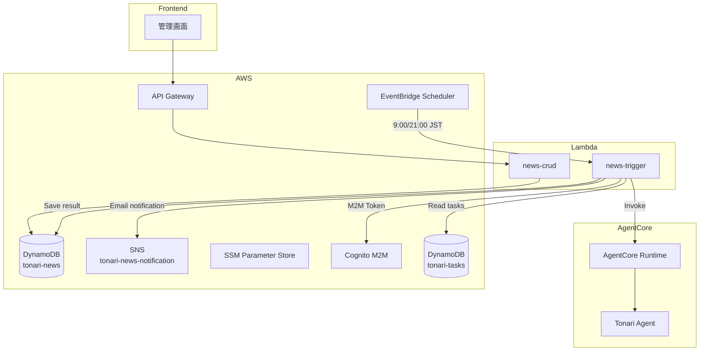

# ニュースツール設計

## 構成図

## バッチ処理: news-trigger

EventBridgeスケジュールから定時起動され、AgentCore Runtimeにニュース収集パイプラインの実行を指示する。収集結果をDynamoDBに保存し、SNSでメール通知する。

### 基本情報

| 項目 | 値 |
|------|-----|
| Lambda | `tonari-news-trigger` |
| ソース | `infra/lambda/news-trigger/` |
| Runtime | Python 3.12 / 5min / 256MB |
| トリガー | EventBridge Scheduler |

### スケジュール

| 名称 | 時刻 (JST) |
|------|-----------|
| `tonari-news-morning` | 9:00 |
| `tonari-news-evening` | 21:00 |

### 処理フロー

1. SSMからCognito Client Secretを取得
2. DynamoDBからオーナーのタスク一覧を取得（コンテキスト用）
3. プロンプトを構築（タスク情報、前回ニュース参照）
4. Cognito M2Mトークンを取得
5. AgentCore Runtimeを呼び出し（SSE）
6. エージェントがTavily Web SearchでニュースをGoogle Calendar API収集
7. 収集結果をDynamoDBに保存
8. SNSでメール通知

### 環境変数

| 変数 | 説明 |
|------|------|
| `AGENTCORE_REGION` | AgentCoreリージョン |
| `AGENTCORE_RUNTIME_ARN` | Runtime ARN（スタックで後注入） |
| `COGNITO_TOKEN_ENDPOINT` | Cognito Token URL |
| `COGNITO_CLIENT_ID` | Cognito Client ID |
| `COGNITO_SCOPE` | OAuth2スコープ |
| `SSM_COGNITO_CLIENT_SECRET` | SSMパラメータパス |
| `SNS_TOPIC_ARN` | SNS Topic ARN |
| `NEWS_TABLE` | ニューステーブル名 |
| `TASKS_TABLE` | タスクテーブル名 |

---

## 管理API: news-crud

管理画面からニュースデータを閲覧・削除するためのAPI。

### 基本情報

| 項目 | 値 |
|------|-----|
| Lambda | `tonari-news-crud` |
| ソース | `infra/lambda/news-crud/` |
| Runtime | Python 3.12 / 30s / 128MB |
| 認証 | API Gateway + Cognito M2M JWT |

### エンドポイント

| メソッド | パス | 説明 |
|---------|------|------|
| GET | `/news` | 最新ニュース取得 |
| DELETE | `/news` | ニュースデータ削除 |

### データモデル

**DynamoDB テーブル:** `tonari-news`（PK: `userId`）

1ユーザー1レコード方式で上書き保存する。
