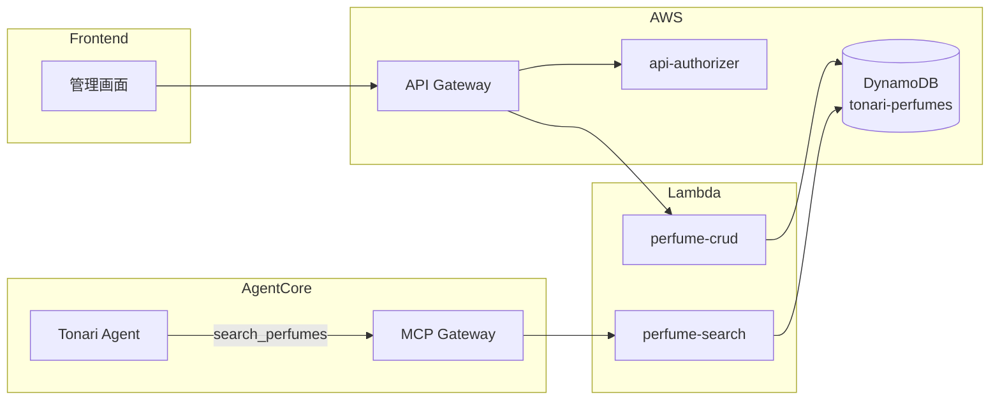

# 香水ツール設計

## 構成図



## エージェントツール: perfume-search

香水データベースに対するキーワード全文検索。エージェントが香水の相談を受けた際に使用する。

### 基本情報

| 項目 | 値 |
|------|-----|
| Lambda | `tonari-perfume-search` |
| Gateway Target | `perfume-search` |
| ソース | `infra/lambda/perfume-search/` |
| Runtime | Python 3.12 / 30s / 128MB |

### ツールスキーマ

| ツール名 | パラメータ | 説明 |
|---------|-----------|------|
| `search_perfumes` | `query` (必須), `limit` | キーワードで香水を検索 |

### レスポンス

```json
{
  "perfumes": [
    {
      "brand": "string",
      "name": "string",
      "country": "string",
      "topNotes": ["string"],
      "middleNotes": ["string"],
      "baseNotes": ["string"],
      "scenes": ["string"],
      "seasons": ["string"],
      "impression": "string",
      "rating": 5
    }
  ],
  "count": 1,
  "message": "1件の香水が見つかりました。"
}
```

### 検索ロジック

- DynamoDB Scanで全件取得後、Pythonでフィルタリング
- 大文字小文字を区別しないキーワードマッチ
- 検索対象: brand, name, country, impression, topNotes, middleNotes, baseNotes, scenes, seasons
- 結果はrating降順でソート後、limit件に制限

---

## 管理API: perfume-crud

DynamoDBの香水データに対するREST CRUD操作。管理画面からアクセスされる。

### 基本情報

| 項目 | 値 |
|------|-----|
| Lambda | `tonari-perfume-crud` |
| ソース | `infra/lambda/perfume-crud/` |
| Runtime | Python 3.12 / 30s / 128MB |
| 認証 | API Gateway + Cognito M2M JWT |

### エンドポイント

| メソッド | パス | 説明 |
|---------|------|------|
| GET | `/perfumes` | 全件取得 |
| POST | `/perfumes` | 新規作成 |
| GET | `/perfumes/{brand}/{name}` | 1件取得 |
| PUT | `/perfumes/{brand}/{name}` | 更新 |
| DELETE | `/perfumes/{brand}/{name}` | 削除 |

### データモデル

**DynamoDB テーブル:** `tonari-perfumes`（PK: `brand`, SK: `name`）

| 属性 | 型 | 説明 |
|------|-----|------|
| brand (PK) | String | ブランド名 |
| name (SK) | String | 香水名 |
| country | String | 生産国 |
| topNotes | List | トップノート |
| middleNotes | List | ミドルノート |
| baseNotes | List | ベースノート |
| scenes | List | おすすめシーン |
| seasons | List | おすすめ季節 |
| impression | String | 感想 |
| rating | Number | 評価（1-5） |
| createdAt / updatedAt | String | タイムスタンプ |
