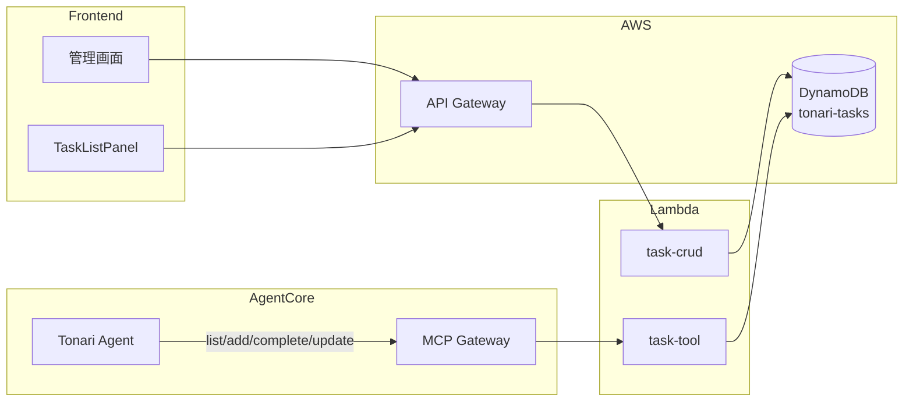

# タスク管理ツール設計

## 構成図



## エージェントツール: task-tool

オーナーのタスクの追加・一覧・完了・更新を行う。会話内でタスク登録の意図を自動検出して提案する機能も持つ。

### 基本情報

| 項目 | 値 |
|------|-----|
| Lambda | `tonari-task-tool` |
| Gateway Target | `task-tool` |
| ソース | `infra/lambda/task-tool/` |
| Runtime | Python 3.12 / 30s / 128MB |

### ツールスキーマ

| ツール名 | パラメータ | 説明 |
|---------|-----------|------|
| `list_tasks` | `user_id` (必須), `include_completed`, `days_until_due` | タスク一覧取得 |
| `add_task` | `user_id` (必須), `title` (必須), `due_date` | 新規タスク追加 |
| `complete_task` | `user_id` (必須), `task_id` (必須) | タスクを完了にする |
| `update_task` | `user_id` (必須), `task_id` (必須), `title`, `due_date` | タスクを更新 |

### ディスパッチロジック

```
task_id あり + title/due_date なし → complete_task
task_id あり + title/due_date あり → update_task
title あり                       → add_task
それ以外                         → list_tasks
```

### レスポンス (list_tasks)

```json
{
  "tasks": [
    {
      "taskId": "uuid",
      "title": "タスク名",
      "dueDate": "2026-03-05",
      "sortOrder": 0,
      "completed": false,
      "createdAt": "2026-03-01T09:00:00+09:00"
    }
  ],
  "count": 1,
  "message": "1件のタスクが見つかりました。"
}
```

---

## 管理API: task-crud

フロントエンドのTaskListPanelと管理画面からタスクデータを操作するためのAPI。

### 基本情報

| 項目 | 値 |
|------|-----|
| Lambda | `tonari-task-crud` |
| ソース | `infra/lambda/task-crud/` |
| Runtime | Python 3.12 / 30s / 128MB |
| 認証 | API Gateway + Cognito M2M JWT |

### エンドポイント

| メソッド | パス | 説明 |
|---------|------|------|
| GET | `/tasks` | タスク一覧取得 |
| POST | `/tasks` | 新規タスク作成 |
| GET | `/tasks/{taskId}` | タスク取得 |
| PUT | `/tasks/{taskId}` | タスク更新 |
| DELETE | `/tasks/{taskId}` | タスク削除 |
| PUT | `/tasks/reorder` | タスク並び替え |

### データモデル

**DynamoDB テーブル:** `tonari-tasks`（PK: `taskId`、TTL: `ttl`）

| 属性 | 型 | 説明 |
|------|-----|------|
| taskId (PK) | String | UUID |
| title | String | タスク名 |
| dueDate | String | 期限（YYYY-MM-DD） |
| sortOrder | Number | 表示順 |
| completed | Boolean | 完了フラグ |
| completedAt | String | 完了日時 |
| createdAt | String | 作成日時 |
| ttl | Number | TTL（完了後30日で自動削除） |
