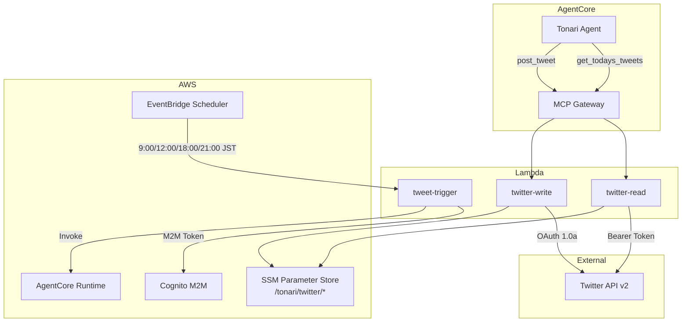

# Twitter ツール設計

## 構成図



## エージェントツール: twitter-read

オーナー（@_cityside）の当日ツイートを取得する。エージェントがツイート生成の参考にするために使用する。

### 基本情報

| 項目 | 値 |
|------|-----|
| Lambda | `tonari-twitter-read` |
| Gateway Target | `twitter-read` |
| ソース | `infra/lambda/twitter-read/` |
| Runtime | Python 3.12 / 30s / 128MB |
| 依存パッケージ | `tweepy>=4.14.0` |

### ツールスキーマ

| ツール名 | パラメータ | 説明 |
|---------|-----------|------|
| `get_todays_tweets` | `owner_user_id` (必須), `max_count` | 当日のツイートを取得 |

### 処理フロー

1. SSMからBearer Tokenを取得
2. `tweepy.Client` で参照専用クライアント初期化
3. `get_users_tweets()` で最新5件取得（リツイート・リプライ除外）
4. JST基準で当日のツイートのみフィルタリング
5. `max_count` 件に制限して返却

### SSM パラメータ

| パス | 説明 |
|------|------|
| `/tonari/twitter/bearer_token` | Twitter API v2 Bearer Token |

---

## エージェントツール: twitter-write

TONaRiアカウント（@tonari_with）からツイートを投稿する。

### 基本情報

| 項目 | 値 |
|------|-----|
| Lambda | `tonari-twitter-write` |
| Gateway Target | `twitter-write` |
| ソース | `infra/lambda/twitter-write/` |
| Runtime | Python 3.12 / 30s / 128MB |
| 依存パッケージ | `tweepy>=4.14.0` |

### ツールスキーマ

| ツール名 | パラメータ | 説明 |
|---------|-----------|------|
| `post_tweet` | `text` (必須) | ツイートを投稿（最大280文字） |

### 処理フロー

1. SSMから `/tonari/twitter/` 配下のOAuth 1.0a認証情報を一括取得
2. 必須4キーの存在チェック
3. `tweepy.Client` で初期化
4. `create_tweet(text=text)` でツイート投稿
5. tweet_idを返却

### SSM パラメータ

| パス | 説明 |
|------|------|
| `/tonari/twitter/api_key` | Consumer Key |
| `/tonari/twitter/api_secret` | Consumer Secret |
| `/tonari/twitter/access_token` | Access Token |
| `/tonari/twitter/access_token_secret` | Access Token Secret |

---

## バッチ処理: tweet-trigger

EventBridgeスケジュールから定時起動され、AgentCore Runtimeにツイートパイプラインの実行を指示する。

### 基本情報

| 項目 | 値 |
|------|-----|
| Lambda | `tonari-tweet-trigger` |
| ソース | `infra/lambda/tweet-trigger/` |
| Runtime | Python 3.12 / 5min / 128MB |
| トリガー | EventBridge Scheduler |

### スケジュール

| 名称 | 時刻 (JST) |
|------|-----------|
| `tonari-tweet-morning` | 9:00 |
| `tonari-tweet-noon` | 12:00 |
| `tonari-tweet-evening` | 18:00 |
| `tonari-tweet-night` | 21:00 |

### ツイートパイプライン

```
1. get_todays_tweets でオーナーの今日のツイートを確認
2. ツイート内容を生成
3. セルフレビュー（品質基準チェック）
4. post_tweet で投稿（またはスキップ）
```

### 品質基準

| 項目 | 基準 |
|------|------|
| 文字数目標 | 120文字以内 |
| 文字数上限 | 140文字（絶対超過不可） |
| 日本語品質 | 自然で読みやすいこと |
| 禁止要素 | 感情タグ・ジェスチャータグ |
| 修正不能時 | 投稿スキップ |
